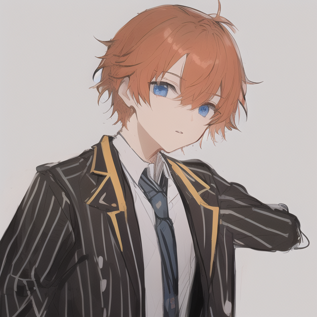
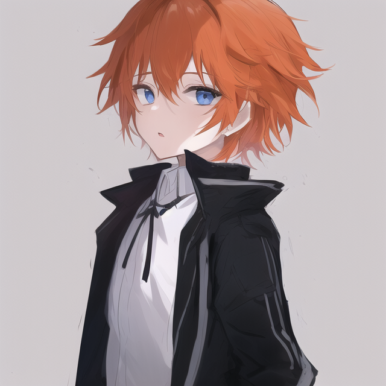
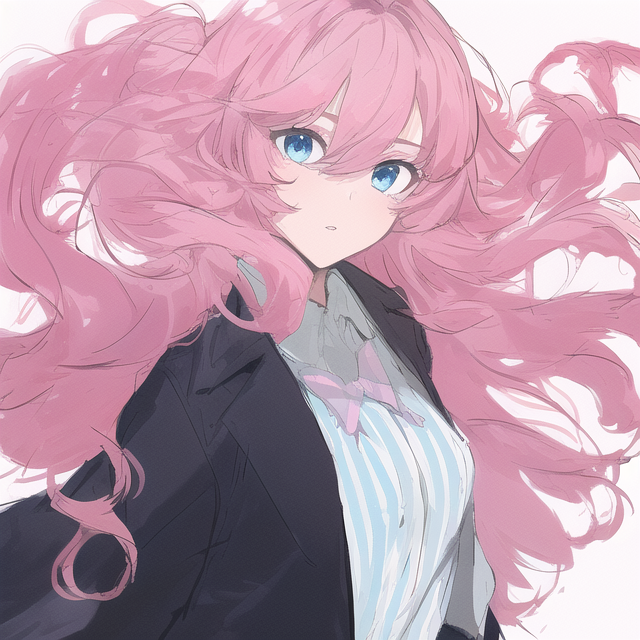
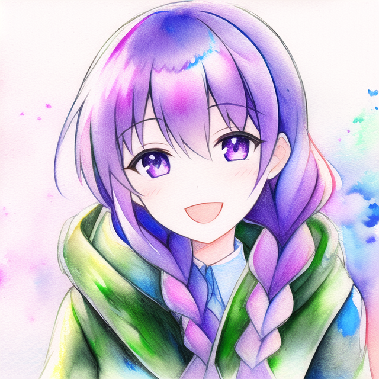
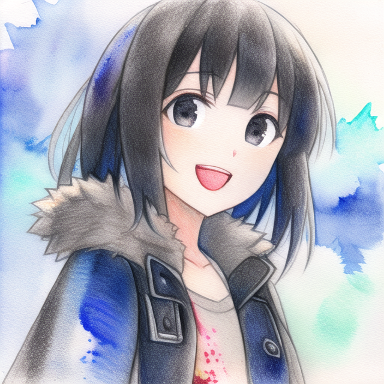
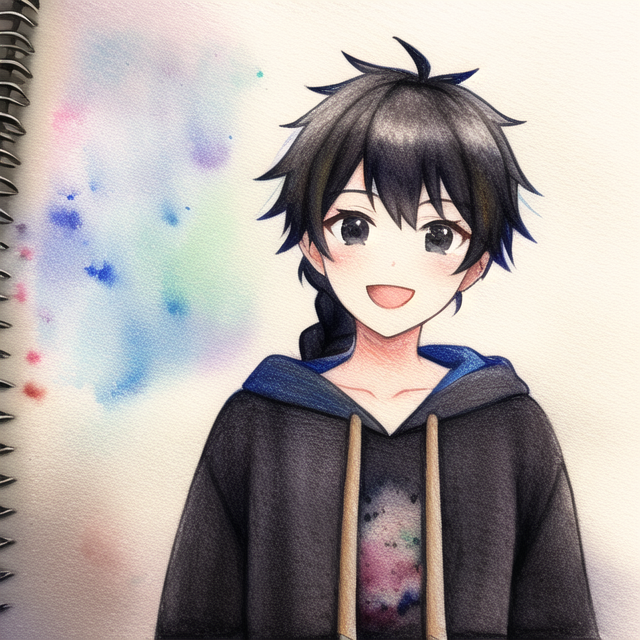
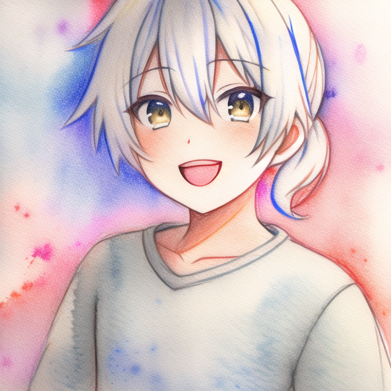
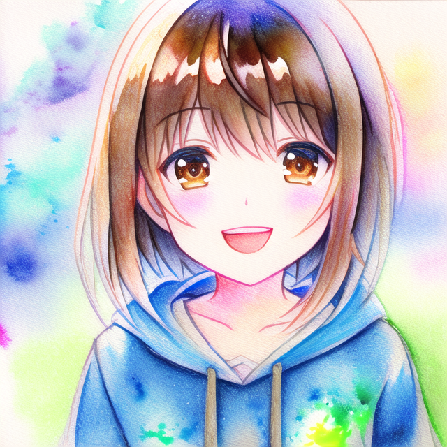
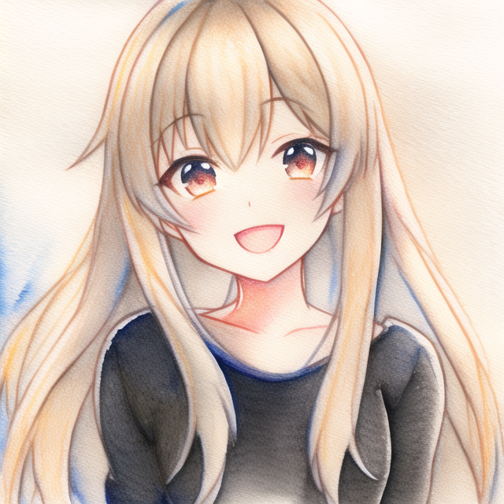

# Novel AI Paintings

<details open>
<summary>
boy-a
</summary>

<table style="display: block; max-width: 100%; overflow: auto;">
<tr>
<td><a target="_blank" href="./boy-a/boy-a_claohdghr0000ccsnfhvzfkau.png"></a>
<details>

```json
{
    "prompt": "masterpiece, {{1boy}}, blue_eyes, orange_hair, short_hair, vertical_stripes, striped, looking_at_viewer, upper_body, solo, one_side_up, jacket, white_background, parted_lips, bangs, hair_between_eyes, black_jacket, white_jacket, simple_background, long_sleeves, collared_shirt, white_shirt, black_shirt, shiny, sketch",
    "negative": "",
    "model": "safe-diffusion",
    "width": 640,
    "height": 640,
    "steps": 28,
    "scale": 4.5,
    "sampler": "k_euler_ancestral",
    "seed": 931301988
}
```

</details>
</td>
<td><a target="_blank" href="./boy-a/boy-a_claohdghr0001ccsn7cs9ct5a.png"></a>
<details>

```json
{
    "prompt": "masterpiece, {{1boy}}, blue_eyes, orange_hair, short_hair, vertical_stripes, striped, looking_at_viewer, upper_body, solo, one_side_up, jacket, white_background, parted_lips, bangs, hair_between_eyes, black_jacket, white_jacket, simple_background, long_sleeves, collared_shirt, white_shirt, black_shirt, shiny, sketch",
    "negative": "",
    "model": "safe-diffusion",
    "width": 640,
    "height": 640,
    "steps": 28,
    "scale": 4.5,
    "sampler": "k_euler_ancestral",
    "seed": 1233481797
}
```

</details>
</td>
<td><a target="_blank" href="./boy-a/boy-a_claohdghr0002ccsn1yrbgfa2.png"></a>
<details>

```json
{
    "prompt": "masterpiece, {{1boy}}, blue_eyes, orange_hair, short_hair, vertical_stripes, striped, looking_at_viewer, upper_body, solo, one_side_up, jacket, white_background, parted_lips, bangs, hair_between_eyes, black_jacket, white_jacket, simple_background, long_sleeves, collared_shirt, white_shirt, black_shirt, shiny, sketch",
    "negative": "",
    "model": "safe-diffusion",
    "width": 640,
    "height": 640,
    "steps": 28,
    "scale": 4.5,
    "sampler": "k_euler_ancestral",
    "seed": 406269708
}
```

</details>
</td>
<td><a target="_blank" href="./boy-a/boy-a_claohdghr0003ccsn62b0444r.png"></a>
<details>

```json
{
    "prompt": "masterpiece, {{1boy}}, blue_eyes, orange_hair, short_hair, vertical_stripes, striped, looking_at_viewer, upper_body, solo, one_side_up, jacket, white_background, parted_lips, bangs, hair_between_eyes, black_jacket, white_jacket, simple_background, long_sleeves, collared_shirt, white_shirt, black_shirt, shiny, sketch",
    "negative": "",
    "model": "safe-diffusion",
    "width": 640,
    "height": 640,
    "steps": 28,
    "scale": 4.5,
    "sampler": "k_euler_ancestral",
    "seed": 1043596823
}
```

</details>
</td>
</tr>
<tr>
<td><a target="_blank" href="./boy-a/boy-a_claohdghr0004ccsnaidwg0tb.png"></a>
<details>

```json
{
    "prompt": "masterpiece, {{1boy}}, blue_eyes, orange_hair, short_hair, vertical_stripes, striped, looking_at_viewer, upper_body, solo, one_side_up, jacket, white_background, parted_lips, bangs, hair_between_eyes, black_jacket, white_jacket, simple_background, long_sleeves, collared_shirt, white_shirt, black_shirt, shiny, sketch",
    "negative": "",
    "model": "safe-diffusion",
    "width": 640,
    "height": 640,
    "steps": 28,
    "scale": 4.5,
    "sampler": "k_euler_ancestral",
    "seed": 572409112
}
```

</details>
</td>
<td><a target="_blank" href="./boy-a/boy-a_claohdghs0005ccsn7mbkg797.png"></a>
<details>

```json
{
    "prompt": "masterpiece, {{1boy}}, blue_eyes, orange_hair, short_hair, vertical_stripes, striped, looking_at_viewer, upper_body, solo, one_side_up, jacket, white_background, parted_lips, bangs, hair_between_eyes, black_jacket, white_jacket, simple_background, long_sleeves, collared_shirt, white_shirt, black_shirt, shiny, sketch",
    "negative": "",
    "model": "safe-diffusion",
    "width": 640,
    "height": 640,
    "steps": 28,
    "scale": 4.5,
    "sampler": "k_euler_ancestral",
    "seed": 1273515321
}
```

</details>
</td>
<td><a target="_blank" href="./boy-a/boy-a_claohdghs0006ccsn4ikb64bf.png"></a>
<details>

```json
{
    "prompt": "masterpiece, {{1boy}}, blue_eyes, orange_hair, short_hair, vertical_stripes, striped, looking_at_viewer, upper_body, solo, one_side_up, jacket, white_background, parted_lips, bangs, hair_between_eyes, black_jacket, white_jacket, simple_background, long_sleeves, collared_shirt, white_shirt, black_shirt, shiny, sketch",
    "negative": "",
    "model": "safe-diffusion",
    "width": 640,
    "height": 640,
    "steps": 28,
    "scale": 4.5,
    "sampler": "k_euler_ancestral",
    "seed": 1533615818
}
```

</details>
</td>
<td><a target="_blank" href="./boy-a/boy-a_claohdghs0007ccsn1jw3dh01.png"></a>
<details>

```json
{
    "prompt": "masterpiece, {{1boy}}, blue_eyes, orange_hair, short_hair, vertical_stripes, striped, looking_at_viewer, upper_body, solo, one_side_up, jacket, white_background, parted_lips, bangs, hair_between_eyes, black_jacket, white_jacket, simple_background, long_sleeves, collared_shirt, white_shirt, black_shirt, shiny, sketch",
    "negative": "",
    "model": "safe-diffusion",
    "width": 640,
    "height": 640,
    "steps": 28,
    "scale": 4.5,
    "sampler": "k_euler_ancestral",
    "seed": 1125660056
}
```

</details>
</td>
</tr>
<tr>
<td><a target="_blank" href="./boy-a/boy-a_claohdghs0008ccsn3kildnk0.png"></a>
<details>

```json
{
    "prompt": "masterpiece, {{1boy}}, blue_eyes, orange_hair, short_hair, vertical_stripes, striped, looking_at_viewer, upper_body, solo, one_side_up, jacket, white_background, parted_lips, bangs, hair_between_eyes, black_jacket, white_jacket, simple_background, long_sleeves, collared_shirt, white_shirt, black_shirt, shiny, sketch",
    "negative": "",
    "model": "safe-diffusion",
    "width": 640,
    "height": 640,
    "steps": 28,
    "scale": 4.5,
    "sampler": "k_euler_ancestral",
    "seed": 1400706545
}
```

</details>
</td>
<td><a target="_blank" href="./boy-a/boy-a_claohdghs0009ccsnfdv7c5a2.png"></a>
<details>

```json
{
    "prompt": "masterpiece, {{1boy}}, blue_eyes, orange_hair, short_hair, vertical_stripes, striped, looking_at_viewer, upper_body, solo, one_side_up, jacket, white_background, parted_lips, bangs, hair_between_eyes, black_jacket, white_jacket, simple_background, long_sleeves, collared_shirt, white_shirt, black_shirt, shiny, sketch",
    "negative": "",
    "model": "safe-diffusion",
    "width": 640,
    "height": 640,
    "steps": 28,
    "scale": 4.5,
    "sampler": "k_euler_ancestral",
    "seed": 1883556225
}
```

</details>
</td>
<td><a target="_blank" href="./boy-a/boy-a_claohdghs000accsnapjdb5aq.png"></a>
<details>

```json
{
    "prompt": "masterpiece, {{1boy}}, blue_eyes, orange_hair, short_hair, vertical_stripes, striped, looking_at_viewer, upper_body, solo, one_side_up, jacket, white_background, parted_lips, bangs, hair_between_eyes, black_jacket, white_jacket, simple_background, long_sleeves, collared_shirt, white_shirt, black_shirt, shiny, sketch",
    "negative": "",
    "model": "safe-diffusion",
    "width": 640,
    "height": 640,
    "steps": 28,
    "scale": 4.5,
    "sampler": "k_euler_ancestral",
    "seed": 1894672356
}
```

</details>
</td>
<td><a target="_blank" href="./boy-a/boy-a_claohdghs000bccsn6q2d9ycd.png"></a>
<details>

```json
{
    "prompt": "masterpiece, {{1boy}}, blue_eyes, orange_hair, short_hair, vertical_stripes, striped, looking_at_viewer, upper_body, solo, one_side_up, jacket, white_background, parted_lips, bangs, hair_between_eyes, black_jacket, white_jacket, simple_background, long_sleeves, collared_shirt, white_shirt, black_shirt, shiny, sketch",
    "negative": "",
    "model": "safe-diffusion",
    "width": 640,
    "height": 640,
    "steps": 28,
    "scale": 4.5,
    "sampler": "k_euler_ancestral",
    "seed": 186960774
}
```

</details>
</td>
</tr>
<tr>
<td><a target="_blank" href="./boy-a/boy-a_claohdghs000cccsn2nlw4nr5.png"></a>
<details>

```json
{
    "prompt": "masterpiece, {{1boy}}, blue_eyes, orange_hair, short_hair, vertical_stripes, striped, looking_at_viewer, upper_body, solo, one_side_up, jacket, white_background, parted_lips, bangs, hair_between_eyes, black_jacket, white_jacket, simple_background, long_sleeves, collared_shirt, white_shirt, black_shirt, shiny, sketch",
    "negative": "",
    "model": "safe-diffusion",
    "width": 640,
    "height": 640,
    "steps": 28,
    "scale": 4.5,
    "sampler": "k_euler_ancestral",
    "seed": 1521959743
}
```

</details>
</td>
<td><a target="_blank" href="./boy-a/boy-a_claohdghs000dccsn15cxd9k7.png"></a>
<details>

```json
{
    "prompt": "masterpiece, {{1boy}}, blue_eyes, orange_hair, short_hair, vertical_stripes, striped, looking_at_viewer, upper_body, solo, one_side_up, jacket, white_background, parted_lips, bangs, hair_between_eyes, black_jacket, white_jacket, simple_background, long_sleeves, collared_shirt, white_shirt, black_shirt, shiny, sketch",
    "negative": "",
    "model": "safe-diffusion",
    "width": 640,
    "height": 640,
    "steps": 28,
    "scale": 4.5,
    "sampler": "k_euler_ancestral",
    "seed": 118216699
}
```

</details>
</td>
<td><a target="_blank" href="./boy-a/boy-a_claohdghs000eccsn0dcxac38.png"></a>
<details>

```json
{
    "prompt": "masterpiece, {{1boy}}, blue_eyes, orange_hair, short_hair, vertical_stripes, striped, looking_at_viewer, upper_body, solo, one_side_up, jacket, white_background, parted_lips, bangs, hair_between_eyes, black_jacket, white_jacket, simple_background, long_sleeves, collared_shirt, white_shirt, black_shirt, shiny, sketch",
    "negative": "",
    "model": "safe-diffusion",
    "width": 640,
    "height": 640,
    "steps": 28,
    "scale": 4.5,
    "sampler": "k_euler_ancestral",
    "seed": 1590806088
}
```

</details>
</td>
<td><a target="_blank" href="./boy-a/boy-a_claohdght000fccsn3v0oeesf.png"></a>
<details>

```json
{
    "prompt": "masterpiece, {{1boy}}, blue_eyes, orange_hair, short_hair, vertical_stripes, striped, looking_at_viewer, upper_body, solo, one_side_up, jacket, white_background, parted_lips, bangs, hair_between_eyes, black_jacket, white_jacket, simple_background, long_sleeves, collared_shirt, white_shirt, black_shirt, shiny, sketch",
    "negative": "",
    "model": "safe-diffusion",
    "width": 640,
    "height": 640,
    "steps": 28,
    "scale": 4.5,
    "sampler": "k_euler_ancestral",
    "seed": 1844046502
}
```

</details>
</td>
</tr>
<tr>
<td><a target="_blank" href="./boy-a/boy-a_claohdght000gccsn9mundfy1.png"></a>
<details>

```json
{
    "prompt": "masterpiece, {{1boy}}, blue_eyes, orange_hair, short_hair, vertical_stripes, striped, looking_at_viewer, upper_body, solo, one_side_up, jacket, white_background, parted_lips, bangs, hair_between_eyes, black_jacket, white_jacket, simple_background, long_sleeves, collared_shirt, white_shirt, black_shirt, shiny, sketch",
    "negative": "",
    "model": "safe-diffusion",
    "width": 640,
    "height": 640,
    "steps": 28,
    "scale": 4.5,
    "sampler": "k_euler_ancestral",
    "seed": 787610084
}
```

</details>
</td>
<td><a target="_blank" href="./boy-a/boy-a_claohdght000hccsn3j6rcuqz.png"></a>
<details>

```json
{
    "prompt": "masterpiece, {{1boy}}, blue_eyes, orange_hair, short_hair, vertical_stripes, striped, looking_at_viewer, upper_body, solo, one_side_up, jacket, white_background, parted_lips, bangs, hair_between_eyes, black_jacket, white_jacket, simple_background, long_sleeves, collared_shirt, white_shirt, black_shirt, shiny, sketch",
    "negative": "",
    "model": "safe-diffusion",
    "width": 640,
    "height": 640,
    "steps": 28,
    "scale": 4.5,
    "sampler": "k_euler_ancestral",
    "seed": 1424053824
}
```

</details>
</td>
<td><a target="_blank" href="./boy-a/boy-a_claohdght000iccsn7szu3zx6.png"></a>
<details>

```json
{
    "prompt": "masterpiece, {{1boy}}, blue_eyes, orange_hair, short_hair, vertical_stripes, striped, looking_at_viewer, upper_body, solo, one_side_up, jacket, white_background, parted_lips, bangs, hair_between_eyes, black_jacket, white_jacket, simple_background, long_sleeves, collared_shirt, white_shirt, black_shirt, shiny, sketch",
    "negative": "",
    "model": "safe-diffusion",
    "width": 640,
    "height": 640,
    "steps": 28,
    "scale": 4.5,
    "sampler": "k_euler_ancestral",
    "seed": 1188582966
}
```

</details>
</td>
<td><a target="_blank" href="./boy-a/boy-a_claohdght000jccsnf54dh4nw.png"></a>
<details>

```json
{
    "prompt": "masterpiece, {{1boy}}, blue_eyes, orange_hair, short_hair, vertical_stripes, striped, looking_at_viewer, upper_body, solo, one_side_up, jacket, white_background, parted_lips, bangs, hair_between_eyes, black_jacket, white_jacket, simple_background, long_sleeves, collared_shirt, white_shirt, black_shirt, shiny, sketch",
    "negative": "",
    "model": "safe-diffusion",
    "width": 640,
    "height": 640,
    "steps": 28,
    "scale": 4.5,
    "sampler": "k_euler_ancestral",
    "seed": 985791370
}
```

</details>
</td>
</tr>
<tr>
<td><a target="_blank" href="./boy-a/boy-a_claohdght000kccsn479b3int.png"></a>
<details>

```json
{
    "prompt": "masterpiece, {{1boy}}, blue_eyes, orange_hair, short_hair, vertical_stripes, striped, looking_at_viewer, upper_body, solo, one_side_up, jacket, white_background, parted_lips, bangs, hair_between_eyes, black_jacket, white_jacket, simple_background, long_sleeves, collared_shirt, white_shirt, black_shirt, shiny, sketch",
    "negative": "",
    "model": "safe-diffusion",
    "width": 640,
    "height": 640,
    "steps": 28,
    "scale": 4.5,
    "sampler": "k_euler_ancestral",
    "seed": 1149133291
}
```

</details>
</td>
<td><a target="_blank" href="./boy-a/boy-a_claohdght000lccsneezq1vrs.png"></a>
<details>

```json
{
    "prompt": "masterpiece, {{1boy}}, blue_eyes, orange_hair, short_hair, vertical_stripes, striped, looking_at_viewer, upper_body, solo, one_side_up, jacket, white_background, parted_lips, bangs, hair_between_eyes, black_jacket, white_jacket, simple_background, long_sleeves, collared_shirt, white_shirt, black_shirt, shiny, sketch",
    "negative": "",
    "model": "safe-diffusion",
    "width": 640,
    "height": 640,
    "steps": 28,
    "scale": 4.5,
    "sampler": "k_euler_ancestral",
    "seed": 2091168514
}
```

</details>
</td>
<td><a target="_blank" href="./boy-a/boy-a_claohdght000mccsngrq77q5e.png"></a>
<details>

```json
{
    "prompt": "masterpiece, {{1boy}}, blue_eyes, orange_hair, short_hair, vertical_stripes, striped, looking_at_viewer, upper_body, solo, one_side_up, jacket, white_background, parted_lips, bangs, hair_between_eyes, black_jacket, white_jacket, simple_background, long_sleeves, collared_shirt, white_shirt, black_shirt, shiny, sketch",
    "negative": "",
    "model": "safe-diffusion",
    "width": 640,
    "height": 640,
    "steps": 28,
    "scale": 4.5,
    "sampler": "k_euler_ancestral",
    "seed": 334564867
}
```

</details>
</td>
<td><a target="_blank" href="./boy-a/boy-a_claohdght000nccsne6i40nus.png"></a>
<details>

```json
{
    "prompt": "masterpiece, {{1boy}}, blue_eyes, orange_hair, short_hair, vertical_stripes, striped, looking_at_viewer, upper_body, solo, one_side_up, jacket, white_background, parted_lips, bangs, hair_between_eyes, black_jacket, white_jacket, simple_background, long_sleeves, collared_shirt, white_shirt, black_shirt, shiny, sketch",
    "negative": "",
    "model": "safe-diffusion",
    "width": 640,
    "height": 640,
    "steps": 28,
    "scale": 4.5,
    "sampler": "k_euler_ancestral",
    "seed": 231563926
}
```

</details>
</td>
</tr>
<tr>
<td><a target="_blank" href="./boy-a/boy-a_claohdght000occsn7rae1t1t.png"></a>
<details>

```json
{
    "prompt": "masterpiece, {{1boy}}, blue_eyes, orange_hair, short_hair, vertical_stripes, striped, looking_at_viewer, upper_body, solo, one_side_up, jacket, white_background, parted_lips, bangs, hair_between_eyes, black_jacket, white_jacket, simple_background, long_sleeves, collared_shirt, white_shirt, black_shirt, shiny, sketch",
    "negative": "",
    "model": "safe-diffusion",
    "width": 640,
    "height": 640,
    "steps": 28,
    "scale": 4.5,
    "sampler": "k_euler_ancestral",
    "seed": 452201005
}
```

</details>
</td>
<td><a target="_blank" href="./boy-a/boy-a_claohdghu000pccsnejna41oi.png"></a>
<details>

```json
{
    "prompt": "masterpiece, {{1boy}}, blue_eyes, orange_hair, short_hair, vertical_stripes, striped, looking_at_viewer, upper_body, solo, one_side_up, jacket, white_background, parted_lips, bangs, hair_between_eyes, black_jacket, white_jacket, simple_background, long_sleeves, collared_shirt, white_shirt, black_shirt, shiny, sketch",
    "negative": "",
    "model": "safe-diffusion",
    "width": 640,
    "height": 640,
    "steps": 28,
    "scale": 4.5,
    "sampler": "k_euler_ancestral",
    "seed": 1903033473
}
```

</details>
</td>
<td><a target="_blank" href="./boy-a/boy-a_claohdghu000qccsn31de8mpm.png"></a>
<details>

```json
{
    "prompt": "masterpiece, {{1boy}}, blue_eyes, orange_hair, short_hair, vertical_stripes, striped, looking_at_viewer, upper_body, solo, one_side_up, jacket, white_background, parted_lips, bangs, hair_between_eyes, black_jacket, white_jacket, simple_background, long_sleeves, collared_shirt, white_shirt, black_shirt, shiny, sketch",
    "negative": "",
    "model": "safe-diffusion",
    "width": 640,
    "height": 640,
    "steps": 28,
    "scale": 4.5,
    "sampler": "k_euler_ancestral",
    "seed": 2063133525
}
```

</details>
</td>
<td><a target="_blank" href="./boy-a/boy-a_claohdghu000rccsn7a95dcw4.png"></a>
<details>

```json
{
    "prompt": "masterpiece, {{1boy}}, blue_eyes, orange_hair, short_hair, vertical_stripes, striped, looking_at_viewer, upper_body, solo, one_side_up, jacket, white_background, parted_lips, bangs, hair_between_eyes, black_jacket, white_jacket, simple_background, long_sleeves, collared_shirt, white_shirt, black_shirt, shiny, sketch",
    "negative": "",
    "model": "safe-diffusion",
    "width": 640,
    "height": 640,
    "steps": 28,
    "scale": 4.5,
    "sampler": "k_euler_ancestral",
    "seed": 2061669349
}
```

</details>
</td>
</tr>
<tr>
<td><a target="_blank" href="./boy-a/boy-a_claohdghu000sccsnftio41a5.png"></a>
<details>

```json
{
    "prompt": "masterpiece, {{1boy}}, blue_eyes, orange_hair, short_hair, vertical_stripes, striped, looking_at_viewer, upper_body, solo, one_side_up, jacket, white_background, parted_lips, bangs, hair_between_eyes, black_jacket, white_jacket, simple_background, long_sleeves, collared_shirt, white_shirt, black_shirt, shiny, sketch",
    "negative": "",
    "model": "safe-diffusion",
    "width": 640,
    "height": 640,
    "steps": 28,
    "scale": 4.5,
    "sampler": "k_euler_ancestral",
    "seed": 1925970683
}
```

</details>
</td>
<td><a target="_blank" href="./boy-a/boy-a_claohdghu000tccsndvrxadt7.png"></a>
<details>

```json
{
    "prompt": "masterpiece, {{1boy}}, blue_eyes, orange_hair, short_hair, vertical_stripes, striped, looking_at_viewer, upper_body, solo, one_side_up, jacket, white_background, parted_lips, bangs, hair_between_eyes, black_jacket, white_jacket, simple_background, long_sleeves, collared_shirt, white_shirt, black_shirt, shiny, sketch",
    "negative": "",
    "model": "safe-diffusion",
    "width": 640,
    "height": 640,
    "steps": 28,
    "scale": 4.5,
    "sampler": "k_euler_ancestral",
    "seed": 432369246
}
```

</details>
</td>
<td><a target="_blank" href="./boy-a/boy-a_claohdghu000uccsn7cewf6w9.png"></a>
<details>

```json
{
    "prompt": "masterpiece, {{1boy}}, blue_eyes, orange_hair, short_hair, vertical_stripes, striped, looking_at_viewer, upper_body, solo, one_side_up, jacket, white_background, parted_lips, bangs, hair_between_eyes, black_jacket, white_jacket, simple_background, long_sleeves, collared_shirt, white_shirt, black_shirt, shiny, sketch",
    "negative": "",
    "model": "safe-diffusion",
    "width": 640,
    "height": 640,
    "steps": 28,
    "scale": 4.5,
    "sampler": "k_euler_ancestral",
    "seed": 138503002
}
```

</details>
</td>
<td><a target="_blank" href="./boy-a/boy-a_claohdghu000vccsn6o470z4r.png"></a>
<details>

```json
{
    "prompt": "masterpiece, {{1boy}}, blue_eyes, orange_hair, short_hair, vertical_stripes, striped, looking_at_viewer, upper_body, solo, one_side_up, jacket, white_background, parted_lips, bangs, hair_between_eyes, black_jacket, white_jacket, simple_background, long_sleeves, collared_shirt, white_shirt, black_shirt, shiny, sketch",
    "negative": "",
    "model": "safe-diffusion",
    "width": 640,
    "height": 640,
    "steps": 28,
    "scale": 4.5,
    "sampler": "k_euler_ancestral",
    "seed": 447025280
}
```

</details>
</td>
</tr>
<tr>
<td><a target="_blank" href="./boy-a/boy-a_claohdghu000wccsn1cnmh1i0.png"></a>
<details>

```json
{
    "prompt": "masterpiece, {{1boy}}, blue_eyes, orange_hair, short_hair, vertical_stripes, striped, looking_at_viewer, upper_body, solo, one_side_up, jacket, white_background, parted_lips, bangs, hair_between_eyes, black_jacket, white_jacket, simple_background, long_sleeves, collared_shirt, white_shirt, black_shirt, shiny, sketch",
    "negative": "",
    "model": "safe-diffusion",
    "width": 640,
    "height": 640,
    "steps": 28,
    "scale": 4.5,
    "sampler": "k_euler_ancestral",
    "seed": 1987453790
}
```

</details>
</td>
<td><a target="_blank" href="./boy-a/boy-a_claohdghu000xccsn0rlg3prg.png"></a>
<details>

```json
{
    "prompt": "masterpiece, {{1boy}}, blue_eyes, orange_hair, short_hair, vertical_stripes, striped, looking_at_viewer, upper_body, solo, one_side_up, jacket, white_background, parted_lips, bangs, hair_between_eyes, black_jacket, white_jacket, simple_background, long_sleeves, collared_shirt, white_shirt, black_shirt, shiny, sketch",
    "negative": "",
    "model": "safe-diffusion",
    "width": 640,
    "height": 640,
    "steps": 28,
    "scale": 4.5,
    "sampler": "k_euler_ancestral",
    "seed": 562844866
}
```

</details>
</td>
<td><a target="_blank" href="./boy-a/boy-a_claohdghu000yccsn6kpnehvc.png"></a>
<details>

```json
{
    "prompt": "masterpiece, {{1boy}}, blue_eyes, orange_hair, short_hair, vertical_stripes, striped, looking_at_viewer, upper_body, solo, one_side_up, jacket, white_background, parted_lips, bangs, hair_between_eyes, black_jacket, white_jacket, simple_background, long_sleeves, collared_shirt, white_shirt, black_shirt, shiny, sketch",
    "negative": "",
    "model": "safe-diffusion",
    "width": 640,
    "height": 640,
    "steps": 28,
    "scale": 4.5,
    "sampler": "k_euler_ancestral",
    "seed": 1990111763
}
```

</details>
</td>
<td><a target="_blank" href="./boy-a/boy-a_claohdghu000zccsn128b1s6n.png"></a>
<details>

```json
{
    "prompt": "masterpiece, {{1boy}}, blue_eyes, orange_hair, short_hair, vertical_stripes, striped, looking_at_viewer, upper_body, solo, one_side_up, jacket, white_background, parted_lips, bangs, hair_between_eyes, black_jacket, white_jacket, simple_background, long_sleeves, collared_shirt, white_shirt, black_shirt, shiny, sketch",
    "negative": "",
    "model": "safe-diffusion",
    "width": 640,
    "height": 640,
    "steps": 28,
    "scale": 4.5,
    "sampler": "k_euler_ancestral",
    "seed": 1078577881
}
```

</details>
</td>
</tr>
<tr>
<td><a target="_blank" href="./boy-a/boy-a_claohdghu0010ccsn2akv19ks.png"></a>
<details>

```json
{
    "prompt": "masterpiece, {{1boy}}, blue_eyes, orange_hair, short_hair, vertical_stripes, striped, looking_at_viewer, upper_body, solo, one_side_up, jacket, white_background, parted_lips, bangs, hair_between_eyes, black_jacket, white_jacket, simple_background, long_sleeves, collared_shirt, white_shirt, black_shirt, shiny, sketch",
    "negative": "",
    "model": "safe-diffusion",
    "width": 640,
    "height": 640,
    "steps": 28,
    "scale": 4.5,
    "sampler": "k_euler_ancestral",
    "seed": 532138846
}
```

</details>
</td>
<td><a target="_blank" href="./boy-a/boy-a_claohdghu0011ccsn4xgx97wu.png"></a>
<details>

```json
{
    "prompt": "masterpiece, {{1boy}}, blue_eyes, orange_hair, short_hair, vertical_stripes, striped, looking_at_viewer, upper_body, solo, one_side_up, jacket, white_background, parted_lips, bangs, hair_between_eyes, black_jacket, white_jacket, simple_background, long_sleeves, collared_shirt, white_shirt, black_shirt, shiny, sketch",
    "negative": "",
    "model": "safe-diffusion",
    "width": 640,
    "height": 640,
    "steps": 28,
    "scale": 4.5,
    "sampler": "k_euler_ancestral",
    "seed": 751726477
}
```

</details>
</td>
<td><a target="_blank" href="./boy-a/boy-a_claohdghv0012ccsnd8dyf6zw.png"></a>
<details>

```json
{
    "prompt": "masterpiece, {{1boy}}, blue_eyes, orange_hair, short_hair, vertical_stripes, striped, looking_at_viewer, upper_body, solo, one_side_up, jacket, white_background, parted_lips, bangs, hair_between_eyes, black_jacket, white_jacket, simple_background, long_sleeves, collared_shirt, white_shirt, black_shirt, shiny, sketch",
    "negative": "",
    "model": "safe-diffusion",
    "width": 640,
    "height": 640,
    "steps": 28,
    "scale": 4.5,
    "sampler": "k_euler_ancestral",
    "seed": 55654981
}
```

</details>
</td>
<td><a target="_blank" href="./boy-a/boy-a_claohdghv0013ccsnaoss6xtj.png"></a>
<details>

```json
{
    "prompt": "masterpiece, {{1boy}}, blue_eyes, orange_hair, short_hair, vertical_stripes, striped, looking_at_viewer, upper_body, solo, one_side_up, jacket, white_background, parted_lips, bangs, hair_between_eyes, black_jacket, white_jacket, simple_background, long_sleeves, collared_shirt, white_shirt, black_shirt, shiny, sketch",
    "negative": "",
    "model": "safe-diffusion",
    "width": 640,
    "height": 640,
    "steps": 28,
    "scale": 4.5,
    "sampler": "k_euler_ancestral",
    "seed": 350998032
}
```

</details>
</td>
</tr>
<tr>
<td><a target="_blank" href="./boy-a/boy-a_claohdghv0014ccsndxhwfjh4.png"></a>
<details>

```json
{
    "prompt": "masterpiece, {{1boy}}, blue_eyes, orange_hair, short_hair, vertical_stripes, striped, looking_at_viewer, upper_body, solo, one_side_up, jacket, white_background, parted_lips, bangs, hair_between_eyes, black_jacket, white_jacket, simple_background, long_sleeves, collared_shirt, white_shirt, black_shirt, shiny, sketch",
    "negative": "",
    "model": "safe-diffusion",
    "width": 640,
    "height": 640,
    "steps": 28,
    "scale": 4.5,
    "sampler": "k_euler_ancestral",
    "seed": 1369161284
}
```

</details>
</td>
<td><a target="_blank" href="./boy-a/boy-a_claohdghv0015ccsn0d46an3g.png"></a>
<details>

```json
{
    "prompt": "masterpiece, {{1boy}}, blue_eyes, orange_hair, short_hair, vertical_stripes, striped, looking_at_viewer, upper_body, solo, one_side_up, jacket, white_background, parted_lips, bangs, hair_between_eyes, black_jacket, white_jacket, simple_background, long_sleeves, collared_shirt, white_shirt, black_shirt, shiny, sketch",
    "negative": "",
    "model": "safe-diffusion",
    "width": 640,
    "height": 640,
    "steps": 28,
    "scale": 4.5,
    "sampler": "k_euler_ancestral",
    "seed": 513549151
}
```

</details>
</td>
<td><a target="_blank" href="./boy-a/boy-a_claohdghv0016ccsn3dei0fk5.png"></a>
<details>

```json
{
    "prompt": "masterpiece, {{1boy}}, blue_eyes, orange_hair, short_hair, vertical_stripes, striped, looking_at_viewer, upper_body, solo, one_side_up, jacket, white_background, parted_lips, bangs, hair_between_eyes, black_jacket, white_jacket, simple_background, long_sleeves, collared_shirt, white_shirt, black_shirt, shiny, sketch",
    "negative": "",
    "model": "safe-diffusion",
    "width": 640,
    "height": 640,
    "steps": 28,
    "scale": 4.5,
    "sampler": "k_euler_ancestral",
    "seed": 2031040826
}
```

</details>
</td>
<td><a target="_blank" href="./boy-a/boy-a_claohdghv0017ccsn5dtoec8g.png"></a>
<details>

```json
{
    "prompt": "masterpiece, {{1boy}}, blue_eyes, orange_hair, short_hair, vertical_stripes, striped, looking_at_viewer, upper_body, solo, one_side_up, jacket, white_background, parted_lips, bangs, hair_between_eyes, black_jacket, white_jacket, simple_background, long_sleeves, collared_shirt, white_shirt, black_shirt, shiny, sketch",
    "negative": "",
    "model": "safe-diffusion",
    "width": 640,
    "height": 640,
    "steps": 28,
    "scale": 4.5,
    "sampler": "k_euler_ancestral",
    "seed": 1438079393
}
```

</details>
</td>
</tr>
<tr>
<td><a target="_blank" href="./boy-a/boy-a_claohdghv0018ccsn64huesfo.png"></a>
<details>

```json
{
    "prompt": "masterpiece, {{1boy}}, blue_eyes, orange_hair, short_hair, vertical_stripes, striped, looking_at_viewer, upper_body, solo, one_side_up, jacket, white_background, parted_lips, bangs, hair_between_eyes, black_jacket, white_jacket, simple_background, long_sleeves, collared_shirt, white_shirt, black_shirt, shiny, sketch",
    "negative": "",
    "model": "safe-diffusion",
    "width": 640,
    "height": 640,
    "steps": 28,
    "scale": 4.5,
    "sampler": "k_euler_ancestral",
    "seed": 519992000
}
```

</details>
</td>
<td><a target="_blank" href="./boy-a/boy-a_claohdghv0019ccsne8rr9j4x.png"></a>
<details>

```json
{
    "prompt": "masterpiece, {{1boy}}, blue_eyes, orange_hair, short_hair, vertical_stripes, striped, looking_at_viewer, upper_body, solo, one_side_up, jacket, white_background, parted_lips, bangs, hair_between_eyes, black_jacket, white_jacket, simple_background, long_sleeves, collared_shirt, white_shirt, black_shirt, shiny, sketch",
    "negative": "",
    "model": "safe-diffusion",
    "width": 640,
    "height": 640,
    "steps": 28,
    "scale": 4.5,
    "sampler": "k_euler_ancestral",
    "seed": 1055342772
}
```

</details>
</td>
<td><a target="_blank" href="./boy-a/boy-a_claohdghv001accsn7vg7g7ku.png"></a>
<details>

```json
{
    "prompt": "masterpiece, {{1boy}}, blue_eyes, orange_hair, short_hair, vertical_stripes, striped, looking_at_viewer, upper_body, solo, one_side_up, jacket, white_background, parted_lips, bangs, hair_between_eyes, black_jacket, white_jacket, simple_background, long_sleeves, collared_shirt, white_shirt, black_shirt, shiny, sketch",
    "negative": "",
    "model": "safe-diffusion",
    "width": 640,
    "height": 640,
    "steps": 28,
    "scale": 4.5,
    "sampler": "k_euler_ancestral",
    "seed": 1168751615
}
```

</details>
</td>
<td><a target="_blank" href="./boy-a/boy-a_claohdghv001bccsn1qjg3om6.png"></a>
<details>

```json
{
    "prompt": "masterpiece, {{1boy}}, blue_eyes, orange_hair, short_hair, vertical_stripes, striped, looking_at_viewer, upper_body, solo, one_side_up, jacket, white_background, parted_lips, bangs, hair_between_eyes, black_jacket, white_jacket, simple_background, long_sleeves, collared_shirt, white_shirt, black_shirt, shiny, sketch",
    "negative": "",
    "model": "safe-diffusion",
    "width": 640,
    "height": 640,
    "steps": 28,
    "scale": 4.5,
    "sampler": "k_euler_ancestral",
    "seed": 1861883854
}
```

</details>
</td>
</tr>
<tr>
<td><a target="_blank" href="./boy-a/boy-a_claohdghv001cccsnd1kngq09.png"></a>
<details>

```json
{
    "prompt": "masterpiece, {{1boy}}, blue_eyes, orange_hair, short_hair, vertical_stripes, striped, looking_at_viewer, upper_body, solo, one_side_up, jacket, white_background, parted_lips, bangs, hair_between_eyes, black_jacket, white_jacket, simple_background, long_sleeves, collared_shirt, white_shirt, black_shirt, shiny, sketch",
    "negative": "",
    "model": "safe-diffusion",
    "width": 640,
    "height": 640,
    "steps": 28,
    "scale": 4.5,
    "sampler": "k_euler_ancestral",
    "seed": 741934594
}
```

</details>
</td>
<td><a target="_blank" href="./boy-a/boy-a_claohdghv001dccsn3xs82hmi.png"></a>
<details>

```json
{
    "prompt": "masterpiece, {{1boy}}, blue_eyes, orange_hair, short_hair, vertical_stripes, striped, looking_at_viewer, upper_body, solo, one_side_up, jacket, white_background, parted_lips, bangs, hair_between_eyes, black_jacket, white_jacket, simple_background, long_sleeves, collared_shirt, white_shirt, black_shirt, shiny, sketch",
    "negative": "",
    "model": "safe-diffusion",
    "width": 640,
    "height": 640,
    "steps": 28,
    "scale": 4.5,
    "sampler": "k_euler_ancestral",
    "seed": 609346335
}
```

</details>
</td>
<td><a target="_blank" href="./boy-a/boy-a_claohprka00004ysngt2x2z4t.png"></a>
<details>

```json
{
    "prompt": "masterpiece, {{1boy}}, blue_eyes, orange_hair, short_hair, vertical_stripes, striped, looking_at_viewer, upper_body, solo, one_side_up, jacket, white_background, parted_lips, bangs, hair_between_eyes, black_jacket, white_jacket, simple_background, long_sleeves, collared_shirt, white_shirt, black_shirt, shiny, sketch",
    "negative": "",
    "model": "safe-diffusion",
    "width": 640,
    "height": 640,
    "steps": 28,
    "scale": 4.5,
    "sampler": "k_euler_ancestral",
    "seed": 211731062
}
```

</details>
</td>
<td><a target="_blank" href="./boy-a/boy-a_claohprkb00014ysnguf0eocc.png"></a>
<details>

```json
{
    "prompt": "masterpiece, {{1boy}}, blue_eyes, orange_hair, short_hair, vertical_stripes, striped, looking_at_viewer, upper_body, solo, one_side_up, jacket, white_background, parted_lips, bangs, hair_between_eyes, black_jacket, white_jacket, simple_background, long_sleeves, collared_shirt, white_shirt, black_shirt, shiny, sketch",
    "negative": "",
    "model": "safe-diffusion",
    "width": 640,
    "height": 640,
    "steps": 28,
    "scale": 4.5,
    "sampler": "k_euler_ancestral",
    "seed": 897411757
}
```

</details>
</td>
</tr>
<tr>
<td><a target="_blank" href="./boy-a/boy-a_claohprkb00024ysn2hm245c9.png"></a>
<details>

```json
{
    "prompt": "masterpiece, {{1boy}}, blue_eyes, orange_hair, short_hair, vertical_stripes, striped, looking_at_viewer, upper_body, solo, one_side_up, jacket, white_background, parted_lips, bangs, hair_between_eyes, black_jacket, white_jacket, simple_background, long_sleeves, collared_shirt, white_shirt, black_shirt, shiny, sketch",
    "negative": "",
    "model": "safe-diffusion",
    "width": 640,
    "height": 640,
    "steps": 28,
    "scale": 4.5,
    "sampler": "k_euler_ancestral",
    "seed": 1929162003
}
```

</details>
</td>
<td><a target="_blank" href="./boy-a/boy-a_claohprkc00034ysncrofda4v.png"></a>
<details>

```json
{
    "prompt": "masterpiece, {{1boy}}, blue_eyes, orange_hair, short_hair, vertical_stripes, striped, looking_at_viewer, upper_body, solo, one_side_up, jacket, white_background, parted_lips, bangs, hair_between_eyes, black_jacket, white_jacket, simple_background, long_sleeves, collared_shirt, white_shirt, black_shirt, shiny, sketch",
    "negative": "",
    "model": "safe-diffusion",
    "width": 640,
    "height": 640,
    "steps": 28,
    "scale": 4.5,
    "sampler": "k_euler_ancestral",
    "seed": 1324372299
}
```

</details>
</td>
<td><a target="_blank" href="./boy-a/boy-a_claohprkc00044ysn5w227e6y.png"></a>
<details>

```json
{
    "prompt": "masterpiece, {{1boy}}, blue_eyes, orange_hair, short_hair, vertical_stripes, striped, looking_at_viewer, upper_body, solo, one_side_up, jacket, white_background, parted_lips, bangs, hair_between_eyes, black_jacket, white_jacket, simple_background, long_sleeves, collared_shirt, white_shirt, black_shirt, shiny, sketch",
    "negative": "",
    "model": "safe-diffusion",
    "width": 640,
    "height": 640,
    "steps": 28,
    "scale": 4.5,
    "sampler": "k_euler_ancestral",
    "seed": 1212000029
}
```

</details>
</td>
<td><a target="_blank" href="./boy-a/boy-a_claohprkc00054ysngiav6g2b.png"></a>
<details>

```json
{
    "prompt": "masterpiece, {{1boy}}, blue_eyes, orange_hair, short_hair, vertical_stripes, striped, looking_at_viewer, upper_body, solo, one_side_up, jacket, white_background, parted_lips, bangs, hair_between_eyes, black_jacket, white_jacket, simple_background, long_sleeves, collared_shirt, white_shirt, black_shirt, shiny, sketch",
    "negative": "",
    "model": "safe-diffusion",
    "width": 640,
    "height": 640,
    "steps": 28,
    "scale": 4.5,
    "sampler": "k_euler_ancestral",
    "seed": 495772578
}
```

</details>
</td>
</tr>
<tr>
<td><a target="_blank" href="./boy-a/boy-a_claohprkc00064ysn2jlaaz01.png"></a>
<details>

```json
{
    "prompt": "masterpiece, {{1boy}}, blue_eyes, orange_hair, short_hair, vertical_stripes, striped, looking_at_viewer, upper_body, solo, one_side_up, jacket, white_background, parted_lips, bangs, hair_between_eyes, black_jacket, white_jacket, simple_background, long_sleeves, collared_shirt, white_shirt, black_shirt, shiny, sketch",
    "negative": "",
    "model": "safe-diffusion",
    "width": 640,
    "height": 640,
    "steps": 28,
    "scale": 4.5,
    "sampler": "k_euler_ancestral",
    "seed": 634707545
}
```

</details>
</td>
<td><a target="_blank" href="./boy-a/boy-a_claohprkc00074ysn495z0ihk.png"></a>
<details>

```json
{
    "prompt": "masterpiece, {{1boy}}, blue_eyes, orange_hair, short_hair, vertical_stripes, striped, looking_at_viewer, upper_body, solo, one_side_up, jacket, white_background, parted_lips, bangs, hair_between_eyes, black_jacket, white_jacket, simple_background, long_sleeves, collared_shirt, white_shirt, black_shirt, shiny, sketch",
    "negative": "",
    "model": "safe-diffusion",
    "width": 640,
    "height": 640,
    "steps": 28,
    "scale": 4.5,
    "sampler": "k_euler_ancestral",
    "seed": 1808456924
}
```

</details>
</td>
<td><a target="_blank" href="./boy-a/boy-a_claohprkc00084ysn67sy3hvk.png"></a>
<details>

```json
{
    "prompt": "masterpiece, {{1boy}}, blue_eyes, orange_hair, short_hair, vertical_stripes, striped, looking_at_viewer, upper_body, solo, one_side_up, jacket, white_background, parted_lips, bangs, hair_between_eyes, black_jacket, white_jacket, simple_background, long_sleeves, collared_shirt, white_shirt, black_shirt, shiny, sketch",
    "negative": "",
    "model": "safe-diffusion",
    "width": 640,
    "height": 640,
    "steps": 28,
    "scale": 4.5,
    "sampler": "k_euler_ancestral",
    "seed": 1549454877
}
```

</details>
</td>
<td><a target="_blank" href="./boy-a/boy-a_claohprkc00094ysn2jxo5l0x.png"></a>
<details>

```json
{
    "prompt": "masterpiece, {{1boy}}, blue_eyes, orange_hair, short_hair, vertical_stripes, striped, looking_at_viewer, upper_body, solo, one_side_up, jacket, white_background, parted_lips, bangs, hair_between_eyes, black_jacket, white_jacket, simple_background, long_sleeves, collared_shirt, white_shirt, black_shirt, shiny, sketch",
    "negative": "",
    "model": "safe-diffusion",
    "width": 640,
    "height": 640,
    "steps": 28,
    "scale": 4.5,
    "sampler": "k_euler_ancestral",
    "seed": 478957632
}
```

</details>
</td>
</tr>
<tr>
<td><a target="_blank" href="./boy-a/boy-a_claohprkc000a4ysnfqpx66ja.png"></a>
<details>

```json
{
    "prompt": "masterpiece, {{1boy}}, blue_eyes, orange_hair, short_hair, vertical_stripes, striped, looking_at_viewer, upper_body, solo, one_side_up, jacket, white_background, parted_lips, bangs, hair_between_eyes, black_jacket, white_jacket, simple_background, long_sleeves, collared_shirt, white_shirt, black_shirt, shiny, sketch",
    "negative": "",
    "model": "safe-diffusion",
    "width": 640,
    "height": 640,
    "steps": 28,
    "scale": 4.5,
    "sampler": "k_euler_ancestral",
    "seed": 1174867217
}
```

</details>
</td>
<td><a target="_blank" href="./boy-a/boy-a_claohprkc000b4ysn82ina9gx.png"></a>
<details>

```json
{
    "prompt": "masterpiece, {{1boy}}, blue_eyes, orange_hair, short_hair, vertical_stripes, striped, looking_at_viewer, upper_body, solo, one_side_up, jacket, white_background, parted_lips, bangs, hair_between_eyes, black_jacket, white_jacket, simple_background, long_sleeves, collared_shirt, white_shirt, black_shirt, shiny, sketch",
    "negative": "",
    "model": "safe-diffusion",
    "width": 640,
    "height": 640,
    "steps": 28,
    "scale": 4.5,
    "sampler": "k_euler_ancestral",
    "seed": 576217814
}
```

</details>
</td>
<td><a target="_blank" href="./boy-a/boy-a_claohprkd000c4ysndvgxb9ah.png"></a>
<details>

```json
{
    "prompt": "masterpiece, {{1boy}}, blue_eyes, orange_hair, short_hair, vertical_stripes, striped, looking_at_viewer, upper_body, solo, one_side_up, jacket, white_background, parted_lips, bangs, hair_between_eyes, black_jacket, white_jacket, simple_background, long_sleeves, collared_shirt, white_shirt, black_shirt, shiny, sketch",
    "negative": "",
    "model": "safe-diffusion",
    "width": 640,
    "height": 640,
    "steps": 28,
    "scale": 4.5,
    "sampler": "k_euler_ancestral",
    "seed": 1188592612
}
```

</details>
</td>
<td><a target="_blank" href="./boy-a/boy-a_claohprkd000d4ysn519seeqq.png"></a>
<details>

```json
{
    "prompt": "masterpiece, {{1boy}}, blue_eyes, orange_hair, short_hair, vertical_stripes, striped, looking_at_viewer, upper_body, solo, one_side_up, jacket, white_background, parted_lips, bangs, hair_between_eyes, black_jacket, white_jacket, simple_background, long_sleeves, collared_shirt, white_shirt, black_shirt, shiny, sketch",
    "negative": "",
    "model": "safe-diffusion",
    "width": 640,
    "height": 640,
    "steps": 28,
    "scale": 4.5,
    "sampler": "k_euler_ancestral",
    "seed": 2054111261
}
```

</details>
</td>
</tr>
<tr>
<td><a target="_blank" href="./boy-a/boy-a_claohprkd000e4ysn2p0yfk7g.png"></a>
<details>

```json
{
    "prompt": "masterpiece, {{1boy}}, blue_eyes, orange_hair, short_hair, vertical_stripes, striped, looking_at_viewer, upper_body, solo, one_side_up, jacket, white_background, parted_lips, bangs, hair_between_eyes, black_jacket, white_jacket, simple_background, long_sleeves, collared_shirt, white_shirt, black_shirt, shiny, sketch",
    "negative": "",
    "model": "safe-diffusion",
    "width": 640,
    "height": 640,
    "steps": 28,
    "scale": 4.5,
    "sampler": "k_euler_ancestral",
    "seed": 1806263023
}
```

</details>
</td>
<td><a target="_blank" href="./boy-a/boy-a_claohprkd000f4ysnbmp3dyqh.png"></a>
<details>

```json
{
    "prompt": "masterpiece, {{1boy}}, blue_eyes, orange_hair, short_hair, vertical_stripes, striped, looking_at_viewer, upper_body, solo, one_side_up, jacket, white_background, parted_lips, bangs, hair_between_eyes, black_jacket, white_jacket, simple_background, long_sleeves, collared_shirt, white_shirt, black_shirt, shiny, sketch",
    "negative": "",
    "model": "safe-diffusion",
    "width": 640,
    "height": 640,
    "steps": 28,
    "scale": 4.5,
    "sampler": "k_euler_ancestral",
    "seed": 1042046149
}
```

</details>
</td>
<td><a target="_blank" href="./boy-a/boy-a_claohprkd000g4ysnfbjyevzb.png"></a>
<details>

```json
{
    "prompt": "masterpiece, {{1boy}}, blue_eyes, orange_hair, short_hair, vertical_stripes, striped, looking_at_viewer, upper_body, solo, one_side_up, jacket, white_background, parted_lips, bangs, hair_between_eyes, black_jacket, white_jacket, simple_background, long_sleeves, collared_shirt, white_shirt, black_shirt, shiny, sketch",
    "negative": "",
    "model": "safe-diffusion",
    "width": 640,
    "height": 640,
    "steps": 28,
    "scale": 4.5,
    "sampler": "k_euler_ancestral",
    "seed": 243577628
}
```

</details>
</td>
<td><a target="_blank" href="./boy-a/boy-a_claohprkd000h4ysngr9r5a2u.png"></a>
<details>

```json
{
    "prompt": "masterpiece, {{1boy}}, blue_eyes, orange_hair, short_hair, vertical_stripes, striped, looking_at_viewer, upper_body, solo, one_side_up, jacket, white_background, parted_lips, bangs, hair_between_eyes, black_jacket, white_jacket, simple_background, long_sleeves, collared_shirt, white_shirt, black_shirt, shiny, sketch",
    "negative": "",
    "model": "safe-diffusion",
    "width": 640,
    "height": 640,
    "steps": 28,
    "scale": 4.5,
    "sampler": "k_euler_ancestral",
    "seed": 1686367841
}
```

</details>
</td>
</tr>
<tr>
<td><a target="_blank" href="./boy-a/boy-a_claohprkd000i4ysn5lbx02vu.png"></a>
<details>

```json
{
    "prompt": "masterpiece, {{1boy}}, blue_eyes, orange_hair, short_hair, vertical_stripes, striped, looking_at_viewer, upper_body, solo, one_side_up, jacket, white_background, parted_lips, bangs, hair_between_eyes, black_jacket, white_jacket, simple_background, long_sleeves, collared_shirt, white_shirt, black_shirt, shiny, sketch",
    "negative": "",
    "model": "safe-diffusion",
    "width": 640,
    "height": 640,
    "steps": 28,
    "scale": 4.5,
    "sampler": "k_euler_ancestral",
    "seed": 238491140
}
```

</details>
</td>
<td><a target="_blank" href="./boy-a/boy-a_claohprkd000j4ysn4pewa9he.png"></a>
<details>

```json
{
    "prompt": "masterpiece, {{1boy}}, blue_eyes, orange_hair, short_hair, vertical_stripes, striped, looking_at_viewer, upper_body, solo, one_side_up, jacket, white_background, parted_lips, bangs, hair_between_eyes, black_jacket, white_jacket, simple_background, long_sleeves, collared_shirt, white_shirt, black_shirt, shiny, sketch",
    "negative": "",
    "model": "safe-diffusion",
    "width": 640,
    "height": 640,
    "steps": 28,
    "scale": 4.5,
    "sampler": "k_euler_ancestral",
    "seed": 2007507245
}
```

</details>
</td>
<td><a target="_blank" href="./boy-a/boy-a_claohprkd000k4ysn8rj0d6o8.png"></a>
<details>

```json
{
    "prompt": "masterpiece, {{1boy}}, blue_eyes, orange_hair, short_hair, vertical_stripes, striped, looking_at_viewer, upper_body, solo, one_side_up, jacket, white_background, parted_lips, bangs, hair_between_eyes, black_jacket, white_jacket, simple_background, long_sleeves, collared_shirt, white_shirt, black_shirt, shiny, sketch",
    "negative": "",
    "model": "safe-diffusion",
    "width": 640,
    "height": 640,
    "steps": 28,
    "scale": 4.5,
    "sampler": "k_euler_ancestral",
    "seed": 2024357489
}
```

</details>
</td>
<td><a target="_blank" href="./boy-a/boy-a_claohprkd000l4ysn4gdq26on.png"></a>
<details>

```json
{
    "prompt": "masterpiece, {{1boy}}, blue_eyes, orange_hair, short_hair, vertical_stripes, striped, looking_at_viewer, upper_body, solo, one_side_up, jacket, white_background, parted_lips, bangs, hair_between_eyes, black_jacket, white_jacket, simple_background, long_sleeves, collared_shirt, white_shirt, black_shirt, shiny, sketch",
    "negative": "",
    "model": "safe-diffusion",
    "width": 640,
    "height": 640,
    "steps": 28,
    "scale": 4.5,
    "sampler": "k_euler_ancestral",
    "seed": 1307740981
}
```

</details>
</td>
</tr>
<tr>
<td><a target="_blank" href="./boy-a/boy-a_claohprke000m4ysna4mkf8g0.png"></a>
<details>

```json
{
    "prompt": "masterpiece, {{1boy}}, blue_eyes, orange_hair, short_hair, vertical_stripes, striped, looking_at_viewer, upper_body, solo, one_side_up, jacket, white_background, parted_lips, bangs, hair_between_eyes, black_jacket, white_jacket, simple_background, long_sleeves, collared_shirt, white_shirt, black_shirt, shiny, sketch",
    "negative": "",
    "model": "safe-diffusion",
    "width": 640,
    "height": 640,
    "steps": 28,
    "scale": 4.5,
    "sampler": "k_euler_ancestral",
    "seed": 773553671
}
```

</details>
</td>
<td><a target="_blank" href="./boy-a/boy-a_claohprke000n4ysngly46lmx.png"></a>
<details>

```json
{
    "prompt": "masterpiece, {{1boy}}, blue_eyes, orange_hair, short_hair, vertical_stripes, striped, looking_at_viewer, upper_body, solo, one_side_up, jacket, white_background, parted_lips, bangs, hair_between_eyes, black_jacket, white_jacket, simple_background, long_sleeves, collared_shirt, white_shirt, black_shirt, shiny, sketch",
    "negative": "",
    "model": "safe-diffusion",
    "width": 640,
    "height": 640,
    "steps": 28,
    "scale": 4.5,
    "sampler": "k_euler_ancestral",
    "seed": 2045951693
}
```

</details>
</td>
<td><a target="_blank" href="./boy-a/boy-a_claohprke000o4ysn81ze1tkh.png"></a>
<details>

```json
{
    "prompt": "masterpiece, {{1boy}}, blue_eyes, orange_hair, short_hair, vertical_stripes, striped, looking_at_viewer, upper_body, solo, one_side_up, jacket, white_background, parted_lips, bangs, hair_between_eyes, black_jacket, white_jacket, simple_background, long_sleeves, collared_shirt, white_shirt, black_shirt, shiny, sketch",
    "negative": "",
    "model": "safe-diffusion",
    "width": 640,
    "height": 640,
    "steps": 28,
    "scale": 4.5,
    "sampler": "k_euler_ancestral",
    "seed": 1895870673
}
```

</details>
</td>
<td><a target="_blank" href="./boy-a/boy-a_claohprke000p4ysnh1clg30n.png"></a>
<details>

```json
{
    "prompt": "masterpiece, {{1boy}}, blue_eyes, orange_hair, short_hair, vertical_stripes, striped, looking_at_viewer, upper_body, solo, one_side_up, jacket, white_background, parted_lips, bangs, hair_between_eyes, black_jacket, white_jacket, simple_background, long_sleeves, collared_shirt, white_shirt, black_shirt, shiny, sketch",
    "negative": "",
    "model": "safe-diffusion",
    "width": 640,
    "height": 640,
    "steps": 28,
    "scale": 4.5,
    "sampler": "k_euler_ancestral",
    "seed": 883074127
}
```

</details>
</td>
</tr>
<tr>
<td><a target="_blank" href="./boy-a/boy-a_claohprke000q4ysnfwbtbfhh.png"></a>
<details>

```json
{
    "prompt": "masterpiece, {{1boy}}, blue_eyes, orange_hair, short_hair, vertical_stripes, striped, looking_at_viewer, upper_body, solo, one_side_up, jacket, white_background, parted_lips, bangs, hair_between_eyes, black_jacket, white_jacket, simple_background, long_sleeves, collared_shirt, white_shirt, black_shirt, shiny, sketch",
    "negative": "",
    "model": "safe-diffusion",
    "width": 640,
    "height": 640,
    "steps": 28,
    "scale": 4.5,
    "sampler": "k_euler_ancestral",
    "seed": 75063107
}
```

</details>
</td>
<td><a target="_blank" href="./boy-a/boy-a_claohprke000r4ysn12wwdm8a.png"></a>
<details>

```json
{
    "prompt": "masterpiece, {{1boy}}, blue_eyes, orange_hair, short_hair, vertical_stripes, striped, looking_at_viewer, upper_body, solo, one_side_up, jacket, white_background, parted_lips, bangs, hair_between_eyes, black_jacket, white_jacket, simple_background, long_sleeves, collared_shirt, white_shirt, black_shirt, shiny, sketch",
    "negative": "",
    "model": "safe-diffusion",
    "width": 640,
    "height": 640,
    "steps": 28,
    "scale": 4.5,
    "sampler": "k_euler_ancestral",
    "seed": 1506550189
}
```

</details>
</td>
<td><a target="_blank" href="./boy-a/boy-a_claohprke000s4ysneu4tdnis.png"></a>
<details>

```json
{
    "prompt": "masterpiece, {{1boy}}, blue_eyes, orange_hair, short_hair, vertical_stripes, striped, looking_at_viewer, upper_body, solo, one_side_up, jacket, white_background, parted_lips, bangs, hair_between_eyes, black_jacket, white_jacket, simple_background, long_sleeves, collared_shirt, white_shirt, black_shirt, shiny, sketch",
    "negative": "",
    "model": "safe-diffusion",
    "width": 640,
    "height": 640,
    "steps": 28,
    "scale": 4.5,
    "sampler": "k_euler_ancestral",
    "seed": 1721813418
}
```

</details>
</td>
<td><a target="_blank" href="./boy-a/boy-a_claohprke000t4ysnfwgk3k4v.png"></a>
<details>

```json
{
    "prompt": "masterpiece, {{1boy}}, blue_eyes, orange_hair, short_hair, vertical_stripes, striped, looking_at_viewer, upper_body, solo, one_side_up, jacket, white_background, parted_lips, bangs, hair_between_eyes, black_jacket, white_jacket, simple_background, long_sleeves, collared_shirt, white_shirt, black_shirt, shiny, sketch",
    "negative": "",
    "model": "safe-diffusion",
    "width": 640,
    "height": 640,
    "steps": 28,
    "scale": 4.5,
    "sampler": "k_euler_ancestral",
    "seed": 1550080031
}
```

</details>
</td>
</tr>
<tr>
<td><a target="_blank" href="./boy-a/boy-a_claohprke000u4ysne8j12om3.png"></a>
<details>

```json
{
    "prompt": "masterpiece, {{1boy}}, blue_eyes, orange_hair, short_hair, vertical_stripes, striped, looking_at_viewer, upper_body, solo, one_side_up, jacket, white_background, parted_lips, bangs, hair_between_eyes, black_jacket, white_jacket, simple_background, long_sleeves, collared_shirt, white_shirt, black_shirt, shiny, sketch",
    "negative": "",
    "model": "safe-diffusion",
    "width": 640,
    "height": 640,
    "steps": 28,
    "scale": 4.5,
    "sampler": "k_euler_ancestral",
    "seed": 258582164
}
```

</details>
</td>
<td><a target="_blank" href="./boy-a/boy-a_claohprke000v4ysn5wnk82j5.png"></a>
<details>

```json
{
    "prompt": "masterpiece, {{1boy}}, blue_eyes, orange_hair, short_hair, vertical_stripes, striped, looking_at_viewer, upper_body, solo, one_side_up, jacket, white_background, parted_lips, bangs, hair_between_eyes, black_jacket, white_jacket, simple_background, long_sleeves, collared_shirt, white_shirt, black_shirt, shiny, sketch",
    "negative": "",
    "model": "safe-diffusion",
    "width": 640,
    "height": 640,
    "steps": 28,
    "scale": 4.5,
    "sampler": "k_euler_ancestral",
    "seed": 648721390
}
```

</details>
</td>
<td><a target="_blank" href="./boy-a/boy-a_claohprke000w4ysn5iu0ggla.png"></a>
<details>

```json
{
    "prompt": "masterpiece, {{1boy}}, blue_eyes, orange_hair, short_hair, vertical_stripes, striped, looking_at_viewer, upper_body, solo, one_side_up, jacket, white_background, parted_lips, bangs, hair_between_eyes, black_jacket, white_jacket, simple_background, long_sleeves, collared_shirt, white_shirt, black_shirt, shiny, sketch",
    "negative": "",
    "model": "safe-diffusion",
    "width": 640,
    "height": 640,
    "steps": 28,
    "scale": 4.5,
    "sampler": "k_euler_ancestral",
    "seed": 71056701
}
```

</details>
</td>
<td><a target="_blank" href="./boy-a/boy-a_claohprke000x4ysnbum50ok3.png"></a>
<details>

```json
{
    "prompt": "masterpiece, {{1boy}}, blue_eyes, orange_hair, short_hair, vertical_stripes, striped, looking_at_viewer, upper_body, solo, one_side_up, jacket, white_background, parted_lips, bangs, hair_between_eyes, black_jacket, white_jacket, simple_background, long_sleeves, collared_shirt, white_shirt, black_shirt, shiny, sketch",
    "negative": "",
    "model": "safe-diffusion",
    "width": 640,
    "height": 640,
    "steps": 28,
    "scale": 4.5,
    "sampler": "k_euler_ancestral",
    "seed": 1744347228
}
```

</details>
</td>
</tr>
<tr>
<td><a target="_blank" href="./boy-a/boy-a_claohprke000y4ysn2nye6bbh.png"></a>
<details>

```json
{
    "prompt": "masterpiece, {{1boy}}, blue_eyes, orange_hair, short_hair, vertical_stripes, striped, looking_at_viewer, upper_body, solo, one_side_up, jacket, white_background, parted_lips, bangs, hair_between_eyes, black_jacket, white_jacket, simple_background, long_sleeves, collared_shirt, white_shirt, black_shirt, shiny, sketch",
    "negative": "",
    "model": "safe-diffusion",
    "width": 640,
    "height": 640,
    "steps": 28,
    "scale": 4.5,
    "sampler": "k_euler_ancestral",
    "seed": 2092179003
}
```

</details>
</td>
<td><a target="_blank" href="./boy-a/boy-a_claohprkf000z4ysn5arl1aqo.png"></a>
<details>

```json
{
    "prompt": "masterpiece, {{1boy}}, blue_eyes, orange_hair, short_hair, vertical_stripes, striped, looking_at_viewer, upper_body, solo, one_side_up, jacket, white_background, parted_lips, bangs, hair_between_eyes, black_jacket, white_jacket, simple_background, long_sleeves, collared_shirt, white_shirt, black_shirt, shiny, sketch",
    "negative": "",
    "model": "safe-diffusion",
    "width": 640,
    "height": 640,
    "steps": 28,
    "scale": 4.5,
    "sampler": "k_euler_ancestral",
    "seed": 1389602833
}
```

</details>
</td>
<td><a target="_blank" href="./boy-a/boy-a_claohprkf00104ysn23ptenij.png"></a>
<details>

```json
{
    "prompt": "masterpiece, {{1boy}}, blue_eyes, orange_hair, short_hair, vertical_stripes, striped, looking_at_viewer, upper_body, solo, one_side_up, jacket, white_background, parted_lips, bangs, hair_between_eyes, black_jacket, white_jacket, simple_background, long_sleeves, collared_shirt, white_shirt, black_shirt, shiny, sketch",
    "negative": "",
    "model": "safe-diffusion",
    "width": 640,
    "height": 640,
    "steps": 28,
    "scale": 4.5,
    "sampler": "k_euler_ancestral",
    "seed": 1286304149
}
```

</details>
</td>
<td><a target="_blank" href="./boy-a/boy-a_claohprkf00114ysn3rx52dpk.png"></a>
<details>

```json
{
    "prompt": "masterpiece, {{1boy}}, blue_eyes, orange_hair, short_hair, vertical_stripes, striped, looking_at_viewer, upper_body, solo, one_side_up, jacket, white_background, parted_lips, bangs, hair_between_eyes, black_jacket, white_jacket, simple_background, long_sleeves, collared_shirt, white_shirt, black_shirt, shiny, sketch",
    "negative": "",
    "model": "safe-diffusion",
    "width": 640,
    "height": 640,
    "steps": 28,
    "scale": 4.5,
    "sampler": "k_euler_ancestral",
    "seed": 521762158
}
```

</details>
</td>
</tr>
<tr>
<td><a target="_blank" href="./boy-a/boy-a_claohprkf00124ysn5o4y86vu.png"></a>
<details>

```json
{
    "prompt": "masterpiece, {{1boy}}, blue_eyes, orange_hair, short_hair, vertical_stripes, striped, looking_at_viewer, upper_body, solo, one_side_up, jacket, white_background, parted_lips, bangs, hair_between_eyes, black_jacket, white_jacket, simple_background, long_sleeves, collared_shirt, white_shirt, black_shirt, shiny, sketch",
    "negative": "",
    "model": "safe-diffusion",
    "width": 640,
    "height": 640,
    "steps": 28,
    "scale": 4.5,
    "sampler": "k_euler_ancestral",
    "seed": 1322450266
}
```

</details>
</td>
<td><a target="_blank" href="./boy-a/boy-a_claohprkf00134ysn8ak01wma.png"></a>
<details>

```json
{
    "prompt": "masterpiece, {{1boy}}, blue_eyes, orange_hair, short_hair, vertical_stripes, striped, looking_at_viewer, upper_body, solo, one_side_up, jacket, white_background, parted_lips, bangs, hair_between_eyes, black_jacket, white_jacket, simple_background, long_sleeves, collared_shirt, white_shirt, black_shirt, shiny, sketch",
    "negative": "",
    "model": "safe-diffusion",
    "width": 640,
    "height": 640,
    "steps": 28,
    "scale": 4.5,
    "sampler": "k_euler_ancestral",
    "seed": 253751780
}
```

</details>
</td>
<td><a target="_blank" href="./boy-a/boy-a_claohprkf00144ysn1kj19kwy.png"></a>
<details>

```json
{
    "prompt": "masterpiece, {{1boy}}, blue_eyes, orange_hair, short_hair, vertical_stripes, striped, looking_at_viewer, upper_body, solo, one_side_up, jacket, white_background, parted_lips, bangs, hair_between_eyes, black_jacket, white_jacket, simple_background, long_sleeves, collared_shirt, white_shirt, black_shirt, shiny, sketch",
    "negative": "",
    "model": "safe-diffusion",
    "width": 640,
    "height": 640,
    "steps": 28,
    "scale": 4.5,
    "sampler": "k_euler_ancestral",
    "seed": 1912848274
}
```

</details>
</td>
<td><a target="_blank" href="./boy-a/boy-a_claohprkf00154ysn44g7h1bo.png"></a>
<details>

```json
{
    "prompt": "masterpiece, {{1boy}}, blue_eyes, orange_hair, short_hair, vertical_stripes, striped, looking_at_viewer, upper_body, solo, one_side_up, jacket, white_background, parted_lips, bangs, hair_between_eyes, black_jacket, white_jacket, simple_background, long_sleeves, collared_shirt, white_shirt, black_shirt, shiny, sketch",
    "negative": "",
    "model": "safe-diffusion",
    "width": 640,
    "height": 640,
    "steps": 28,
    "scale": 4.5,
    "sampler": "k_euler_ancestral",
    "seed": 1893247800
}
```

</details>
</td>
</tr>
<tr>
<td><a target="_blank" href="./boy-a/boy-a_claohprkf00164ysn69s16al2.png"></a>
<details>

```json
{
    "prompt": "masterpiece, {{1boy}}, blue_eyes, orange_hair, short_hair, vertical_stripes, striped, looking_at_viewer, upper_body, solo, one_side_up, jacket, white_background, parted_lips, bangs, hair_between_eyes, black_jacket, white_jacket, simple_background, long_sleeves, collared_shirt, white_shirt, black_shirt, shiny, sketch",
    "negative": "",
    "model": "safe-diffusion",
    "width": 640,
    "height": 640,
    "steps": 28,
    "scale": 4.5,
    "sampler": "k_euler_ancestral",
    "seed": 192290115
}
```

</details>
</td>
<td><a target="_blank" href="./boy-a/boy-a_claohprkf00174ysngvr02psc.png"></a>
<details>

```json
{
    "prompt": "masterpiece, {{1boy}}, blue_eyes, orange_hair, short_hair, vertical_stripes, striped, looking_at_viewer, upper_body, solo, one_side_up, jacket, white_background, parted_lips, bangs, hair_between_eyes, black_jacket, white_jacket, simple_background, long_sleeves, collared_shirt, white_shirt, black_shirt, shiny, sketch",
    "negative": "",
    "model": "safe-diffusion",
    "width": 640,
    "height": 640,
    "steps": 28,
    "scale": 4.5,
    "sampler": "k_euler_ancestral",
    "seed": 1012037149
}
```

</details>
</td>
<td><a target="_blank" href="./boy-a/boy-a_claohprkf00184ysn2q61hnrc.png"></a>
<details>

```json
{
    "prompt": "masterpiece, {{1boy}}, blue_eyes, orange_hair, short_hair, vertical_stripes, striped, looking_at_viewer, upper_body, solo, one_side_up, jacket, white_background, parted_lips, bangs, hair_between_eyes, black_jacket, white_jacket, simple_background, long_sleeves, collared_shirt, white_shirt, black_shirt, shiny, sketch",
    "negative": "",
    "model": "safe-diffusion",
    "width": 640,
    "height": 640,
    "steps": 28,
    "scale": 4.5,
    "sampler": "k_euler_ancestral",
    "seed": 1515184266
}
```

</details>
</td>
<td><a target="_blank" href="./boy-a/boy-a_claohprkf00194ysn5bm4b7cc.png"></a>
<details>

```json
{
    "prompt": "masterpiece, {{1boy}}, blue_eyes, orange_hair, short_hair, vertical_stripes, striped, looking_at_viewer, upper_body, solo, one_side_up, jacket, white_background, parted_lips, bangs, hair_between_eyes, black_jacket, white_jacket, simple_background, long_sleeves, collared_shirt, white_shirt, black_shirt, shiny, sketch",
    "negative": "",
    "model": "safe-diffusion",
    "width": 640,
    "height": 640,
    "steps": 28,
    "scale": 4.5,
    "sampler": "k_euler_ancestral",
    "seed": 2028296568
}
```

</details>
</td>
</tr>
<tr>
<td><a target="_blank" href="./boy-a/boy-a_claohprkf001a4ysnb4yxg2ro.png"></a>
<details>

```json
{
    "prompt": "masterpiece, {{1boy}}, blue_eyes, orange_hair, short_hair, vertical_stripes, striped, looking_at_viewer, upper_body, solo, one_side_up, jacket, white_background, parted_lips, bangs, hair_between_eyes, black_jacket, white_jacket, simple_background, long_sleeves, collared_shirt, white_shirt, black_shirt, shiny, sketch",
    "negative": "",
    "model": "safe-diffusion",
    "width": 640,
    "height": 640,
    "steps": 28,
    "scale": 4.5,
    "sampler": "k_euler_ancestral",
    "seed": 1814003548
}
```

</details>
</td>
<td><a target="_blank" href="./boy-a/boy-a_claohprkf001b4ysng5ojah5i.png"></a>
<details>

```json
{
    "prompt": "masterpiece, {{1boy}}, blue_eyes, orange_hair, short_hair, vertical_stripes, striped, looking_at_viewer, upper_body, solo, one_side_up, jacket, white_background, parted_lips, bangs, hair_between_eyes, black_jacket, white_jacket, simple_background, long_sleeves, collared_shirt, white_shirt, black_shirt, shiny, sketch",
    "negative": "",
    "model": "safe-diffusion",
    "width": 640,
    "height": 640,
    "steps": 28,
    "scale": 4.5,
    "sampler": "k_euler_ancestral",
    "seed": 139117809
}
```

</details>
</td>
<td><a target="_blank" href="./boy-a/boy-a_claohprkf001c4ysncqewgte9.png"></a>
<details>

```json
{
    "prompt": "masterpiece, {{1boy}}, blue_eyes, orange_hair, short_hair, vertical_stripes, striped, looking_at_viewer, upper_body, solo, one_side_up, jacket, white_background, parted_lips, bangs, hair_between_eyes, black_jacket, white_jacket, simple_background, long_sleeves, collared_shirt, white_shirt, black_shirt, shiny, sketch",
    "negative": "",
    "model": "safe-diffusion",
    "width": 640,
    "height": 640,
    "steps": 28,
    "scale": 4.5,
    "sampler": "k_euler_ancestral",
    "seed": 1775184748
}
```

</details>
</td>
<td><a target="_blank" href="./boy-a/boy-a_claohprkg001d4ysne8xi4el1.png"></a>
<details>

```json
{
    "prompt": "masterpiece, {{1boy}}, blue_eyes, orange_hair, short_hair, vertical_stripes, striped, looking_at_viewer, upper_body, solo, one_side_up, jacket, white_background, parted_lips, bangs, hair_between_eyes, black_jacket, white_jacket, simple_background, long_sleeves, collared_shirt, white_shirt, black_shirt, shiny, sketch",
    "negative": "",
    "model": "safe-diffusion",
    "width": 640,
    "height": 640,
    "steps": 28,
    "scale": 4.5,
    "sampler": "k_euler_ancestral",
    "seed": 752828285
}
```

</details>
</td>
</tr>
</table></details>
<details open>
<summary>
girl-a
</summary>

<table style="display: block; max-width: 100%; overflow: auto;">
<tr>
<td><a target="_blank" href="./girl-a/girl-a_claofuyw80000l7sneiufha3j.png"></a>
<details>

```json
{
    "prompt": "masterpiece, 1girl, blue_eyes, pink_hair, long_hair, curly_hair, floating_hair, vertical_stripes, striped, looking_at_viewer, upper_body, eyebrows_visible_through_hair, solo, one_side_up, jacket, white_background, parted_lips, bangs, hair_between_eyes, medium_breasts, black_jacket, simple_background, pink_jacket, long_hair, long_sleeves, collared_shirt, shiny, sketch",
    "negative": "",
    "model": "safe-diffusion",
    "width": 640,
    "height": 640,
    "steps": 28,
    "scale": 4.5,
    "sampler": "k_euler_ancestral",
    "seed": 1998843947
}
```

</details>
</td>
<td><a target="_blank" href="./girl-a/girl-a_claofuyw90001l7snaqqbdu6k.png"></a>
<details>

```json
{
    "prompt": "masterpiece, 1girl, blue_eyes, pink_hair, long_hair, curly_hair, floating_hair, vertical_stripes, striped, looking_at_viewer, upper_body, eyebrows_visible_through_hair, solo, one_side_up, jacket, white_background, parted_lips, bangs, hair_between_eyes, medium_breasts, black_jacket, simple_background, pink_jacket, long_hair, long_sleeves, collared_shirt, shiny, sketch",
    "negative": "",
    "model": "safe-diffusion",
    "width": 640,
    "height": 640,
    "steps": 28,
    "scale": 4.5,
    "sampler": "k_euler_ancestral",
    "seed": 898639672
}
```

</details>
</td>
<td><a target="_blank" href="./girl-a/girl-a_claofuyw90002l7sndfy4afs4.png"></a>
<details>

```json
{
    "prompt": "masterpiece, 1girl, blue_eyes, pink_hair, long_hair, curly_hair, floating_hair, vertical_stripes, striped, looking_at_viewer, upper_body, eyebrows_visible_through_hair, solo, one_side_up, jacket, white_background, parted_lips, bangs, hair_between_eyes, medium_breasts, black_jacket, simple_background, pink_jacket, long_hair, long_sleeves, collared_shirt, shiny, sketch",
    "negative": "",
    "model": "safe-diffusion",
    "width": 640,
    "height": 640,
    "steps": 28,
    "scale": 4.5,
    "sampler": "k_euler_ancestral",
    "seed": 176481650
}
```

</details>
</td>
<td><a target="_blank" href="./girl-a/girl-a_claofuyw90003l7sn2dm8ere9.png"></a>
<details>

```json
{
    "prompt": "masterpiece, 1girl, blue_eyes, pink_hair, long_hair, curly_hair, floating_hair, vertical_stripes, striped, looking_at_viewer, upper_body, eyebrows_visible_through_hair, solo, one_side_up, jacket, white_background, parted_lips, bangs, hair_between_eyes, medium_breasts, black_jacket, simple_background, pink_jacket, long_hair, long_sleeves, collared_shirt, shiny, sketch",
    "negative": "",
    "model": "safe-diffusion",
    "width": 640,
    "height": 640,
    "steps": 28,
    "scale": 4.5,
    "sampler": "k_euler_ancestral",
    "seed": 1476449141
}
```

</details>
</td>
</tr>
<tr>
<td><a target="_blank" href="./girl-a/girl-a_claofuyw90004l7sn4us817oz.png"></a>
<details>

```json
{
    "prompt": "masterpiece, 1girl, blue_eyes, pink_hair, long_hair, curly_hair, floating_hair, vertical_stripes, striped, looking_at_viewer, upper_body, eyebrows_visible_through_hair, solo, one_side_up, jacket, white_background, parted_lips, bangs, hair_between_eyes, medium_breasts, black_jacket, simple_background, pink_jacket, long_hair, long_sleeves, collared_shirt, shiny, sketch",
    "negative": "",
    "model": "safe-diffusion",
    "width": 640,
    "height": 640,
    "steps": 28,
    "scale": 4.5,
    "sampler": "k_euler_ancestral",
    "seed": 2143190785
}
```

</details>
</td>
<td><a target="_blank" href="./girl-a/girl-a_claofuyw90005l7sndydd3xvu.png"></a>
<details>

```json
{
    "prompt": "masterpiece, 1girl, blue_eyes, pink_hair, long_hair, curly_hair, floating_hair, vertical_stripes, striped, looking_at_viewer, upper_body, eyebrows_visible_through_hair, solo, one_side_up, jacket, white_background, parted_lips, bangs, hair_between_eyes, medium_breasts, black_jacket, simple_background, pink_jacket, long_hair, long_sleeves, collared_shirt, shiny, sketch",
    "negative": "",
    "model": "safe-diffusion",
    "width": 640,
    "height": 640,
    "steps": 28,
    "scale": 4.5,
    "sampler": "k_euler_ancestral",
    "seed": 1626731314
}
```

</details>
</td>
<td><a target="_blank" href="./girl-a/girl-a_claofuyw90006l7snhvc50tm1.png"></a>
<details>

```json
{
    "prompt": "masterpiece, 1girl, blue_eyes, pink_hair, long_hair, curly_hair, floating_hair, vertical_stripes, striped, looking_at_viewer, upper_body, eyebrows_visible_through_hair, solo, one_side_up, jacket, white_background, parted_lips, bangs, hair_between_eyes, medium_breasts, black_jacket, simple_background, pink_jacket, long_hair, long_sleeves, collared_shirt, shiny, sketch",
    "negative": "",
    "model": "safe-diffusion",
    "width": 640,
    "height": 640,
    "steps": 28,
    "scale": 4.5,
    "sampler": "k_euler_ancestral",
    "seed": 1315166424
}
```

</details>
</td>
<td><a target="_blank" href="./girl-a/girl-a_claofuyw90007l7snehd3h4x4.png"></a>
<details>

```json
{
    "prompt": "masterpiece, 1girl, blue_eyes, pink_hair, long_hair, curly_hair, floating_hair, vertical_stripes, striped, looking_at_viewer, upper_body, eyebrows_visible_through_hair, solo, one_side_up, jacket, white_background, parted_lips, bangs, hair_between_eyes, medium_breasts, black_jacket, simple_background, pink_jacket, long_hair, long_sleeves, collared_shirt, shiny, sketch",
    "negative": "",
    "model": "safe-diffusion",
    "width": 640,
    "height": 640,
    "steps": 28,
    "scale": 4.5,
    "sampler": "k_euler_ancestral",
    "seed": 716672391
}
```

</details>
</td>
</tr>
<tr>
<td><a target="_blank" href="./girl-a/girl-a_claofuywa0008l7sn932bhx1j.png"></a>
<details>

```json
{
    "prompt": "masterpiece, 1girl, blue_eyes, pink_hair, long_hair, curly_hair, floating_hair, vertical_stripes, striped, looking_at_viewer, upper_body, eyebrows_visible_through_hair, solo, one_side_up, jacket, white_background, parted_lips, bangs, hair_between_eyes, medium_breasts, black_jacket, simple_background, pink_jacket, long_hair, long_sleeves, collared_shirt, shiny, sketch",
    "negative": "",
    "model": "safe-diffusion",
    "width": 640,
    "height": 640,
    "steps": 28,
    "scale": 4.5,
    "sampler": "k_euler_ancestral",
    "seed": 715097721
}
```

</details>
</td>
<td><a target="_blank" href="./girl-a/girl-a_claofuywa0009l7snby9hdvq2.png"></a>
<details>

```json
{
    "prompt": "masterpiece, 1girl, blue_eyes, pink_hair, long_hair, curly_hair, floating_hair, vertical_stripes, striped, looking_at_viewer, upper_body, eyebrows_visible_through_hair, solo, one_side_up, jacket, white_background, parted_lips, bangs, hair_between_eyes, medium_breasts, black_jacket, simple_background, pink_jacket, long_hair, long_sleeves, collared_shirt, shiny, sketch",
    "negative": "",
    "model": "safe-diffusion",
    "width": 640,
    "height": 640,
    "steps": 28,
    "scale": 4.5,
    "sampler": "k_euler_ancestral",
    "seed": 2101101015
}
```

</details>
</td>
<td><a target="_blank" href="./girl-a/girl-a_claofuywa000al7sn1r9p4a0l.png"></a>
<details>

```json
{
    "prompt": "masterpiece, 1girl, blue_eyes, pink_hair, long_hair, curly_hair, floating_hair, vertical_stripes, striped, looking_at_viewer, upper_body, eyebrows_visible_through_hair, solo, one_side_up, jacket, white_background, parted_lips, bangs, hair_between_eyes, medium_breasts, black_jacket, simple_background, pink_jacket, long_hair, long_sleeves, collared_shirt, shiny, sketch",
    "negative": "",
    "model": "safe-diffusion",
    "width": 640,
    "height": 640,
    "steps": 28,
    "scale": 4.5,
    "sampler": "k_euler_ancestral",
    "seed": 631896995
}
```

</details>
</td>
<td><a target="_blank" href="./girl-a/girl-a_claofuywa000bl7sneu3a9b9e.png"></a>
<details>

```json
{
    "prompt": "masterpiece, 1girl, blue_eyes, pink_hair, long_hair, curly_hair, floating_hair, vertical_stripes, striped, looking_at_viewer, upper_body, eyebrows_visible_through_hair, solo, one_side_up, jacket, white_background, parted_lips, bangs, hair_between_eyes, medium_breasts, black_jacket, simple_background, pink_jacket, long_hair, long_sleeves, collared_shirt, shiny, sketch",
    "negative": "",
    "model": "safe-diffusion",
    "width": 640,
    "height": 640,
    "steps": 28,
    "scale": 4.5,
    "sampler": "k_euler_ancestral",
    "seed": 1441238063
}
```

</details>
</td>
</tr>
<tr>
<td><a target="_blank" href="./girl-a/girl-a_claofuywb000cl7sncc7g7aad.png"></a>
<details>

```json
{
    "prompt": "masterpiece, 1girl, blue_eyes, pink_hair, long_hair, curly_hair, floating_hair, vertical_stripes, striped, looking_at_viewer, upper_body, eyebrows_visible_through_hair, solo, one_side_up, jacket, white_background, parted_lips, bangs, hair_between_eyes, medium_breasts, black_jacket, simple_background, pink_jacket, long_hair, long_sleeves, collared_shirt, shiny, sketch",
    "negative": "",
    "model": "safe-diffusion",
    "width": 640,
    "height": 640,
    "steps": 28,
    "scale": 4.5,
    "sampler": "k_euler_ancestral",
    "seed": 1820050785
}
```

</details>
</td>
<td><a target="_blank" href="./girl-a/girl-a_claofuywb000dl7snevazebtt.png"></a>
<details>

```json
{
    "prompt": "masterpiece, 1girl, blue_eyes, pink_hair, long_hair, curly_hair, floating_hair, vertical_stripes, striped, looking_at_viewer, upper_body, eyebrows_visible_through_hair, solo, one_side_up, jacket, white_background, parted_lips, bangs, hair_between_eyes, medium_breasts, black_jacket, simple_background, pink_jacket, long_hair, long_sleeves, collared_shirt, shiny, sketch",
    "negative": "",
    "model": "safe-diffusion",
    "width": 640,
    "height": 640,
    "steps": 28,
    "scale": 4.5,
    "sampler": "k_euler_ancestral",
    "seed": 1432999146
}
```

</details>
</td>
<td><a target="_blank" href="./girl-a/girl-a_claofuywb000el7snc90lbxpu.png"></a>
<details>

```json
{
    "prompt": "masterpiece, 1girl, blue_eyes, pink_hair, long_hair, curly_hair, floating_hair, vertical_stripes, striped, looking_at_viewer, upper_body, eyebrows_visible_through_hair, solo, one_side_up, jacket, white_background, parted_lips, bangs, hair_between_eyes, medium_breasts, black_jacket, simple_background, pink_jacket, long_hair, long_sleeves, collared_shirt, shiny, sketch",
    "negative": "",
    "model": "safe-diffusion",
    "width": 640,
    "height": 640,
    "steps": 28,
    "scale": 4.5,
    "sampler": "k_euler_ancestral",
    "seed": 1021610449
}
```

</details>
</td>
<td><a target="_blank" href="./girl-a/girl-a_claofuywc000fl7sn26ho0pwx.png"></a>
<details>

```json
{
    "prompt": "masterpiece, 1girl, blue_eyes, pink_hair, long_hair, curly_hair, floating_hair, vertical_stripes, striped, looking_at_viewer, upper_body, eyebrows_visible_through_hair, solo, one_side_up, jacket, white_background, parted_lips, bangs, hair_between_eyes, medium_breasts, black_jacket, simple_background, pink_jacket, long_hair, long_sleeves, collared_shirt, shiny, sketch",
    "negative": "",
    "model": "safe-diffusion",
    "width": 640,
    "height": 640,
    "steps": 28,
    "scale": 4.5,
    "sampler": "k_euler_ancestral",
    "seed": 753417296
}
```

</details>
</td>
</tr>
<tr>
<td><a target="_blank" href="./girl-a/girl-a_claofuywc000gl7snhfjjd06l.png"></a>
<details>

```json
{
    "prompt": "masterpiece, 1girl, blue_eyes, pink_hair, long_hair, curly_hair, floating_hair, vertical_stripes, striped, looking_at_viewer, upper_body, eyebrows_visible_through_hair, solo, one_side_up, jacket, white_background, parted_lips, bangs, hair_between_eyes, medium_breasts, black_jacket, simple_background, pink_jacket, long_hair, long_sleeves, collared_shirt, shiny, sketch",
    "negative": "",
    "model": "safe-diffusion",
    "width": 640,
    "height": 640,
    "steps": 28,
    "scale": 4.5,
    "sampler": "k_euler_ancestral",
    "seed": 399602453
}
```

</details>
</td>
<td><a target="_blank" href="./girl-a/girl-a_claofuywc000hl7sn9oza7kon.png"></a>
<details>

```json
{
    "prompt": "masterpiece, 1girl, blue_eyes, pink_hair, long_hair, curly_hair, floating_hair, vertical_stripes, striped, looking_at_viewer, upper_body, eyebrows_visible_through_hair, solo, one_side_up, jacket, white_background, parted_lips, bangs, hair_between_eyes, medium_breasts, black_jacket, simple_background, pink_jacket, long_hair, long_sleeves, collared_shirt, shiny, sketch",
    "negative": "",
    "model": "safe-diffusion",
    "width": 640,
    "height": 640,
    "steps": 28,
    "scale": 4.5,
    "sampler": "k_euler_ancestral",
    "seed": 942209576
}
```

</details>
</td>
<td><a target="_blank" href="./girl-a/girl-a_claofuywc000il7sn6tl27y8p.png"></a>
<details>

```json
{
    "prompt": "masterpiece, 1girl, blue_eyes, pink_hair, long_hair, curly_hair, floating_hair, vertical_stripes, striped, looking_at_viewer, upper_body, eyebrows_visible_through_hair, solo, one_side_up, jacket, white_background, parted_lips, bangs, hair_between_eyes, medium_breasts, black_jacket, simple_background, pink_jacket, long_hair, long_sleeves, collared_shirt, shiny, sketch",
    "negative": "",
    "model": "safe-diffusion",
    "width": 640,
    "height": 640,
    "steps": 28,
    "scale": 4.5,
    "sampler": "k_euler_ancestral",
    "seed": 2041663122
}
```

</details>
</td>
<td><a target="_blank" href="./girl-a/girl-a_claofuywc000jl7sn5zw5afwc.png"></a>
<details>

```json
{
    "prompt": "masterpiece, 1girl, blue_eyes, pink_hair, long_hair, curly_hair, floating_hair, vertical_stripes, striped, looking_at_viewer, upper_body, eyebrows_visible_through_hair, solo, one_side_up, jacket, white_background, parted_lips, bangs, hair_between_eyes, medium_breasts, black_jacket, simple_background, pink_jacket, long_hair, long_sleeves, collared_shirt, shiny, sketch",
    "negative": "",
    "model": "safe-diffusion",
    "width": 640,
    "height": 640,
    "steps": 28,
    "scale": 4.5,
    "sampler": "k_euler_ancestral",
    "seed": 2121658345
}
```

</details>
</td>
</tr>
<tr>
<td><a target="_blank" href="./girl-a/girl-a_claofuywc000kl7sn2lhg5g2q.png"></a>
<details>

```json
{
    "prompt": "masterpiece, 1girl, blue_eyes, pink_hair, long_hair, curly_hair, floating_hair, vertical_stripes, striped, looking_at_viewer, upper_body, eyebrows_visible_through_hair, solo, one_side_up, jacket, white_background, parted_lips, bangs, hair_between_eyes, medium_breasts, black_jacket, simple_background, pink_jacket, long_hair, long_sleeves, collared_shirt, shiny, sketch",
    "negative": "",
    "model": "safe-diffusion",
    "width": 640,
    "height": 640,
    "steps": 28,
    "scale": 4.5,
    "sampler": "k_euler_ancestral",
    "seed": 1311855992
}
```

</details>
</td>
<td><a target="_blank" href="./girl-a/girl-a_claofuywc000ll7sn1ld4h96i.png"></a>
<details>

```json
{
    "prompt": "masterpiece, 1girl, blue_eyes, pink_hair, long_hair, curly_hair, floating_hair, vertical_stripes, striped, looking_at_viewer, upper_body, eyebrows_visible_through_hair, solo, one_side_up, jacket, white_background, parted_lips, bangs, hair_between_eyes, medium_breasts, black_jacket, simple_background, pink_jacket, long_hair, long_sleeves, collared_shirt, shiny, sketch",
    "negative": "",
    "model": "safe-diffusion",
    "width": 640,
    "height": 640,
    "steps": 28,
    "scale": 4.5,
    "sampler": "k_euler_ancestral",
    "seed": 1910427624
}
```

</details>
</td>
<td><a target="_blank" href="./girl-a/girl-a_claofuywc000ml7sn47qp8mj6.png"></a>
<details>

```json
{
    "prompt": "masterpiece, 1girl, blue_eyes, pink_hair, long_hair, curly_hair, floating_hair, vertical_stripes, striped, looking_at_viewer, upper_body, eyebrows_visible_through_hair, solo, one_side_up, jacket, white_background, parted_lips, bangs, hair_between_eyes, medium_breasts, black_jacket, simple_background, pink_jacket, long_hair, long_sleeves, collared_shirt, shiny, sketch",
    "negative": "",
    "model": "safe-diffusion",
    "width": 640,
    "height": 640,
    "steps": 28,
    "scale": 4.5,
    "sampler": "k_euler_ancestral",
    "seed": 1862035251
}
```

</details>
</td>
<td><a target="_blank" href="./girl-a/girl-a_claofuywc000nl7sncsew15wm.png"></a>
<details>

```json
{
    "prompt": "masterpiece, 1girl, blue_eyes, pink_hair, long_hair, curly_hair, floating_hair, vertical_stripes, striped, looking_at_viewer, upper_body, eyebrows_visible_through_hair, solo, one_side_up, jacket, white_background, parted_lips, bangs, hair_between_eyes, medium_breasts, black_jacket, simple_background, pink_jacket, long_hair, long_sleeves, collared_shirt, shiny, sketch",
    "negative": "",
    "model": "safe-diffusion",
    "width": 640,
    "height": 640,
    "steps": 28,
    "scale": 4.5,
    "sampler": "k_euler_ancestral",
    "seed": 1517462082
}
```

</details>
</td>
</tr>
<tr>
<td><a target="_blank" href="./girl-a/girl-a_claofuywc000ol7sn31er9yfl.png"></a>
<details>

```json
{
    "prompt": "masterpiece, 1girl, blue_eyes, pink_hair, long_hair, curly_hair, floating_hair, vertical_stripes, striped, looking_at_viewer, upper_body, eyebrows_visible_through_hair, solo, one_side_up, jacket, white_background, parted_lips, bangs, hair_between_eyes, medium_breasts, black_jacket, simple_background, pink_jacket, long_hair, long_sleeves, collared_shirt, shiny, sketch",
    "negative": "",
    "model": "safe-diffusion",
    "width": 640,
    "height": 640,
    "steps": 28,
    "scale": 4.5,
    "sampler": "k_euler_ancestral",
    "seed": 2116376301
}
```

</details>
</td>
<td><a target="_blank" href="./girl-a/girl-a_claofuywc000pl7snh7q4fwsu.png"></a>
<details>

```json
{
    "prompt": "masterpiece, 1girl, blue_eyes, pink_hair, long_hair, curly_hair, floating_hair, vertical_stripes, striped, looking_at_viewer, upper_body, eyebrows_visible_through_hair, solo, one_side_up, jacket, white_background, parted_lips, bangs, hair_between_eyes, medium_breasts, black_jacket, simple_background, pink_jacket, long_hair, long_sleeves, collared_shirt, shiny, sketch",
    "negative": "",
    "model": "safe-diffusion",
    "width": 640,
    "height": 640,
    "steps": 28,
    "scale": 4.5,
    "sampler": "k_euler_ancestral",
    "seed": 1974657058
}
```

</details>
</td>
<td><a target="_blank" href="./girl-a/girl-a_claofuywc000ql7sn2b440w4r.png"></a>
<details>

```json
{
    "prompt": "masterpiece, 1girl, blue_eyes, pink_hair, long_hair, curly_hair, floating_hair, vertical_stripes, striped, looking_at_viewer, upper_body, eyebrows_visible_through_hair, solo, one_side_up, jacket, white_background, parted_lips, bangs, hair_between_eyes, medium_breasts, black_jacket, simple_background, pink_jacket, long_hair, long_sleeves, collared_shirt, shiny, sketch",
    "negative": "",
    "model": "safe-diffusion",
    "width": 640,
    "height": 640,
    "steps": 28,
    "scale": 4.5,
    "sampler": "k_euler_ancestral",
    "seed": 1863870066
}
```

</details>
</td>
<td><a target="_blank" href="./girl-a/girl-a_claofuywd000rl7snhlqj9eil.png"></a>
<details>

```json
{
    "prompt": "masterpiece, 1girl, blue_eyes, pink_hair, long_hair, curly_hair, floating_hair, vertical_stripes, striped, looking_at_viewer, upper_body, eyebrows_visible_through_hair, solo, one_side_up, jacket, white_background, parted_lips, bangs, hair_between_eyes, medium_breasts, black_jacket, simple_background, pink_jacket, long_hair, long_sleeves, collared_shirt, shiny, sketch",
    "negative": "",
    "model": "safe-diffusion",
    "width": 640,
    "height": 640,
    "steps": 28,
    "scale": 4.5,
    "sampler": "k_euler_ancestral",
    "seed": 995419878
}
```

</details>
</td>
</tr>
<tr>
<td><a target="_blank" href="./girl-a/girl-a_claofuywd000sl7sn6trp8qt6.png"></a>
<details>

```json
{
    "prompt": "masterpiece, 1girl, blue_eyes, pink_hair, long_hair, curly_hair, floating_hair, vertical_stripes, striped, looking_at_viewer, upper_body, eyebrows_visible_through_hair, solo, one_side_up, jacket, white_background, parted_lips, bangs, hair_between_eyes, medium_breasts, black_jacket, simple_background, pink_jacket, long_hair, long_sleeves, collared_shirt, shiny, sketch",
    "negative": "",
    "model": "safe-diffusion",
    "width": 640,
    "height": 640,
    "steps": 28,
    "scale": 4.5,
    "sampler": "k_euler_ancestral",
    "seed": 636997928
}
```

</details>
</td>
<td><a target="_blank" href="./girl-a/girl-a_claofuywd000tl7snflpc9uqn.png"></a>
<details>

```json
{
    "prompt": "masterpiece, 1girl, blue_eyes, pink_hair, long_hair, curly_hair, floating_hair, vertical_stripes, striped, looking_at_viewer, upper_body, eyebrows_visible_through_hair, solo, one_side_up, jacket, white_background, parted_lips, bangs, hair_between_eyes, medium_breasts, black_jacket, simple_background, pink_jacket, long_hair, long_sleeves, collared_shirt, shiny, sketch",
    "negative": "",
    "model": "safe-diffusion",
    "width": 640,
    "height": 640,
    "steps": 28,
    "scale": 4.5,
    "sampler": "k_euler_ancestral",
    "seed": 1534298320
}
```

</details>
</td>
<td><a target="_blank" href="./girl-a/girl-a_claofxwcw0000wesn0k446of4.png"></a>
<details>

```json
{
    "prompt": "masterpiece, 1girl, blue_eyes, pink_hair, long_hair, curly_hair, floating_hair, vertical_stripes, striped, looking_at_viewer, upper_body, eyebrows_visible_through_hair, solo, one_side_up, jacket, white_background, parted_lips, bangs, hair_between_eyes, medium_breasts, black_jacket, simple_background, pink_jacket, long_hair, long_sleeves, collared_shirt, shiny, sketch",
    "negative": "",
    "model": "safe-diffusion",
    "width": 640,
    "height": 640,
    "steps": 28,
    "scale": 4.5,
    "sampler": "k_euler_ancestral",
    "seed": 1891460470
}
```

</details>
</td>
<td><a target="_blank" href="./girl-a/girl-a_claofxwcx0001wesnc1v06o42.png"></a>
<details>

```json
{
    "prompt": "masterpiece, 1girl, blue_eyes, pink_hair, long_hair, curly_hair, floating_hair, vertical_stripes, striped, looking_at_viewer, upper_body, eyebrows_visible_through_hair, solo, one_side_up, jacket, white_background, parted_lips, bangs, hair_between_eyes, medium_breasts, black_jacket, simple_background, pink_jacket, long_hair, long_sleeves, collared_shirt, shiny, sketch",
    "negative": "",
    "model": "safe-diffusion",
    "width": 640,
    "height": 640,
    "steps": 28,
    "scale": 4.5,
    "sampler": "k_euler_ancestral",
    "seed": 270842649
}
```

</details>
</td>
</tr>
<tr>
<td><a target="_blank" href="./girl-a/girl-a_claofxwcx0002wesngk7gcqlf.png"></a>
<details>

```json
{
    "prompt": "masterpiece, 1girl, blue_eyes, pink_hair, long_hair, curly_hair, floating_hair, vertical_stripes, striped, looking_at_viewer, upper_body, eyebrows_visible_through_hair, solo, one_side_up, jacket, white_background, parted_lips, bangs, hair_between_eyes, medium_breasts, black_jacket, simple_background, pink_jacket, long_hair, long_sleeves, collared_shirt, shiny, sketch",
    "negative": "",
    "model": "safe-diffusion",
    "width": 640,
    "height": 640,
    "steps": 28,
    "scale": 4.5,
    "sampler": "k_euler_ancestral",
    "seed": 1915057445
}
```

</details>
</td>
<td><a target="_blank" href="./girl-a/girl-a_claofxwcx0003wesn38pm1kcb.png"></a>
<details>

```json
{
    "prompt": "masterpiece, 1girl, blue_eyes, pink_hair, long_hair, curly_hair, floating_hair, vertical_stripes, striped, looking_at_viewer, upper_body, eyebrows_visible_through_hair, solo, one_side_up, jacket, white_background, parted_lips, bangs, hair_between_eyes, medium_breasts, black_jacket, simple_background, pink_jacket, long_hair, long_sleeves, collared_shirt, shiny, sketch",
    "negative": "",
    "model": "safe-diffusion",
    "width": 640,
    "height": 640,
    "steps": 28,
    "scale": 4.5,
    "sampler": "k_euler_ancestral",
    "seed": 725796346
}
```

</details>
</td>
<td><a target="_blank" href="./girl-a/girl-a_claofxwcx0004wesnftyp6hdq.png"></a>
<details>

```json
{
    "prompt": "masterpiece, 1girl, blue_eyes, pink_hair, long_hair, curly_hair, floating_hair, vertical_stripes, striped, looking_at_viewer, upper_body, eyebrows_visible_through_hair, solo, one_side_up, jacket, white_background, parted_lips, bangs, hair_between_eyes, medium_breasts, black_jacket, simple_background, pink_jacket, long_hair, long_sleeves, collared_shirt, shiny, sketch",
    "negative": "",
    "model": "safe-diffusion",
    "width": 640,
    "height": 640,
    "steps": 28,
    "scale": 4.5,
    "sampler": "k_euler_ancestral",
    "seed": 508261345
}
```

</details>
</td>
<td><a target="_blank" href="./girl-a/girl-a_claofxwcx0005wesn7tg59www.png"></a>
<details>

```json
{
    "prompt": "masterpiece, 1girl, blue_eyes, pink_hair, long_hair, curly_hair, floating_hair, vertical_stripes, striped, looking_at_viewer, upper_body, eyebrows_visible_through_hair, solo, one_side_up, jacket, white_background, parted_lips, bangs, hair_between_eyes, medium_breasts, black_jacket, simple_background, pink_jacket, long_hair, long_sleeves, collared_shirt, shiny, sketch",
    "negative": "",
    "model": "safe-diffusion",
    "width": 640,
    "height": 640,
    "steps": 28,
    "scale": 4.5,
    "sampler": "k_euler_ancestral",
    "seed": 1525426643
}
```

</details>
</td>
</tr>
<tr>
<td><a target="_blank" href="./girl-a/girl-a_claofxwcx0006wesn4m1j2s8y.png"></a>
<details>

```json
{
    "prompt": "masterpiece, 1girl, blue_eyes, pink_hair, long_hair, curly_hair, floating_hair, vertical_stripes, striped, looking_at_viewer, upper_body, eyebrows_visible_through_hair, solo, one_side_up, jacket, white_background, parted_lips, bangs, hair_between_eyes, medium_breasts, black_jacket, simple_background, pink_jacket, long_hair, long_sleeves, collared_shirt, shiny, sketch",
    "negative": "",
    "model": "safe-diffusion",
    "width": 640,
    "height": 640,
    "steps": 28,
    "scale": 4.5,
    "sampler": "k_euler_ancestral",
    "seed": 1075682299
}
```

</details>
</td>
<td><a target="_blank" href="./girl-a/girl-a_claofxwcy0007wesn3q7n7xam.png"></a>
<details>

```json
{
    "prompt": "masterpiece, 1girl, blue_eyes, pink_hair, long_hair, curly_hair, floating_hair, vertical_stripes, striped, looking_at_viewer, upper_body, eyebrows_visible_through_hair, solo, one_side_up, jacket, white_background, parted_lips, bangs, hair_between_eyes, medium_breasts, black_jacket, simple_background, pink_jacket, long_hair, long_sleeves, collared_shirt, shiny, sketch",
    "negative": "",
    "model": "safe-diffusion",
    "width": 640,
    "height": 640,
    "steps": 28,
    "scale": 4.5,
    "sampler": "k_euler_ancestral",
    "seed": 763167988
}
```

</details>
</td>
<td><a target="_blank" href="./girl-a/girl-a_claofxwcy0008wesn6jlegn3y.png"></a>
<details>

```json
{
    "prompt": "masterpiece, 1girl, blue_eyes, pink_hair, long_hair, curly_hair, floating_hair, vertical_stripes, striped, looking_at_viewer, upper_body, eyebrows_visible_through_hair, solo, one_side_up, jacket, white_background, parted_lips, bangs, hair_between_eyes, medium_breasts, black_jacket, simple_background, pink_jacket, long_hair, long_sleeves, collared_shirt, shiny, sketch",
    "negative": "",
    "model": "safe-diffusion",
    "width": 640,
    "height": 640,
    "steps": 28,
    "scale": 4.5,
    "sampler": "k_euler_ancestral",
    "seed": 904390863
}
```

</details>
</td>
<td><a target="_blank" href="./girl-a/girl-a_claofxwcy0009wesnbcj2ey1k.png"></a>
<details>

```json
{
    "prompt": "masterpiece, 1girl, blue_eyes, pink_hair, long_hair, curly_hair, floating_hair, vertical_stripes, striped, looking_at_viewer, upper_body, eyebrows_visible_through_hair, solo, one_side_up, jacket, white_background, parted_lips, bangs, hair_between_eyes, medium_breasts, black_jacket, simple_background, pink_jacket, long_hair, long_sleeves, collared_shirt, shiny, sketch",
    "negative": "",
    "model": "safe-diffusion",
    "width": 640,
    "height": 640,
    "steps": 28,
    "scale": 4.5,
    "sampler": "k_euler_ancestral",
    "seed": 227960475
}
```

</details>
</td>
</tr>
<tr>
<td><a target="_blank" href="./girl-a/girl-a_claofxwcy000awesn3cju0o4h.png"></a>
<details>

```json
{
    "prompt": "masterpiece, 1girl, blue_eyes, pink_hair, long_hair, curly_hair, floating_hair, vertical_stripes, striped, looking_at_viewer, upper_body, eyebrows_visible_through_hair, solo, one_side_up, jacket, white_background, parted_lips, bangs, hair_between_eyes, medium_breasts, black_jacket, simple_background, pink_jacket, long_hair, long_sleeves, collared_shirt, shiny, sketch",
    "negative": "",
    "model": "safe-diffusion",
    "width": 640,
    "height": 640,
    "steps": 28,
    "scale": 4.5,
    "sampler": "k_euler_ancestral",
    "seed": 1048598513
}
```

</details>
</td>
<td><a target="_blank" href="./girl-a/girl-a_claofxwcy000bwesn0luqekz4.png"></a>
<details>

```json
{
    "prompt": "masterpiece, 1girl, blue_eyes, pink_hair, long_hair, curly_hair, floating_hair, vertical_stripes, striped, looking_at_viewer, upper_body, eyebrows_visible_through_hair, solo, one_side_up, jacket, white_background, parted_lips, bangs, hair_between_eyes, medium_breasts, black_jacket, simple_background, pink_jacket, long_hair, long_sleeves, collared_shirt, shiny, sketch",
    "negative": "",
    "model": "safe-diffusion",
    "width": 640,
    "height": 640,
    "steps": 28,
    "scale": 4.5,
    "sampler": "k_euler_ancestral",
    "seed": 375291988
}
```

</details>
</td>
<td><a target="_blank" href="./girl-a/girl-a_claofxwcy000cwesn1kvu59r7.png"></a>
<details>

```json
{
    "prompt": "masterpiece, 1girl, blue_eyes, pink_hair, long_hair, curly_hair, floating_hair, vertical_stripes, striped, looking_at_viewer, upper_body, eyebrows_visible_through_hair, solo, one_side_up, jacket, white_background, parted_lips, bangs, hair_between_eyes, medium_breasts, black_jacket, simple_background, pink_jacket, long_hair, long_sleeves, collared_shirt, shiny, sketch",
    "negative": "",
    "model": "safe-diffusion",
    "width": 640,
    "height": 640,
    "steps": 28,
    "scale": 4.5,
    "sampler": "k_euler_ancestral",
    "seed": 732659124
}
```

</details>
</td>
<td><a target="_blank" href="./girl-a/girl-a_claofxwcy000dwesn8qybaa48.png"></a>
<details>

```json
{
    "prompt": "masterpiece, 1girl, blue_eyes, pink_hair, long_hair, curly_hair, floating_hair, vertical_stripes, striped, looking_at_viewer, upper_body, eyebrows_visible_through_hair, solo, one_side_up, jacket, white_background, parted_lips, bangs, hair_between_eyes, medium_breasts, black_jacket, simple_background, pink_jacket, long_hair, long_sleeves, collared_shirt, shiny, sketch",
    "negative": "",
    "model": "safe-diffusion",
    "width": 640,
    "height": 640,
    "steps": 28,
    "scale": 4.5,
    "sampler": "k_euler_ancestral",
    "seed": 1452137827
}
```

</details>
</td>
</tr>
<tr>
<td><a target="_blank" href="./girl-a/girl-a_claofxwcy000ewesnfndsa49n.png"></a>
<details>

```json
{
    "prompt": "masterpiece, 1girl, blue_eyes, pink_hair, long_hair, curly_hair, floating_hair, vertical_stripes, striped, looking_at_viewer, upper_body, eyebrows_visible_through_hair, solo, one_side_up, jacket, white_background, parted_lips, bangs, hair_between_eyes, medium_breasts, black_jacket, simple_background, pink_jacket, long_hair, long_sleeves, collared_shirt, shiny, sketch",
    "negative": "",
    "model": "safe-diffusion",
    "width": 640,
    "height": 640,
    "steps": 28,
    "scale": 4.5,
    "sampler": "k_euler_ancestral",
    "seed": 1472393024
}
```

</details>
</td>
<td><a target="_blank" href="./girl-a/girl-a_claofxwcy000fwesnepd526f8.png"></a>
<details>

```json
{
    "prompt": "masterpiece, 1girl, blue_eyes, pink_hair, long_hair, curly_hair, floating_hair, vertical_stripes, striped, looking_at_viewer, upper_body, eyebrows_visible_through_hair, solo, one_side_up, jacket, white_background, parted_lips, bangs, hair_between_eyes, medium_breasts, black_jacket, simple_background, pink_jacket, long_hair, long_sleeves, collared_shirt, shiny, sketch",
    "negative": "",
    "model": "safe-diffusion",
    "width": 640,
    "height": 640,
    "steps": 28,
    "scale": 4.5,
    "sampler": "k_euler_ancestral",
    "seed": 1214976506
}
```

</details>
</td>
<td><a target="_blank" href="./girl-a/girl-a_claofxwcz000gwesnfxix1imu.png"></a>
<details>

```json
{
    "prompt": "masterpiece, 1girl, blue_eyes, pink_hair, long_hair, curly_hair, floating_hair, vertical_stripes, striped, looking_at_viewer, upper_body, eyebrows_visible_through_hair, solo, one_side_up, jacket, white_background, parted_lips, bangs, hair_between_eyes, medium_breasts, black_jacket, simple_background, pink_jacket, long_hair, long_sleeves, collared_shirt, shiny, sketch",
    "negative": "",
    "model": "safe-diffusion",
    "width": 640,
    "height": 640,
    "steps": 28,
    "scale": 4.5,
    "sampler": "k_euler_ancestral",
    "seed": 523945485
}
```

</details>
</td>
<td><a target="_blank" href="./girl-a/girl-a_claofxwcz000hwesnby210iij.png"></a>
<details>

```json
{
    "prompt": "masterpiece, 1girl, blue_eyes, pink_hair, long_hair, curly_hair, floating_hair, vertical_stripes, striped, looking_at_viewer, upper_body, eyebrows_visible_through_hair, solo, one_side_up, jacket, white_background, parted_lips, bangs, hair_between_eyes, medium_breasts, black_jacket, simple_background, pink_jacket, long_hair, long_sleeves, collared_shirt, shiny, sketch",
    "negative": "",
    "model": "safe-diffusion",
    "width": 640,
    "height": 640,
    "steps": 28,
    "scale": 4.5,
    "sampler": "k_euler_ancestral",
    "seed": 690306024
}
```

</details>
</td>
</tr>
<tr>
<td><a target="_blank" href="./girl-a/girl-a_claofxwcz000iwesn62wa8kf9.png"></a>
<details>

```json
{
    "prompt": "masterpiece, 1girl, blue_eyes, pink_hair, long_hair, curly_hair, floating_hair, vertical_stripes, striped, looking_at_viewer, upper_body, eyebrows_visible_through_hair, solo, one_side_up, jacket, white_background, parted_lips, bangs, hair_between_eyes, medium_breasts, black_jacket, simple_background, pink_jacket, long_hair, long_sleeves, collared_shirt, shiny, sketch",
    "negative": "",
    "model": "safe-diffusion",
    "width": 640,
    "height": 640,
    "steps": 28,
    "scale": 4.5,
    "sampler": "k_euler_ancestral",
    "seed": 1909040861
}
```

</details>
</td>
<td><a target="_blank" href="./girl-a/girl-a_claofxwcz000jwesn3twv3d0i.png"></a>
<details>

```json
{
    "prompt": "masterpiece, 1girl, blue_eyes, pink_hair, long_hair, curly_hair, floating_hair, vertical_stripes, striped, looking_at_viewer, upper_body, eyebrows_visible_through_hair, solo, one_side_up, jacket, white_background, parted_lips, bangs, hair_between_eyes, medium_breasts, black_jacket, simple_background, pink_jacket, long_hair, long_sleeves, collared_shirt, shiny, sketch",
    "negative": "",
    "model": "safe-diffusion",
    "width": 640,
    "height": 640,
    "steps": 28,
    "scale": 4.5,
    "sampler": "k_euler_ancestral",
    "seed": 1336191043
}
```

</details>
</td>
<td><a target="_blank" href="./girl-a/girl-a_claofxwcz000kwesnb5zw72t5.png"></a>
<details>

```json
{
    "prompt": "masterpiece, 1girl, blue_eyes, pink_hair, long_hair, curly_hair, floating_hair, vertical_stripes, striped, looking_at_viewer, upper_body, eyebrows_visible_through_hair, solo, one_side_up, jacket, white_background, parted_lips, bangs, hair_between_eyes, medium_breasts, black_jacket, simple_background, pink_jacket, long_hair, long_sleeves, collared_shirt, shiny, sketch",
    "negative": "",
    "model": "safe-diffusion",
    "width": 640,
    "height": 640,
    "steps": 28,
    "scale": 4.5,
    "sampler": "k_euler_ancestral",
    "seed": 1147076139
}
```

</details>
</td>
<td><a target="_blank" href="./girl-a/girl-a_claofxwcz000lwesn0fmi120f.png"></a>
<details>

```json
{
    "prompt": "masterpiece, 1girl, blue_eyes, pink_hair, long_hair, curly_hair, floating_hair, vertical_stripes, striped, looking_at_viewer, upper_body, eyebrows_visible_through_hair, solo, one_side_up, jacket, white_background, parted_lips, bangs, hair_between_eyes, medium_breasts, black_jacket, simple_background, pink_jacket, long_hair, long_sleeves, collared_shirt, shiny, sketch",
    "negative": "",
    "model": "safe-diffusion",
    "width": 640,
    "height": 640,
    "steps": 28,
    "scale": 4.5,
    "sampler": "k_euler_ancestral",
    "seed": 906287398
}
```

</details>
</td>
</tr>
<tr>
<td><a target="_blank" href="./girl-a/girl-a_claofxwcz000mwesn1vhh3jrj.png"></a>
<details>

```json
{
    "prompt": "masterpiece, 1girl, blue_eyes, pink_hair, long_hair, curly_hair, floating_hair, vertical_stripes, striped, looking_at_viewer, upper_body, eyebrows_visible_through_hair, solo, one_side_up, jacket, white_background, parted_lips, bangs, hair_between_eyes, medium_breasts, black_jacket, simple_background, pink_jacket, long_hair, long_sleeves, collared_shirt, shiny, sketch",
    "negative": "",
    "model": "safe-diffusion",
    "width": 640,
    "height": 640,
    "steps": 28,
    "scale": 4.5,
    "sampler": "k_euler_ancestral",
    "seed": 1801505827
}
```

</details>
</td>
<td><a target="_blank" href="./girl-a/girl-a_claofxwcz000nwesnbes93q63.png"></a>
<details>

```json
{
    "prompt": "masterpiece, 1girl, blue_eyes, pink_hair, long_hair, curly_hair, floating_hair, vertical_stripes, striped, looking_at_viewer, upper_body, eyebrows_visible_through_hair, solo, one_side_up, jacket, white_background, parted_lips, bangs, hair_between_eyes, medium_breasts, black_jacket, simple_background, pink_jacket, long_hair, long_sleeves, collared_shirt, shiny, sketch",
    "negative": "",
    "model": "safe-diffusion",
    "width": 640,
    "height": 640,
    "steps": 28,
    "scale": 4.5,
    "sampler": "k_euler_ancestral",
    "seed": 1400565834
}
```

</details>
</td>
<td><a target="_blank" href="./girl-a/girl-a_claofxwcz000owesn5x9td565.png"></a>
<details>

```json
{
    "prompt": "masterpiece, 1girl, blue_eyes, pink_hair, long_hair, curly_hair, floating_hair, vertical_stripes, striped, looking_at_viewer, upper_body, eyebrows_visible_through_hair, solo, one_side_up, jacket, white_background, parted_lips, bangs, hair_between_eyes, medium_breasts, black_jacket, simple_background, pink_jacket, long_hair, long_sleeves, collared_shirt, shiny, sketch",
    "negative": "",
    "model": "safe-diffusion",
    "width": 640,
    "height": 640,
    "steps": 28,
    "scale": 4.5,
    "sampler": "k_euler_ancestral",
    "seed": 871600052
}
```

</details>
</td>
<td><a target="_blank" href="./girl-a/girl-a_claofxwcz000pwesn11qlgzog.png"></a>
<details>

```json
{
    "prompt": "masterpiece, 1girl, blue_eyes, pink_hair, long_hair, curly_hair, floating_hair, vertical_stripes, striped, looking_at_viewer, upper_body, eyebrows_visible_through_hair, solo, one_side_up, jacket, white_background, parted_lips, bangs, hair_between_eyes, medium_breasts, black_jacket, simple_background, pink_jacket, long_hair, long_sleeves, collared_shirt, shiny, sketch",
    "negative": "",
    "model": "safe-diffusion",
    "width": 640,
    "height": 640,
    "steps": 28,
    "scale": 4.5,
    "sampler": "k_euler_ancestral",
    "seed": 883270242
}
```

</details>
</td>
</tr>
<tr>
<td><a target="_blank" href="./girl-a/girl-a_claofxwd0000qwesng4thd7ve.png"></a>
<details>

```json
{
    "prompt": "masterpiece, 1girl, blue_eyes, pink_hair, long_hair, curly_hair, floating_hair, vertical_stripes, striped, looking_at_viewer, upper_body, eyebrows_visible_through_hair, solo, one_side_up, jacket, white_background, parted_lips, bangs, hair_between_eyes, medium_breasts, black_jacket, simple_background, pink_jacket, long_hair, long_sleeves, collared_shirt, shiny, sketch",
    "negative": "",
    "model": "safe-diffusion",
    "width": 640,
    "height": 640,
    "steps": 28,
    "scale": 4.5,
    "sampler": "k_euler_ancestral",
    "seed": 1281634964
}
```

</details>
</td>
<td><a target="_blank" href="./girl-a/girl-a_claofxwd0000rwesn98tm2xkq.png"></a>
<details>

```json
{
    "prompt": "masterpiece, 1girl, blue_eyes, pink_hair, long_hair, curly_hair, floating_hair, vertical_stripes, striped, looking_at_viewer, upper_body, eyebrows_visible_through_hair, solo, one_side_up, jacket, white_background, parted_lips, bangs, hair_between_eyes, medium_breasts, black_jacket, simple_background, pink_jacket, long_hair, long_sleeves, collared_shirt, shiny, sketch",
    "negative": "",
    "model": "safe-diffusion",
    "width": 640,
    "height": 640,
    "steps": 28,
    "scale": 4.5,
    "sampler": "k_euler_ancestral",
    "seed": 760747290
}
```

</details>
</td>
<td><a target="_blank" href="./girl-a/girl-a_claofxwd0000swesn9yb9ap09.png"></a>
<details>

```json
{
    "prompt": "masterpiece, 1girl, blue_eyes, pink_hair, long_hair, curly_hair, floating_hair, vertical_stripes, striped, looking_at_viewer, upper_body, eyebrows_visible_through_hair, solo, one_side_up, jacket, white_background, parted_lips, bangs, hair_between_eyes, medium_breasts, black_jacket, simple_background, pink_jacket, long_hair, long_sleeves, collared_shirt, shiny, sketch",
    "negative": "",
    "model": "safe-diffusion",
    "width": 640,
    "height": 640,
    "steps": 28,
    "scale": 4.5,
    "sampler": "k_euler_ancestral",
    "seed": 883553869
}
```

</details>
</td>
<td><a target="_blank" href="./girl-a/girl-a_claofxwd0000twesn007oei7e.png"></a>
<details>

```json
{
    "prompt": "masterpiece, 1girl, blue_eyes, pink_hair, long_hair, curly_hair, floating_hair, vertical_stripes, striped, looking_at_viewer, upper_body, eyebrows_visible_through_hair, solo, one_side_up, jacket, white_background, parted_lips, bangs, hair_between_eyes, medium_breasts, black_jacket, simple_background, pink_jacket, long_hair, long_sleeves, collared_shirt, shiny, sketch",
    "negative": "",
    "model": "safe-diffusion",
    "width": 640,
    "height": 640,
    "steps": 28,
    "scale": 4.5,
    "sampler": "k_euler_ancestral",
    "seed": 1190483535
}
```

</details>
</td>
</tr>
<tr>
<td><a target="_blank" href="./girl-a/girl-a_claog0o8r00007qsn1699c2wg.png"></a>
<details>

```json
{
    "prompt": "masterpiece, 1girl, blue_eyes, pink_hair, long_hair, curly_hair, floating_hair, vertical_stripes, striped, looking_at_viewer, upper_body, eyebrows_visible_through_hair, solo, one_side_up, jacket, white_background, parted_lips, bangs, hair_between_eyes, medium_breasts, black_jacket, simple_background, pink_jacket, long_hair, long_sleeves, collared_shirt, shiny, sketch",
    "negative": "",
    "model": "safe-diffusion",
    "width": 640,
    "height": 640,
    "steps": 28,
    "scale": 4.5,
    "sampler": "k_euler_ancestral",
    "seed": 2087275652
}
```

</details>
</td>
<td><a target="_blank" href="./girl-a/girl-a_claog0o8s00017qsn51mgfop6.png"></a>
<details>

```json
{
    "prompt": "masterpiece, 1girl, blue_eyes, pink_hair, long_hair, curly_hair, floating_hair, vertical_stripes, striped, looking_at_viewer, upper_body, eyebrows_visible_through_hair, solo, one_side_up, jacket, white_background, parted_lips, bangs, hair_between_eyes, medium_breasts, black_jacket, simple_background, pink_jacket, long_hair, long_sleeves, collared_shirt, shiny, sketch",
    "negative": "",
    "model": "safe-diffusion",
    "width": 640,
    "height": 640,
    "steps": 28,
    "scale": 4.5,
    "sampler": "k_euler_ancestral",
    "seed": 980500715
}
```

</details>
</td>
<td><a target="_blank" href="./girl-a/girl-a_claog0o8s00027qsn31xcdrpq.png"></a>
<details>

```json
{
    "prompt": "masterpiece, 1girl, blue_eyes, pink_hair, long_hair, curly_hair, floating_hair, vertical_stripes, striped, looking_at_viewer, upper_body, eyebrows_visible_through_hair, solo, one_side_up, jacket, white_background, parted_lips, bangs, hair_between_eyes, medium_breasts, black_jacket, simple_background, pink_jacket, long_hair, long_sleeves, collared_shirt, shiny, sketch",
    "negative": "",
    "model": "safe-diffusion",
    "width": 640,
    "height": 640,
    "steps": 28,
    "scale": 4.5,
    "sampler": "k_euler_ancestral",
    "seed": 396459822
}
```

</details>
</td>
<td><a target="_blank" href="./girl-a/girl-a_claog0o8s00037qsnhhyt2qkl.png"></a>
<details>

```json
{
    "prompt": "masterpiece, 1girl, blue_eyes, pink_hair, long_hair, curly_hair, floating_hair, vertical_stripes, striped, looking_at_viewer, upper_body, eyebrows_visible_through_hair, solo, one_side_up, jacket, white_background, parted_lips, bangs, hair_between_eyes, medium_breasts, black_jacket, simple_background, pink_jacket, long_hair, long_sleeves, collared_shirt, shiny, sketch",
    "negative": "",
    "model": "safe-diffusion",
    "width": 640,
    "height": 640,
    "steps": 28,
    "scale": 4.5,
    "sampler": "k_euler_ancestral",
    "seed": 1607299899
}
```

</details>
</td>
</tr>
<tr>
<td><a target="_blank" href="./girl-a/girl-a_claog0o8s00047qsnfzvoguxz.png"></a>
<details>

```json
{
    "prompt": "masterpiece, 1girl, blue_eyes, pink_hair, long_hair, curly_hair, floating_hair, vertical_stripes, striped, looking_at_viewer, upper_body, eyebrows_visible_through_hair, solo, one_side_up, jacket, white_background, parted_lips, bangs, hair_between_eyes, medium_breasts, black_jacket, simple_background, pink_jacket, long_hair, long_sleeves, collared_shirt, shiny, sketch",
    "negative": "",
    "model": "safe-diffusion",
    "width": 640,
    "height": 640,
    "steps": 28,
    "scale": 4.5,
    "sampler": "k_euler_ancestral",
    "seed": 11790338
}
```

</details>
</td>
<td><a target="_blank" href="./girl-a/girl-a_claog0o8s00057qsn9u9s29uv.png"></a>
<details>

```json
{
    "prompt": "masterpiece, 1girl, blue_eyes, pink_hair, long_hair, curly_hair, floating_hair, vertical_stripes, striped, looking_at_viewer, upper_body, eyebrows_visible_through_hair, solo, one_side_up, jacket, white_background, parted_lips, bangs, hair_between_eyes, medium_breasts, black_jacket, simple_background, pink_jacket, long_hair, long_sleeves, collared_shirt, shiny, sketch",
    "negative": "",
    "model": "safe-diffusion",
    "width": 640,
    "height": 640,
    "steps": 28,
    "scale": 4.5,
    "sampler": "k_euler_ancestral",
    "seed": 252816753
}
```

</details>
</td>
<td><a target="_blank" href="./girl-a/girl-a_claog0o8s00067qsnbo6zbqnm.png"></a>
<details>

```json
{
    "prompt": "masterpiece, 1girl, blue_eyes, pink_hair, long_hair, curly_hair, floating_hair, vertical_stripes, striped, looking_at_viewer, upper_body, eyebrows_visible_through_hair, solo, one_side_up, jacket, white_background, parted_lips, bangs, hair_between_eyes, medium_breasts, black_jacket, simple_background, pink_jacket, long_hair, long_sleeves, collared_shirt, shiny, sketch",
    "negative": "",
    "model": "safe-diffusion",
    "width": 640,
    "height": 640,
    "steps": 28,
    "scale": 4.5,
    "sampler": "k_euler_ancestral",
    "seed": 1051901482
}
```

</details>
</td>
<td><a target="_blank" href="./girl-a/girl-a_claog0o8s00077qsn4jr97cb1.png"></a>
<details>

```json
{
    "prompt": "masterpiece, 1girl, blue_eyes, pink_hair, long_hair, curly_hair, floating_hair, vertical_stripes, striped, looking_at_viewer, upper_body, eyebrows_visible_through_hair, solo, one_side_up, jacket, white_background, parted_lips, bangs, hair_between_eyes, medium_breasts, black_jacket, simple_background, pink_jacket, long_hair, long_sleeves, collared_shirt, shiny, sketch",
    "negative": "",
    "model": "safe-diffusion",
    "width": 640,
    "height": 640,
    "steps": 28,
    "scale": 4.5,
    "sampler": "k_euler_ancestral",
    "seed": 1178488720
}
```

</details>
</td>
</tr>
<tr>
<td><a target="_blank" href="./girl-a/girl-a_claog0o8s00087qsn09qbeq3a.png"></a>
<details>

```json
{
    "prompt": "masterpiece, 1girl, blue_eyes, pink_hair, long_hair, curly_hair, floating_hair, vertical_stripes, striped, looking_at_viewer, upper_body, eyebrows_visible_through_hair, solo, one_side_up, jacket, white_background, parted_lips, bangs, hair_between_eyes, medium_breasts, black_jacket, simple_background, pink_jacket, long_hair, long_sleeves, collared_shirt, shiny, sketch",
    "negative": "",
    "model": "safe-diffusion",
    "width": 640,
    "height": 640,
    "steps": 28,
    "scale": 4.5,
    "sampler": "k_euler_ancestral",
    "seed": 1109589684
}
```

</details>
</td>
<td><a target="_blank" href="./girl-a/girl-a_claog0o8t00097qsn0jg1dw08.png"></a>
<details>

```json
{
    "prompt": "masterpiece, 1girl, blue_eyes, pink_hair, long_hair, curly_hair, floating_hair, vertical_stripes, striped, looking_at_viewer, upper_body, eyebrows_visible_through_hair, solo, one_side_up, jacket, white_background, parted_lips, bangs, hair_between_eyes, medium_breasts, black_jacket, simple_background, pink_jacket, long_hair, long_sleeves, collared_shirt, shiny, sketch",
    "negative": "",
    "model": "safe-diffusion",
    "width": 640,
    "height": 640,
    "steps": 28,
    "scale": 4.5,
    "sampler": "k_euler_ancestral",
    "seed": 1770164375
}
```

</details>
</td>
<td><a target="_blank" href="./girl-a/girl-a_claog0o8t000a7qsn4exi0eg9.png"></a>
<details>

```json
{
    "prompt": "masterpiece, 1girl, blue_eyes, pink_hair, long_hair, curly_hair, floating_hair, vertical_stripes, striped, looking_at_viewer, upper_body, eyebrows_visible_through_hair, solo, one_side_up, jacket, white_background, parted_lips, bangs, hair_between_eyes, medium_breasts, black_jacket, simple_background, pink_jacket, long_hair, long_sleeves, collared_shirt, shiny, sketch",
    "negative": "",
    "model": "safe-diffusion",
    "width": 640,
    "height": 640,
    "steps": 28,
    "scale": 4.5,
    "sampler": "k_euler_ancestral",
    "seed": 111105668
}
```

</details>
</td>
<td><a target="_blank" href="./girl-a/girl-a_claog0o8t000b7qsn7qs32guo.png"></a>
<details>

```json
{
    "prompt": "masterpiece, 1girl, blue_eyes, pink_hair, long_hair, curly_hair, floating_hair, vertical_stripes, striped, looking_at_viewer, upper_body, eyebrows_visible_through_hair, solo, one_side_up, jacket, white_background, parted_lips, bangs, hair_between_eyes, medium_breasts, black_jacket, simple_background, pink_jacket, long_hair, long_sleeves, collared_shirt, shiny, sketch",
    "negative": "",
    "model": "safe-diffusion",
    "width": 640,
    "height": 640,
    "steps": 28,
    "scale": 4.5,
    "sampler": "k_euler_ancestral",
    "seed": 19857807
}
```

</details>
</td>
</tr>
<tr>
<td><a target="_blank" href="./girl-a/girl-a_claog0o8t000c7qsn2059egob.png"></a>
<details>

```json
{
    "prompt": "masterpiece, 1girl, blue_eyes, pink_hair, long_hair, curly_hair, floating_hair, vertical_stripes, striped, looking_at_viewer, upper_body, eyebrows_visible_through_hair, solo, one_side_up, jacket, white_background, parted_lips, bangs, hair_between_eyes, medium_breasts, black_jacket, simple_background, pink_jacket, long_hair, long_sleeves, collared_shirt, shiny, sketch",
    "negative": "",
    "model": "safe-diffusion",
    "width": 640,
    "height": 640,
    "steps": 28,
    "scale": 4.5,
    "sampler": "k_euler_ancestral",
    "seed": 1413830483
}
```

</details>
</td>
<td><a target="_blank" href="./girl-a/girl-a_claog0o8t000d7qsnerc45gpv.png"></a>
<details>

```json
{
    "prompt": "masterpiece, 1girl, blue_eyes, pink_hair, long_hair, curly_hair, floating_hair, vertical_stripes, striped, looking_at_viewer, upper_body, eyebrows_visible_through_hair, solo, one_side_up, jacket, white_background, parted_lips, bangs, hair_between_eyes, medium_breasts, black_jacket, simple_background, pink_jacket, long_hair, long_sleeves, collared_shirt, shiny, sketch",
    "negative": "",
    "model": "safe-diffusion",
    "width": 640,
    "height": 640,
    "steps": 28,
    "scale": 4.5,
    "sampler": "k_euler_ancestral",
    "seed": 2012707650
}
```

</details>
</td>
<td><a target="_blank" href="./girl-a/girl-a_claog0o8t000e7qsncrpratg7.png"></a>
<details>

```json
{
    "prompt": "masterpiece, 1girl, blue_eyes, pink_hair, long_hair, curly_hair, floating_hair, vertical_stripes, striped, looking_at_viewer, upper_body, eyebrows_visible_through_hair, solo, one_side_up, jacket, white_background, parted_lips, bangs, hair_between_eyes, medium_breasts, black_jacket, simple_background, pink_jacket, long_hair, long_sleeves, collared_shirt, shiny, sketch",
    "negative": "",
    "model": "safe-diffusion",
    "width": 640,
    "height": 640,
    "steps": 28,
    "scale": 4.5,
    "sampler": "k_euler_ancestral",
    "seed": 254022462
}
```

</details>
</td>
<td><a target="_blank" href="./girl-a/girl-a_claog0o8t000f7qsn2tsqgy5o.png"></a>
<details>

```json
{
    "prompt": "masterpiece, 1girl, blue_eyes, pink_hair, long_hair, curly_hair, floating_hair, vertical_stripes, striped, looking_at_viewer, upper_body, eyebrows_visible_through_hair, solo, one_side_up, jacket, white_background, parted_lips, bangs, hair_between_eyes, medium_breasts, black_jacket, simple_background, pink_jacket, long_hair, long_sleeves, collared_shirt, shiny, sketch",
    "negative": "",
    "model": "safe-diffusion",
    "width": 640,
    "height": 640,
    "steps": 28,
    "scale": 4.5,
    "sampler": "k_euler_ancestral",
    "seed": 1505600007
}
```

</details>
</td>
</tr>
<tr>
<td><a target="_blank" href="./girl-a/girl-a_claog0o8t000g7qsn9u8o0ly6.png"></a>
<details>

```json
{
    "prompt": "masterpiece, 1girl, blue_eyes, pink_hair, long_hair, curly_hair, floating_hair, vertical_stripes, striped, looking_at_viewer, upper_body, eyebrows_visible_through_hair, solo, one_side_up, jacket, white_background, parted_lips, bangs, hair_between_eyes, medium_breasts, black_jacket, simple_background, pink_jacket, long_hair, long_sleeves, collared_shirt, shiny, sketch",
    "negative": "",
    "model": "safe-diffusion",
    "width": 640,
    "height": 640,
    "steps": 28,
    "scale": 4.5,
    "sampler": "k_euler_ancestral",
    "seed": 1604558186
}
```

</details>
</td>
<td><a target="_blank" href="./girl-a/girl-a_claog0o8t000h7qsnhzdl2qag.png"></a>
<details>

```json
{
    "prompt": "masterpiece, 1girl, blue_eyes, pink_hair, long_hair, curly_hair, floating_hair, vertical_stripes, striped, looking_at_viewer, upper_body, eyebrows_visible_through_hair, solo, one_side_up, jacket, white_background, parted_lips, bangs, hair_between_eyes, medium_breasts, black_jacket, simple_background, pink_jacket, long_hair, long_sleeves, collared_shirt, shiny, sketch",
    "negative": "",
    "model": "safe-diffusion",
    "width": 640,
    "height": 640,
    "steps": 28,
    "scale": 4.5,
    "sampler": "k_euler_ancestral",
    "seed": 807068891
}
```

</details>
</td>
<td><a target="_blank" href="./girl-a/girl-a_claog0o8u000i7qsn6mq3567h.png"></a>
<details>

```json
{
    "prompt": "masterpiece, 1girl, blue_eyes, pink_hair, long_hair, curly_hair, floating_hair, vertical_stripes, striped, looking_at_viewer, upper_body, eyebrows_visible_through_hair, solo, one_side_up, jacket, white_background, parted_lips, bangs, hair_between_eyes, medium_breasts, black_jacket, simple_background, pink_jacket, long_hair, long_sleeves, collared_shirt, shiny, sketch",
    "negative": "",
    "model": "safe-diffusion",
    "width": 640,
    "height": 640,
    "steps": 28,
    "scale": 4.5,
    "sampler": "k_euler_ancestral",
    "seed": 1838377734
}
```

</details>
</td>
<td><a target="_blank" href="./girl-a/girl-a_claog0o8u000j7qsn9423c5xr.png"></a>
<details>

```json
{
    "prompt": "masterpiece, 1girl, blue_eyes, pink_hair, long_hair, curly_hair, floating_hair, vertical_stripes, striped, looking_at_viewer, upper_body, eyebrows_visible_through_hair, solo, one_side_up, jacket, white_background, parted_lips, bangs, hair_between_eyes, medium_breasts, black_jacket, simple_background, pink_jacket, long_hair, long_sleeves, collared_shirt, shiny, sketch",
    "negative": "",
    "model": "safe-diffusion",
    "width": 640,
    "height": 640,
    "steps": 28,
    "scale": 4.5,
    "sampler": "k_euler_ancestral",
    "seed": 1334409812
}
```

</details>
</td>
</tr>
<tr>
<td><a target="_blank" href="./girl-a/girl-a_claog0o8u000k7qsn3j6o1obf.png"></a>
<details>

```json
{
    "prompt": "masterpiece, 1girl, blue_eyes, pink_hair, long_hair, curly_hair, floating_hair, vertical_stripes, striped, looking_at_viewer, upper_body, eyebrows_visible_through_hair, solo, one_side_up, jacket, white_background, parted_lips, bangs, hair_between_eyes, medium_breasts, black_jacket, simple_background, pink_jacket, long_hair, long_sleeves, collared_shirt, shiny, sketch",
    "negative": "",
    "model": "safe-diffusion",
    "width": 640,
    "height": 640,
    "steps": 28,
    "scale": 4.5,
    "sampler": "k_euler_ancestral",
    "seed": 1122601256
}
```

</details>
</td>
<td><a target="_blank" href="./girl-a/girl-a_claog0o8u000l7qsn17yi07u4.png"></a>
<details>

```json
{
    "prompt": "masterpiece, 1girl, blue_eyes, pink_hair, long_hair, curly_hair, floating_hair, vertical_stripes, striped, looking_at_viewer, upper_body, eyebrows_visible_through_hair, solo, one_side_up, jacket, white_background, parted_lips, bangs, hair_between_eyes, medium_breasts, black_jacket, simple_background, pink_jacket, long_hair, long_sleeves, collared_shirt, shiny, sketch",
    "negative": "",
    "model": "safe-diffusion",
    "width": 640,
    "height": 640,
    "steps": 28,
    "scale": 4.5,
    "sampler": "k_euler_ancestral",
    "seed": 1984566568
}
```

</details>
</td>
<td><a target="_blank" href="./girl-a/girl-a_claog0o8u000m7qsn1o4p69ug.png"></a>
<details>

```json
{
    "prompt": "masterpiece, 1girl, blue_eyes, pink_hair, long_hair, curly_hair, floating_hair, vertical_stripes, striped, looking_at_viewer, upper_body, eyebrows_visible_through_hair, solo, one_side_up, jacket, white_background, parted_lips, bangs, hair_between_eyes, medium_breasts, black_jacket, simple_background, pink_jacket, long_hair, long_sleeves, collared_shirt, shiny, sketch",
    "negative": "",
    "model": "safe-diffusion",
    "width": 640,
    "height": 640,
    "steps": 28,
    "scale": 4.5,
    "sampler": "k_euler_ancestral",
    "seed": 494447641
}
```

</details>
</td>
<td><a target="_blank" href="./girl-a/girl-a_claog0o8u000n7qsn0a87a4o9.png"></a>
<details>

```json
{
    "prompt": "masterpiece, 1girl, blue_eyes, pink_hair, long_hair, curly_hair, floating_hair, vertical_stripes, striped, looking_at_viewer, upper_body, eyebrows_visible_through_hair, solo, one_side_up, jacket, white_background, parted_lips, bangs, hair_between_eyes, medium_breasts, black_jacket, simple_background, pink_jacket, long_hair, long_sleeves, collared_shirt, shiny, sketch",
    "negative": "",
    "model": "safe-diffusion",
    "width": 640,
    "height": 640,
    "steps": 28,
    "scale": 4.5,
    "sampler": "k_euler_ancestral",
    "seed": 1937095742
}
```

</details>
</td>
</tr>
<tr>
<td><a target="_blank" href="./girl-a/girl-a_claog0o8u000o7qsncp8ge50g.png"></a>
<details>

```json
{
    "prompt": "masterpiece, 1girl, blue_eyes, pink_hair, long_hair, curly_hair, floating_hair, vertical_stripes, striped, looking_at_viewer, upper_body, eyebrows_visible_through_hair, solo, one_side_up, jacket, white_background, parted_lips, bangs, hair_between_eyes, medium_breasts, black_jacket, simple_background, pink_jacket, long_hair, long_sleeves, collared_shirt, shiny, sketch",
    "negative": "",
    "model": "safe-diffusion",
    "width": 640,
    "height": 640,
    "steps": 28,
    "scale": 4.5,
    "sampler": "k_euler_ancestral",
    "seed": 103851511
}
```

</details>
</td>
<td><a target="_blank" href="./girl-a/girl-a_claog0o8u000p7qsn4d6b3w5c.png"></a>
<details>

```json
{
    "prompt": "masterpiece, 1girl, blue_eyes, pink_hair, long_hair, curly_hair, floating_hair, vertical_stripes, striped, looking_at_viewer, upper_body, eyebrows_visible_through_hair, solo, one_side_up, jacket, white_background, parted_lips, bangs, hair_between_eyes, medium_breasts, black_jacket, simple_background, pink_jacket, long_hair, long_sleeves, collared_shirt, shiny, sketch",
    "negative": "",
    "model": "safe-diffusion",
    "width": 640,
    "height": 640,
    "steps": 28,
    "scale": 4.5,
    "sampler": "k_euler_ancestral",
    "seed": 984812632
}
```

</details>
</td>
<td><a target="_blank" href="./girl-a/girl-a_claog0o8u000q7qsnde9icum3.png"></a>
<details>

```json
{
    "prompt": "masterpiece, 1girl, blue_eyes, pink_hair, long_hair, curly_hair, floating_hair, vertical_stripes, striped, looking_at_viewer, upper_body, eyebrows_visible_through_hair, solo, one_side_up, jacket, white_background, parted_lips, bangs, hair_between_eyes, medium_breasts, black_jacket, simple_background, pink_jacket, long_hair, long_sleeves, collared_shirt, shiny, sketch",
    "negative": "",
    "model": "safe-diffusion",
    "width": 640,
    "height": 640,
    "steps": 28,
    "scale": 4.5,
    "sampler": "k_euler_ancestral",
    "seed": 1740725510
}
```

</details>
</td>
<td><a target="_blank" href="./girl-a/girl-a_claog0o8u000r7qsndq4y9jsv.png"></a>
<details>

```json
{
    "prompt": "masterpiece, 1girl, blue_eyes, pink_hair, long_hair, curly_hair, floating_hair, vertical_stripes, striped, looking_at_viewer, upper_body, eyebrows_visible_through_hair, solo, one_side_up, jacket, white_background, parted_lips, bangs, hair_between_eyes, medium_breasts, black_jacket, simple_background, pink_jacket, long_hair, long_sleeves, collared_shirt, shiny, sketch",
    "negative": "",
    "model": "safe-diffusion",
    "width": 640,
    "height": 640,
    "steps": 28,
    "scale": 4.5,
    "sampler": "k_euler_ancestral",
    "seed": 621467763
}
```

</details>
</td>
</tr>
<tr>
<td><a target="_blank" href="./girl-a/girl-a_claog0o8u000s7qsnbt02a2v8.png"></a>
<details>

```json
{
    "prompt": "masterpiece, 1girl, blue_eyes, pink_hair, long_hair, curly_hair, floating_hair, vertical_stripes, striped, looking_at_viewer, upper_body, eyebrows_visible_through_hair, solo, one_side_up, jacket, white_background, parted_lips, bangs, hair_between_eyes, medium_breasts, black_jacket, simple_background, pink_jacket, long_hair, long_sleeves, collared_shirt, shiny, sketch",
    "negative": "",
    "model": "safe-diffusion",
    "width": 640,
    "height": 640,
    "steps": 28,
    "scale": 4.5,
    "sampler": "k_euler_ancestral",
    "seed": 371724270
}
```

</details>
</td>
<td><a target="_blank" href="./girl-a/girl-a_claog0o8v000t7qsn7gjjdthf.png"></a>
<details>

```json
{
    "prompt": "masterpiece, 1girl, blue_eyes, pink_hair, long_hair, curly_hair, floating_hair, vertical_stripes, striped, looking_at_viewer, upper_body, eyebrows_visible_through_hair, solo, one_side_up, jacket, white_background, parted_lips, bangs, hair_between_eyes, medium_breasts, black_jacket, simple_background, pink_jacket, long_hair, long_sleeves, collared_shirt, shiny, sketch",
    "negative": "",
    "model": "safe-diffusion",
    "width": 640,
    "height": 640,
    "steps": 28,
    "scale": 4.5,
    "sampler": "k_euler_ancestral",
    "seed": 1372521922
}
```

</details>
</td>
<td><a target="_blank" href="./girl-a/girl-a_claogarnx0000wbsnb0jv62hr.png"></a>
<details>

```json
{
    "prompt": "masterpiece, 1girl, blue_eyes, pink_hair, long_hair, curly_hair, floating_hair, vertical_stripes, striped, looking_at_viewer, upper_body, eyebrows_visible_through_hair, solo, one_side_up, jacket, white_background, parted_lips, bangs, hair_between_eyes, medium_breasts, black_jacket, simple_background, pink_jacket, long_hair, long_sleeves, collared_shirt, shiny, sketch",
    "negative": "",
    "model": "safe-diffusion",
    "width": 640,
    "height": 640,
    "steps": 28,
    "scale": 4.5,
    "sampler": "k_euler_ancestral",
    "seed": 1897714545
}
```

</details>
</td>
<td><a target="_blank" href="./girl-a/girl-a_claogarnx0001wbsn5rl1amzv.png"></a>
<details>

```json
{
    "prompt": "masterpiece, 1girl, blue_eyes, pink_hair, long_hair, curly_hair, floating_hair, vertical_stripes, striped, looking_at_viewer, upper_body, eyebrows_visible_through_hair, solo, one_side_up, jacket, white_background, parted_lips, bangs, hair_between_eyes, medium_breasts, black_jacket, simple_background, pink_jacket, long_hair, long_sleeves, collared_shirt, shiny, sketch",
    "negative": "",
    "model": "safe-diffusion",
    "width": 640,
    "height": 640,
    "steps": 28,
    "scale": 4.5,
    "sampler": "k_euler_ancestral",
    "seed": 1790521954
}
```

</details>
</td>
</tr>
<tr>
<td><a target="_blank" href="./girl-a/girl-a_claogarnx0002wbsn92m6ckmi.png"></a>
<details>

```json
{
    "prompt": "masterpiece, 1girl, blue_eyes, pink_hair, long_hair, curly_hair, floating_hair, vertical_stripes, striped, looking_at_viewer, upper_body, eyebrows_visible_through_hair, solo, one_side_up, jacket, white_background, parted_lips, bangs, hair_between_eyes, medium_breasts, black_jacket, simple_background, pink_jacket, long_hair, long_sleeves, collared_shirt, shiny, sketch",
    "negative": "",
    "model": "safe-diffusion",
    "width": 640,
    "height": 640,
    "steps": 28,
    "scale": 4.5,
    "sampler": "k_euler_ancestral",
    "seed": 873730039
}
```

</details>
</td>
<td><a target="_blank" href="./girl-a/girl-a_claogarnx0003wbsn0ot9bz0o.png"></a>
<details>

```json
{
    "prompt": "masterpiece, 1girl, blue_eyes, pink_hair, long_hair, curly_hair, floating_hair, vertical_stripes, striped, looking_at_viewer, upper_body, eyebrows_visible_through_hair, solo, one_side_up, jacket, white_background, parted_lips, bangs, hair_between_eyes, medium_breasts, black_jacket, simple_background, pink_jacket, long_hair, long_sleeves, collared_shirt, shiny, sketch",
    "negative": "",
    "model": "safe-diffusion",
    "width": 640,
    "height": 640,
    "steps": 28,
    "scale": 4.5,
    "sampler": "k_euler_ancestral",
    "seed": 57228808
}
```

</details>
</td>
<td><a target="_blank" href="./girl-a/girl-a_claogarny0004wbsn3ncx62h6.png"></a>
<details>

```json
{
    "prompt": "masterpiece, 1girl, blue_eyes, pink_hair, long_hair, curly_hair, floating_hair, vertical_stripes, striped, looking_at_viewer, upper_body, eyebrows_visible_through_hair, solo, one_side_up, jacket, white_background, parted_lips, bangs, hair_between_eyes, medium_breasts, black_jacket, simple_background, pink_jacket, long_hair, long_sleeves, collared_shirt, shiny, sketch",
    "negative": "",
    "model": "safe-diffusion",
    "width": 640,
    "height": 640,
    "steps": 28,
    "scale": 4.5,
    "sampler": "k_euler_ancestral",
    "seed": 2017214435
}
```

</details>
</td>
<td><a target="_blank" href="./girl-a/girl-a_claogarny0005wbsn1o6jf479.png"></a>
<details>

```json
{
    "prompt": "masterpiece, 1girl, blue_eyes, pink_hair, long_hair, curly_hair, floating_hair, vertical_stripes, striped, looking_at_viewer, upper_body, eyebrows_visible_through_hair, solo, one_side_up, jacket, white_background, parted_lips, bangs, hair_between_eyes, medium_breasts, black_jacket, simple_background, pink_jacket, long_hair, long_sleeves, collared_shirt, shiny, sketch",
    "negative": "",
    "model": "safe-diffusion",
    "width": 640,
    "height": 640,
    "steps": 28,
    "scale": 4.5,
    "sampler": "k_euler_ancestral",
    "seed": 157469030
}
```

</details>
</td>
</tr>
<tr>
<td><a target="_blank" href="./girl-a/girl-a_claogarny0006wbsn95tk8hmc.png"></a>
<details>

```json
{
    "prompt": "masterpiece, 1girl, blue_eyes, pink_hair, long_hair, curly_hair, floating_hair, vertical_stripes, striped, looking_at_viewer, upper_body, eyebrows_visible_through_hair, solo, one_side_up, jacket, white_background, parted_lips, bangs, hair_between_eyes, medium_breasts, black_jacket, simple_background, pink_jacket, long_hair, long_sleeves, collared_shirt, shiny, sketch",
    "negative": "",
    "model": "safe-diffusion",
    "width": 640,
    "height": 640,
    "steps": 28,
    "scale": 4.5,
    "sampler": "k_euler_ancestral",
    "seed": 331048116
}
```

</details>
</td>
<td><a target="_blank" href="./girl-a/girl-a_claogarny0007wbsn3ef8bi3u.png"></a>
<details>

```json
{
    "prompt": "masterpiece, 1girl, blue_eyes, pink_hair, long_hair, curly_hair, floating_hair, vertical_stripes, striped, looking_at_viewer, upper_body, eyebrows_visible_through_hair, solo, one_side_up, jacket, white_background, parted_lips, bangs, hair_between_eyes, medium_breasts, black_jacket, simple_background, pink_jacket, long_hair, long_sleeves, collared_shirt, shiny, sketch",
    "negative": "",
    "model": "safe-diffusion",
    "width": 640,
    "height": 640,
    "steps": 28,
    "scale": 4.5,
    "sampler": "k_euler_ancestral",
    "seed": 62433123
}
```

</details>
</td>
<td><a target="_blank" href="./girl-a/girl-a_claogarny0008wbsn076sdmlv.png"></a>
<details>

```json
{
    "prompt": "masterpiece, 1girl, blue_eyes, pink_hair, long_hair, curly_hair, floating_hair, vertical_stripes, striped, looking_at_viewer, upper_body, eyebrows_visible_through_hair, solo, one_side_up, jacket, white_background, parted_lips, bangs, hair_between_eyes, medium_breasts, black_jacket, simple_background, pink_jacket, long_hair, long_sleeves, collared_shirt, shiny, sketch",
    "negative": "",
    "model": "safe-diffusion",
    "width": 640,
    "height": 640,
    "steps": 28,
    "scale": 4.5,
    "sampler": "k_euler_ancestral",
    "seed": 1190376176
}
```

</details>
</td>
<td><a target="_blank" href="./girl-a/girl-a_claogarny0009wbsne6subp0g.png"></a>
<details>

```json
{
    "prompt": "masterpiece, 1girl, blue_eyes, pink_hair, long_hair, curly_hair, floating_hair, vertical_stripes, striped, looking_at_viewer, upper_body, eyebrows_visible_through_hair, solo, one_side_up, jacket, white_background, parted_lips, bangs, hair_between_eyes, medium_breasts, black_jacket, simple_background, pink_jacket, long_hair, long_sleeves, collared_shirt, shiny, sketch",
    "negative": "",
    "model": "safe-diffusion",
    "width": 640,
    "height": 640,
    "steps": 28,
    "scale": 4.5,
    "sampler": "k_euler_ancestral",
    "seed": 1333140418
}
```

</details>
</td>
</tr>
</table></details>
<details open>
<summary>
watercolor
</summary>

<table style="display: block; max-width: 100%; overflow: auto;">
<tr>
<td><a target="_blank" href="./watercolor/watercolor_clapk45uj0000rfsn6is1g9zk.png"></a>
<details>

```json
{
    "prompt": "solo, upper body, looking at viewer, open mouth, smile, :d, 1girl, pink hair, pink eyes, braid_ponytail, , hoodie, {{watercolor pencil}}, {watercolor}, sketch",
    "negative": "",
    "model": "safe-diffusion",
    "width": 640,
    "height": 640,
    "steps": 28,
    "scale": 11,
    "sampler": "k_euler_ancestral",
    "seed": 1021517243
}
```

</details>
</td>
<td><a target="_blank" href="./watercolor/watercolor_clapk45uj0001rfsnfw3vgg3f.png"></a>
<details>

```json
{
    "prompt": "solo, upper body, looking at viewer, open mouth, smile, :d, 1girl, purple hair, purple eyes, braid, , coat, {{watercolor pencil}}, {watercolor}, sketch",
    "negative": "",
    "model": "safe-diffusion",
    "width": 640,
    "height": 640,
    "steps": 28,
    "scale": 11,
    "sampler": "k_euler_ancestral",
    "seed": 973801706
}
```

</details>
</td>
<td><a target="_blank" href="./watercolor/watercolor_clapk45uj0002rfsn7sd821a9.png"></a>
<details>

```json
{
    "prompt": "solo, upper body, looking at viewer, open mouth, smile, :d, 1girl, aqua hair, aqua eyes, , , shirt, {{watercolor pencil}}, {watercolor}, sketch",
    "negative": "",
    "model": "safe-diffusion",
    "width": 640,
    "height": 640,
    "steps": 28,
    "scale": 11,
    "sampler": "k_euler_ancestral",
    "seed": 316883207
}
```

</details>
</td>
<td><a target="_blank" href="./watercolor/watercolor_clapk45uj0003rfsngn2z9138.png"></a>
<details>

```json
{
    "prompt": "solo, upper body, looking at viewer, open mouth, smile, :d, 1girl, red hair, red eyes, formal_updo, swept_bangs, hoodie, {{watercolor pencil}}, {watercolor}, sketch",
    "negative": "",
    "model": "safe-diffusion",
    "width": 640,
    "height": 640,
    "steps": 28,
    "scale": 11,
    "sampler": "k_euler_ancestral",
    "seed": 69413543
}
```

</details>
</td>
</tr>
<tr>
<td><a target="_blank" href="./watercolor/watercolor_clapk45uk0004rfsn2v5udedj.png"></a>
<details>

```json
{
    "prompt": "solo, upper body, looking at viewer, open mouth, smile, :d, 1boy, white hair, white eyes, jarhead, , shirt, {{watercolor pencil}}, {watercolor}, sketch",
    "negative": "",
    "model": "safe-diffusion",
    "width": 640,
    "height": 640,
    "steps": 28,
    "scale": 11,
    "sampler": "k_euler_ancestral",
    "seed": 202821984
}
```

</details>
</td>
<td><a target="_blank" href="./watercolor/watercolor_clapk45uk0005rfsncjrm0vpp.png"></a>
<details>

```json
{
    "prompt": "solo, upper body, looking at viewer, open mouth, smile, :d, 1boy, brown hair, brown eyes, , , hoodie, {{watercolor pencil}}, {watercolor}, sketch",
    "negative": "",
    "model": "safe-diffusion",
    "width": 640,
    "height": 640,
    "steps": 28,
    "scale": 11,
    "sampler": "k_euler_ancestral",
    "seed": 276949527
}
```

</details>
</td>
<td><a target="_blank" href="./watercolor/watercolor_clapk45uk0006rfsn18jja5nv.png"></a>
<details>

```json
{
    "prompt": "solo, upper body, looking at viewer, open mouth, smile, :d, 1boy, yellow hair, yellow eyes, , sideswept_bangs, shirt, {{watercolor pencil}}, {watercolor}, sketch",
    "negative": "",
    "model": "safe-diffusion",
    "width": 640,
    "height": 640,
    "steps": 28,
    "scale": 11,
    "sampler": "k_euler_ancestral",
    "seed": 989476952
}
```

</details>
</td>
<td><a target="_blank" href="./watercolor/watercolor_clapk45uk0007rfsnbfi88djf.png"></a>
<details>

```json
{
    "prompt": "solo, upper body, looking at viewer, open mouth, smile, :d, 1boy, pink hair, pink eyes, , , coat, {{watercolor pencil}}, {watercolor}, sketch",
    "negative": "",
    "model": "safe-diffusion",
    "width": 640,
    "height": 640,
    "steps": 28,
    "scale": 11,
    "sampler": "k_euler_ancestral",
    "seed": 417295475
}
```

</details>
</td>
</tr>
<tr>
<td><a target="_blank" href="./watercolor/watercolor_clapk45uk0008rfsndwhbdzy0.png"></a>
<details>

```json
{
    "prompt": "solo, upper body, looking at viewer, open mouth, smile, :d, 1girl, violet hair, violet eyes, , hime_cut, sweater, {{watercolor pencil}}, {watercolor}, sketch",
    "negative": "",
    "model": "safe-diffusion",
    "width": 640,
    "height": 640,
    "steps": 28,
    "scale": 11,
    "sampler": "k_euler_ancestral",
    "seed": 1769174273
}
```

</details>
</td>
<td><a target="_blank" href="./watercolor/watercolor_clapk45uk0009rfsn1n83fmvf.png"></a>
<details>

```json
{
    "prompt": "solo, upper body, looking at viewer, open mouth, smile, :d, 1boy, white hair, white eyes, , swept_bangs, hoodie, {{watercolor pencil}}, {watercolor}, sketch",
    "negative": "",
    "model": "safe-diffusion",
    "width": 640,
    "height": 640,
    "steps": 28,
    "scale": 11,
    "sampler": "k_euler_ancestral",
    "seed": 1250164999
}
```

</details>
</td>
<td><a target="_blank" href="./watercolor/watercolor_clapk45uk000arfsnb6cg90jy.png"></a>
<details>

```json
{
    "prompt": "solo, upper body, looking at viewer, open mouth, smile, :d, 1boy, indigo hair, indigo eyes, shoulder_length_hair, , jacket, {{watercolor pencil}}, {watercolor}, sketch",
    "negative": "",
    "model": "safe-diffusion",
    "width": 640,
    "height": 640,
    "steps": 28,
    "scale": 11,
    "sampler": "k_euler_ancestral",
    "seed": 1955635568
}
```

</details>
</td>
<td><a target="_blank" href="./watercolor/watercolor_clapk45uk000brfsn2dew4v00.png"></a>
<details>

```json
{
    "prompt": "solo, upper body, looking at viewer, open mouth, smile, :d, 1boy, silver hair, silver eyes, formal_updo, hair_over_left_one_eye, sweatshirt, {{watercolor pencil}}, {watercolor}, sketch",
    "negative": "",
    "model": "safe-diffusion",
    "width": 640,
    "height": 640,
    "steps": 28,
    "scale": 11,
    "sampler": "k_euler_ancestral",
    "seed": 140184697
}
```

</details>
</td>
</tr>
<tr>
<td><a target="_blank" href="./watercolor/watercolor_clapk45uk000crfsn10fyeo0i.png"></a>
<details>

```json
{
    "prompt": "solo, upper body, looking at viewer, open mouth, smile, :d, 1girl, brown hair, brown eyes, , , hoodie, {{watercolor pencil}}, {watercolor}, sketch",
    "negative": "",
    "model": "safe-diffusion",
    "width": 640,
    "height": 640,
    "steps": 28,
    "scale": 11,
    "sampler": "k_euler_ancestral",
    "seed": 1177016998
}
```

</details>
</td>
<td><a target="_blank" href="./watercolor/watercolor_clapk45uk000drfsn7jvr7gqy.png"></a>
<details>

```json
{
    "prompt": "solo, upper body, looking at viewer, open mouth, smile, :d, 1girl, gray hair, gray eyes, , hair_over_left_one_eye, coat, {{watercolor pencil}}, {watercolor}, sketch",
    "negative": "",
    "model": "safe-diffusion",
    "width": 640,
    "height": 640,
    "steps": 28,
    "scale": 11,
    "sampler": "k_euler_ancestral",
    "seed": 486615917
}
```

</details>
</td>
<td><a target="_blank" href="./watercolor/watercolor_clapk45ul000erfsneljbdje1.png"></a>
<details>

```json
{
    "prompt": "solo, upper body, looking at viewer, open mouth, smile, :d, 1girl, yellow hair, yellow eyes, messy_hair, , sweater, {{watercolor pencil}}, {watercolor}, sketch",
    "negative": "",
    "model": "safe-diffusion",
    "width": 640,
    "height": 640,
    "steps": 28,
    "scale": 11,
    "sampler": "k_euler_ancestral",
    "seed": 554500863
}
```

</details>
</td>
<td><a target="_blank" href="./watercolor/watercolor_clapk45ul000frfsnfiqh6egm.png"></a>
<details>

```json
{
    "prompt": "solo, upper body, looking at viewer, open mouth, smile, :d, 1girl, blue hair, blue eyes, , hime_cut, sweater, {{watercolor pencil}}, {watercolor}, sketch",
    "negative": "",
    "model": "safe-diffusion",
    "width": 640,
    "height": 640,
    "steps": 28,
    "scale": 11,
    "sampler": "k_euler_ancestral",
    "seed": 1439927478
}
```

</details>
</td>
</tr>
<tr>
<td><a target="_blank" href="./watercolor/watercolor_clapk45ul000grfsn2ks48h9w.png"></a>
<details>

```json
{
    "prompt": "solo, upper body, looking at viewer, open mouth, smile, :d, 1girl, cyan hair, cyan eyes, bald, Brazilian_Blowout, hoodie, {{watercolor pencil}}, {watercolor}, sketch",
    "negative": "",
    "model": "safe-diffusion",
    "width": 640,
    "height": 640,
    "steps": 28,
    "scale": 11,
    "sampler": "k_euler_ancestral",
    "seed": 1890701385
}
```

</details>
</td>
<td><a target="_blank" href="./watercolor/watercolor_clapk45ul000hrfsn85lwd50f.png"></a>
<details>

```json
{
    "prompt": "solo, upper body, looking at viewer, open mouth, smile, :d, 1boy, gray hair, gray eyes, , Brazilian_Blowout, jacket, {{watercolor pencil}}, {watercolor}, sketch",
    "negative": "",
    "model": "safe-diffusion",
    "width": 640,
    "height": 640,
    "steps": 28,
    "scale": 11,
    "sampler": "k_euler_ancestral",
    "seed": 896772140
}
```

</details>
</td>
<td><a target="_blank" href="./watercolor/watercolor_clapk45ul000irfsn84eiglfg.png"></a>
<details>

```json
{
    "prompt": "solo, upper body, looking at viewer, open mouth, smile, :d, 1girl, cyan hair, cyan eyes, sidelock, Brazilian_Blowout, sweater, {{watercolor pencil}}, {watercolor}, sketch",
    "negative": "",
    "model": "safe-diffusion",
    "width": 640,
    "height": 640,
    "steps": 28,
    "scale": 11,
    "sampler": "k_euler_ancestral",
    "seed": 57566453
}
```

</details>
</td>
<td><a target="_blank" href="./watercolor/watercolor_clapk45ul000jrfsn2djk9h80.png"></a>
<details>

```json
{
    "prompt": "solo, upper body, looking at viewer, open mouth, smile, :d, 1boy, brown hair, brown eyes, disheveled_hair, parted_bangs, sweater, {{watercolor pencil}}, {watercolor}, sketch",
    "negative": "",
    "model": "safe-diffusion",
    "width": 640,
    "height": 640,
    "steps": 28,
    "scale": 11,
    "sampler": "k_euler_ancestral",
    "seed": 1246453405
}
```

</details>
</td>
</tr>
<tr>
<td><a target="_blank" href="./watercolor/watercolor_clapk69xs00001jsn73tv4jne.png"></a>
<details>

```json
{
    "prompt": "solo, upper body, looking at viewer, open mouth, smile, :d, 1boy, teal hair, teal eyes, , , coat, {{watercolor pencil}}, {watercolor}, sketch",
    "negative": "",
    "model": "safe-diffusion",
    "width": 640,
    "height": 640,
    "steps": 28,
    "scale": 11,
    "sampler": "k_euler_ancestral",
    "seed": 2026737214
}
```

</details>
</td>
<td><a target="_blank" href="./watercolor/watercolor_clapk69xt00011jsn49bi8nmr.png"></a>
<details>

```json
{
    "prompt": "solo, upper body, looking at viewer, open mouth, smile, :d, 1girl, white hair, white eyes, shoulder_length_hair, crossed_bangs, sweater, {{watercolor pencil}}, {watercolor}, sketch",
    "negative": "",
    "model": "safe-diffusion",
    "width": 640,
    "height": 640,
    "steps": 28,
    "scale": 11,
    "sampler": "k_euler_ancestral",
    "seed": 1229814233
}
```

</details>
</td>
<td><a target="_blank" href="./watercolor/watercolor_clapk69xt00021jsn4gdz8mqh.png"></a>
<details>

```json
{
    "prompt": "solo, upper body, looking at viewer, open mouth, smile, :d, 1girl, green hair, green eyes, , hime_cut, jacket, {{watercolor pencil}}, {watercolor}, sketch",
    "negative": "",
    "model": "safe-diffusion",
    "width": 640,
    "height": 640,
    "steps": 28,
    "scale": 11,
    "sampler": "k_euler_ancestral",
    "seed": 1865740409
}
```

</details>
</td>
<td><a target="_blank" href="./watercolor/watercolor_clapk69xt00031jsn0414htnv.png"></a>
<details>

```json
{
    "prompt": "solo, upper body, looking at viewer, open mouth, smile, :d, 1boy, indigo hair, indigo eyes, , , shirt, {{watercolor pencil}}, {watercolor}, sketch",
    "negative": "",
    "model": "safe-diffusion",
    "width": 640,
    "height": 640,
    "steps": 28,
    "scale": 11,
    "sampler": "k_euler_ancestral",
    "seed": 317986799
}
```

</details>
</td>
</tr>
<tr>
<td><a target="_blank" href="./watercolor/watercolor_clapk69xt00041jsn2qhmgjuu.png"></a>
<details>

```json
{
    "prompt": "solo, upper body, looking at viewer, open mouth, smile, :d, 1girl, violet hair, violet eyes, , , hoodie, {{watercolor pencil}}, {watercolor}, sketch",
    "negative": "",
    "model": "safe-diffusion",
    "width": 640,
    "height": 640,
    "steps": 28,
    "scale": 11,
    "sampler": "k_euler_ancestral",
    "seed": 473992049
}
```

</details>
</td>
<td><a target="_blank" href="./watercolor/watercolor_clapk69xt00051jsn1yle4dpf.png"></a>
<details>

```json
{
    "prompt": "solo, upper body, looking at viewer, open mouth, smile, :d, 1boy, beige hair, beige eyes, straight_hair, choppy_cuts, sweater, {{watercolor pencil}}, {watercolor}, sketch",
    "negative": "",
    "model": "safe-diffusion",
    "width": 640,
    "height": 640,
    "steps": 28,
    "scale": 11,
    "sampler": "k_euler_ancestral",
    "seed": 1443831822
}
```

</details>
</td>
<td><a target="_blank" href="./watercolor/watercolor_clapk69xt00061jsn9o5m1mau.png"></a>
<details>

```json
{
    "prompt": "solo, upper body, looking at viewer, open mouth, smile, :d, 1girl, brown hair, brown eyes, , centre_parting_bangs, sweater, {{watercolor pencil}}, {watercolor}, sketch",
    "negative": "",
    "model": "safe-diffusion",
    "width": 640,
    "height": 640,
    "steps": 28,
    "scale": 11,
    "sampler": "k_euler_ancestral",
    "seed": 1432077043
}
```

</details>
</td>
<td><a target="_blank" href="./watercolor/watercolor_clapk69xt00071jsnf7cffnf6.png"></a>
<details>

```json
{
    "prompt": "solo, upper body, looking at viewer, open mouth, smile, :d, 1boy, beige hair, beige eyes, , , hoodie, {{watercolor pencil}}, {watercolor}, sketch",
    "negative": "",
    "model": "safe-diffusion",
    "width": 640,
    "height": 640,
    "steps": 28,
    "scale": 11,
    "sampler": "k_euler_ancestral",
    "seed": 25491139
}
```

</details>
</td>
</tr>
<tr>
<td><a target="_blank" href="./watercolor/watercolor_clapk69xu00081jsna4935zkv.png"></a>
<details>

```json
{
    "prompt": "solo, upper body, looking at viewer, open mouth, smile, :d, 1girl, gray hair, gray eyes, , , coat, {{watercolor pencil}}, {watercolor}, sketch",
    "negative": "",
    "model": "safe-diffusion",
    "width": 640,
    "height": 640,
    "steps": 28,
    "scale": 11,
    "sampler": "k_euler_ancestral",
    "seed": 1287955321
}
```

</details>
</td>
<td><a target="_blank" href="./watercolor/watercolor_clapk69xu00091jsn1kvm6moo.png"></a>
<details>

```json
{
    "prompt": "solo, upper body, looking at viewer, open mouth, smile, :d, 1girl, orange hair, orange eyes, spiked_hair, hair_over_one_eye, sweater, {{watercolor pencil}}, {watercolor}, sketch",
    "negative": "",
    "model": "safe-diffusion",
    "width": 640,
    "height": 640,
    "steps": 28,
    "scale": 11,
    "sampler": "k_euler_ancestral",
    "seed": 1112241196
}
```

</details>
</td>
<td><a target="_blank" href="./watercolor/watercolor_clapk69xu000a1jsnbn7r518v.png"></a>
<details>

```json
{
    "prompt": "solo, upper body, looking at viewer, open mouth, smile, :d, 1girl, yellow hair, yellow eyes, pompadour, hime_cut, sweater, {{watercolor pencil}}, {watercolor}, sketch",
    "negative": "",
    "model": "safe-diffusion",
    "width": 640,
    "height": 640,
    "steps": 28,
    "scale": 11,
    "sampler": "k_euler_ancestral",
    "seed": 26587631
}
```

</details>
</td>
<td><a target="_blank" href="./watercolor/watercolor_clapk69xu000b1jsnfk5i65gt.png"></a>
<details>

```json
{
    "prompt": "solo, upper body, looking at viewer, open mouth, smile, :d, 1girl, black hair, black eyes, blunt_sideburns, , coat, {{watercolor pencil}}, {watercolor}, sketch",
    "negative": "",
    "model": "safe-diffusion",
    "width": 640,
    "height": 640,
    "steps": 28,
    "scale": 11,
    "sampler": "k_euler_ancestral",
    "seed": 11320837
}
```

</details>
</td>
</tr>
<tr>
<td><a target="_blank" href="./watercolor/watercolor_clapk69xu000c1jsn435u8a1v.png"></a>
<details>

```json
{
    "prompt": "solo, upper body, looking at viewer, open mouth, smile, :d, 1boy, blue hair, blue eyes, spiked_hair, centre_parting_bangs, sweater, {{watercolor pencil}}, {watercolor}, sketch",
    "negative": "",
    "model": "safe-diffusion",
    "width": 640,
    "height": 640,
    "steps": 28,
    "scale": 11,
    "sampler": "k_euler_ancestral",
    "seed": 446901488
}
```

</details>
</td>
<td><a target="_blank" href="./watercolor/watercolor_clapk69xu000d1jsn05mkcp8g.png"></a>
<details>

```json
{
    "prompt": "solo, upper body, looking at viewer, open mouth, smile, :d, 1boy, gray hair, gray eyes, spiked_hair, swept_bangs, sweatshirt, {{watercolor pencil}}, {watercolor}, sketch",
    "negative": "",
    "model": "safe-diffusion",
    "width": 640,
    "height": 640,
    "steps": 28,
    "scale": 11,
    "sampler": "k_euler_ancestral",
    "seed": 1050505159
}
```

</details>
</td>
<td><a target="_blank" href="./watercolor/watercolor_clapk69xu000e1jsnd6p3gsmh.png"></a>
<details>

```json
{
    "prompt": "solo, upper body, looking at viewer, open mouth, smile, :d, 1girl, red hair, red eyes, , asymmetrical_bangs, jacket, {{watercolor pencil}}, {watercolor}, sketch",
    "negative": "",
    "model": "safe-diffusion",
    "width": 640,
    "height": 640,
    "steps": 28,
    "scale": 11,
    "sampler": "k_euler_ancestral",
    "seed": 1859154594
}
```

</details>
</td>
<td><a target="_blank" href="./watercolor/watercolor_clapk69xu000f1jsn0cy46ka2.png"></a>
<details>

```json
{
    "prompt": "solo, upper body, looking at viewer, open mouth, smile, :d, 1girl, purple hair, purple eyes, under_cut, , sweater, {{watercolor pencil}}, {watercolor}, sketch",
    "negative": "",
    "model": "safe-diffusion",
    "width": 640,
    "height": 640,
    "steps": 28,
    "scale": 11,
    "sampler": "k_euler_ancestral",
    "seed": 1991947789
}
```

</details>
</td>
</tr>
<tr>
<td><a target="_blank" href="./watercolor/watercolor_clapk69xu000g1jsnht3vepo0.png"></a>
<details>

```json
{
    "prompt": "solo, upper body, looking at viewer, open mouth, smile, :d, 1girl, pink hair, pink eyes, bob_cut, , coat, {{watercolor pencil}}, {watercolor}, sketch",
    "negative": "",
    "model": "safe-diffusion",
    "width": 640,
    "height": 640,
    "steps": 28,
    "scale": 11,
    "sampler": "k_euler_ancestral",
    "seed": 609231706
}
```

</details>
</td>
<td><a target="_blank" href="./watercolor/watercolor_clapk69xu000h1jsn2uj96ag6.png"></a>
<details>

```json
{
    "prompt": "solo, upper body, looking at viewer, open mouth, smile, :d, 1girl, brown hair, brown eyes, , hair_over_one_eye, shirt, {{watercolor pencil}}, {watercolor}, sketch",
    "negative": "",
    "model": "safe-diffusion",
    "width": 640,
    "height": 640,
    "steps": 28,
    "scale": 11,
    "sampler": "k_euler_ancestral",
    "seed": 472877536
}
```

</details>
</td>
<td><a target="_blank" href="./watercolor/watercolor_clapk69xv000i1jsnf2n7009h.png"></a>
<details>

```json
{
    "prompt": "solo, upper body, looking at viewer, open mouth, smile, :d, 1girl, cyan hair, cyan eyes, , , shirt, {{watercolor pencil}}, {watercolor}, sketch",
    "negative": "",
    "model": "safe-diffusion",
    "width": 640,
    "height": 640,
    "steps": 28,
    "scale": 11,
    "sampler": "k_euler_ancestral",
    "seed": 1264645035
}
```

</details>
</td>
<td><a target="_blank" href="./watercolor/watercolor_clapk69xv000j1jsnbwk08nqp.png"></a>
<details>

```json
{
    "prompt": "solo, upper body, looking at viewer, open mouth, smile, :d, 1boy, cyan hair, cyan eyes, , , hoodie, {{watercolor pencil}}, {watercolor}, sketch",
    "negative": "",
    "model": "safe-diffusion",
    "width": 640,
    "height": 640,
    "steps": 28,
    "scale": 11,
    "sampler": "k_euler_ancestral",
    "seed": 960640854
}
```

</details>
</td>
</tr>
<tr>
<td><a target="_blank" href="./watercolor/watercolor_clapk69xv000k1jsn8yaq2usc.png"></a>
<details>

```json
{
    "prompt": "solo, upper body, looking at viewer, open mouth, smile, :d, 1girl, teal hair, teal eyes, , , coat, {{watercolor pencil}}, {watercolor}, sketch",
    "negative": "",
    "model": "safe-diffusion",
    "width": 640,
    "height": 640,
    "steps": 28,
    "scale": 11,
    "sampler": "k_euler_ancestral",
    "seed": 1237865550
}
```

</details>
</td>
<td><a target="_blank" href="./watercolor/watercolor_clapk69xv000l1jsn6avk5mdb.png"></a>
<details>

```json
{
    "prompt": "solo, upper body, looking at viewer, open mouth, smile, :d, 1boy, silver hair, silver eyes, hair_behind_ear, swept_bangs, coat, {{watercolor pencil}}, {watercolor}, sketch",
    "negative": "",
    "model": "safe-diffusion",
    "width": 640,
    "height": 640,
    "steps": 28,
    "scale": 11,
    "sampler": "k_euler_ancestral",
    "seed": 593952162
}
```

</details>
</td>
<td><a target="_blank" href="./watercolor/watercolor_clapk69xv000m1jsn49uceewb.png"></a>
<details>

```json
{
    "prompt": "solo, upper body, looking at viewer, open mouth, smile, :d, 1girl, crimson hair, crimson eyes, , , shirt, {{watercolor pencil}}, {watercolor}, sketch",
    "negative": "",
    "model": "safe-diffusion",
    "width": 640,
    "height": 640,
    "steps": 28,
    "scale": 11,
    "sampler": "k_euler_ancestral",
    "seed": 202598255
}
```

</details>
</td>
<td><a target="_blank" href="./watercolor/watercolor_clapk69xv000n1jsn30r31o2q.png"></a>
<details>

```json
{
    "prompt": "solo, upper body, looking at viewer, open mouth, smile, :d, 1girl, crimson hair, crimson eyes, ringlets, , jacket, {{watercolor pencil}}, {watercolor}, sketch",
    "negative": "",
    "model": "safe-diffusion",
    "width": 640,
    "height": 640,
    "steps": 28,
    "scale": 11,
    "sampler": "k_euler_ancestral",
    "seed": 735046150
}
```

</details>
</td>
</tr>
<tr>
<td><a target="_blank" href="./watercolor/watercolor_clapk69xv000o1jsn4hrp9fyc.png"></a>
<details>

```json
{
    "prompt": "solo, upper body, looking at viewer, open mouth, smile, :d, 1boy, red hair, red eyes, cornrows, sideswept_bangs, sweater, {{watercolor pencil}}, {watercolor}, sketch",
    "negative": "",
    "model": "safe-diffusion",
    "width": 640,
    "height": 640,
    "steps": 28,
    "scale": 11,
    "sampler": "k_euler_ancestral",
    "seed": 155063973
}
```

</details>
</td>
<td><a target="_blank" href="./watercolor/watercolor_clapk69xv000p1jsn6h0l89ap.png"></a>
<details>

```json
{
    "prompt": "solo, upper body, looking at viewer, open mouth, smile, :d, 1boy, yellow hair, yellow eyes, side_braid, asymmetrical_bangs, shirt, {{watercolor pencil}}, {watercolor}, sketch",
    "negative": "",
    "model": "safe-diffusion",
    "width": 640,
    "height": 640,
    "steps": 28,
    "scale": 11,
    "sampler": "k_euler_ancestral",
    "seed": 1684824672
}
```

</details>
</td>
<td><a target="_blank" href="./watercolor/watercolor_clapk69xv000q1jsn6goigaad.png"></a>
<details>

```json
{
    "prompt": "solo, upper body, looking at viewer, open mouth, smile, :d, 1boy, black hair, black eyes, afro, , shirt, {{watercolor pencil}}, {watercolor}, sketch",
    "negative": "",
    "model": "safe-diffusion",
    "width": 640,
    "height": 640,
    "steps": 28,
    "scale": 11,
    "sampler": "k_euler_ancestral",
    "seed": 950416592
}
```

</details>
</td>
<td><a target="_blank" href="./watercolor/watercolor_clapk69xv000r1jsnhyyt0aid.png"></a>
<details>

```json
{
    "prompt": "solo, upper body, looking at viewer, open mouth, smile, :d, 1girl, green hair, green eyes, hair_intakes, Brazilian_Blowout, sweater, {{watercolor pencil}}, {watercolor}, sketch",
    "negative": "",
    "model": "safe-diffusion",
    "width": 640,
    "height": 640,
    "steps": 28,
    "scale": 11,
    "sampler": "k_euler_ancestral",
    "seed": 209507239
}
```

</details>
</td>
</tr>
<tr>
<td><a target="_blank" href="./watercolor/watercolor_clapk69xv000s1jsn4d9z9my5.png"></a>
<details>

```json
{
    "prompt": "solo, upper body, looking at viewer, open mouth, smile, :d, 1boy, gray hair, gray eyes, pixie_cut, choppy_cuts, shirt, {{watercolor pencil}}, {watercolor}, sketch",
    "negative": "",
    "model": "safe-diffusion",
    "width": 640,
    "height": 640,
    "steps": 28,
    "scale": 11,
    "sampler": "k_euler_ancestral",
    "seed": 1206975268
}
```

</details>
</td>
<td><a target="_blank" href="./watercolor/watercolor_clapk69xw000t1jsnd48q8p4s.png"></a>
<details>

```json
{
    "prompt": "solo, upper body, looking at viewer, open mouth, smile, :d, 1boy, pink hair, pink eyes, , , hoodie, {{watercolor pencil}}, {watercolor}, sketch",
    "negative": "",
    "model": "safe-diffusion",
    "width": 640,
    "height": 640,
    "steps": 28,
    "scale": 11,
    "sampler": "k_euler_ancestral",
    "seed": 1960167980
}
```

</details>
</td>
<td><a target="_blank" href="./watercolor/watercolor_clapk69xw000u1jsn4ns95giu.png"></a>
<details>

```json
{
    "prompt": "solo, upper body, looking at viewer, open mouth, smile, :d, 1boy, crimson hair, crimson eyes, , hair_over_left_one_eye, jacket, {{watercolor pencil}}, {watercolor}, sketch",
    "negative": "",
    "model": "safe-diffusion",
    "width": 640,
    "height": 640,
    "steps": 28,
    "scale": 11,
    "sampler": "k_euler_ancestral",
    "seed": 375978444
}
```

</details>
</td>
<td><a target="_blank" href="./watercolor/watercolor_clapk69xw000v1jsn69um809n.png"></a>
<details>

```json
{
    "prompt": "solo, upper body, looking at viewer, open mouth, smile, :d, 1girl, crimson hair, crimson eyes, long_wavy_hair, , sweater, {{watercolor pencil}}, {watercolor}, sketch",
    "negative": "",
    "model": "safe-diffusion",
    "width": 640,
    "height": 640,
    "steps": 28,
    "scale": 11,
    "sampler": "k_euler_ancestral",
    "seed": 77728730
}
```

</details>
</td>
</tr>
<tr>
<td><a target="_blank" href="./watercolor/watercolor_clapk69xw000w1jsncva1hu0p.png"></a>
<details>

```json
{
    "prompt": "solo, upper body, looking at viewer, open mouth, smile, :d, 1girl, fuchsia hair, fuchsia eyes, bowl_cut_hair, , jacket, {{watercolor pencil}}, {watercolor}, sketch",
    "negative": "",
    "model": "safe-diffusion",
    "width": 640,
    "height": 640,
    "steps": 28,
    "scale": 11,
    "sampler": "k_euler_ancestral",
    "seed": 1799702482
}
```

</details>
</td>
<td><a target="_blank" href="./watercolor/watercolor_clapk69xw000x1jsnapr0b9j7.png"></a>
<details>

```json
{
    "prompt": "solo, upper body, looking at viewer, open mouth, smile, :d, 1boy, aqua hair, aqua eyes, antenna_hair, , sweater, {{watercolor pencil}}, {watercolor}, sketch",
    "negative": "",
    "model": "safe-diffusion",
    "width": 640,
    "height": 640,
    "steps": 28,
    "scale": 11,
    "sampler": "k_euler_ancestral",
    "seed": 510768727
}
```

</details>
</td>
<td><a target="_blank" href="./watercolor/watercolor_clapk69xw000y1jsn6gr41855.png"></a>
<details>

```json
{
    "prompt": "solo, upper body, looking at viewer, open mouth, smile, :d, 1girl, cyan hair, cyan eyes, , , coat, {{watercolor pencil}}, {watercolor}, sketch",
    "negative": "",
    "model": "safe-diffusion",
    "width": 640,
    "height": 640,
    "steps": 28,
    "scale": 11,
    "sampler": "k_euler_ancestral",
    "seed": 1527606944
}
```

</details>
</td>
<td><a target="_blank" href="./watercolor/watercolor_clapk69xw000z1jsnh0qh035e.png"></a>
<details>

```json
{
    "prompt": "solo, upper body, looking at viewer, open mouth, smile, :d, 1boy, crimson hair, crimson eyes, , hime_cut, coat, {{watercolor pencil}}, {watercolor}, sketch",
    "negative": "",
    "model": "safe-diffusion",
    "width": 640,
    "height": 640,
    "steps": 28,
    "scale": 11,
    "sampler": "k_euler_ancestral",
    "seed": 1216117855
}
```

</details>
</td>
</tr>
<tr>
<td><a target="_blank" href="./watercolor/watercolor_clapk69xw00101jsn0yshfyqy.png"></a>
<details>

```json
{
    "prompt": "solo, upper body, looking at viewer, open mouth, smile, :d, 1boy, black hair, black eyes, spiralcurl, , jacket, {{watercolor pencil}}, {watercolor}, sketch",
    "negative": "",
    "model": "safe-diffusion",
    "width": 640,
    "height": 640,
    "steps": 28,
    "scale": 11,
    "sampler": "k_euler_ancestral",
    "seed": 678991798
}
```

</details>
</td>
<td><a target="_blank" href="./watercolor/watercolor_clapk69xw00111jsnbkgs0vxn.png"></a>
<details>

```json
{
    "prompt": "solo, upper body, looking at viewer, open mouth, smile, :d, 1boy, violet hair, violet eyes, , , hoodie, {{watercolor pencil}}, {watercolor}, sketch",
    "negative": "",
    "model": "safe-diffusion",
    "width": 640,
    "height": 640,
    "steps": 28,
    "scale": 11,
    "sampler": "k_euler_ancestral",
    "seed": 132009074
}
```

</details>
</td>
<td><a target="_blank" href="./watercolor/watercolor_clapk69xw00121jsn9cb94ou2.png"></a>
<details>

```json
{
    "prompt": "solo, upper body, looking at viewer, open mouth, smile, :d, 1boy, yellow hair, yellow eyes, , , shirt, {{watercolor pencil}}, {watercolor}, sketch",
    "negative": "",
    "model": "safe-diffusion",
    "width": 640,
    "height": 640,
    "steps": 28,
    "scale": 11,
    "sampler": "k_euler_ancestral",
    "seed": 1592709543
}
```

</details>
</td>
<td><a target="_blank" href="./watercolor/watercolor_clapk69xw00131jsn317uhyk8.png"></a>
<details>

```json
{
    "prompt": "solo, upper body, looking at viewer, open mouth, smile, :d, 1boy, green hair, green eyes, , , sweatshirt, {{watercolor pencil}}, {watercolor}, sketch",
    "negative": "",
    "model": "safe-diffusion",
    "width": 640,
    "height": 640,
    "steps": 28,
    "scale": 11,
    "sampler": "k_euler_ancestral",
    "seed": 1694155335
}
```

</details>
</td>
</tr>
<tr>
<td><a target="_blank" href="./watercolor/watercolor_clapk69xw00141jsn0cg8ec2v.png"></a>
<details>

```json
{
    "prompt": "solo, upper body, looking at viewer, open mouth, smile, :d, 1boy, black hair, black eyes, braid, choppy_cuts, hoodie, {{watercolor pencil}}, {watercolor}, sketch",
    "negative": "",
    "model": "safe-diffusion",
    "width": 640,
    "height": 640,
    "steps": 28,
    "scale": 11,
    "sampler": "k_euler_ancestral",
    "seed": 1143761406
}
```

</details>
</td>
<td><a target="_blank" href="./watercolor/watercolor_clapk69xx00151jsn9tppbl1i.png"></a>
<details>

```json
{
    "prompt": "solo, upper body, looking at viewer, open mouth, smile, :d, 1boy, silver hair, silver eyes, lockssidelock, centre_parting_bangs, sweater, {{watercolor pencil}}, {watercolor}, sketch",
    "negative": "",
    "model": "safe-diffusion",
    "width": 640,
    "height": 640,
    "steps": 28,
    "scale": 11,
    "sampler": "k_euler_ancestral",
    "seed": 688193014
}
```

</details>
</td>
<td><a target="_blank" href="./watercolor/watercolor_clapk69xx00161jsn1egr5661.png"></a>
<details>

```json
{
    "prompt": "solo, upper body, looking at viewer, open mouth, smile, :d, 1girl, aqua hair, aqua eyes, messy_hair, , sweatshirt, {{watercolor pencil}}, {watercolor}, sketch",
    "negative": "",
    "model": "safe-diffusion",
    "width": 640,
    "height": 640,
    "steps": 28,
    "scale": 11,
    "sampler": "k_euler_ancestral",
    "seed": 1968228121
}
```

</details>
</td>
<td><a target="_blank" href="./watercolor/watercolor_clapk69xx00171jsn6l6c7f1o.png"></a>
<details>

```json
{
    "prompt": "solo, upper body, looking at viewer, open mouth, smile, :d, 1boy, sky hair, sky eyes, straight_hair, , sweater, {{watercolor pencil}}, {watercolor}, sketch",
    "negative": "",
    "model": "safe-diffusion",
    "width": 640,
    "height": 640,
    "steps": 28,
    "scale": 11,
    "sampler": "k_euler_ancestral",
    "seed": 582038840
}
```

</details>
</td>
</tr>
<tr>
<td><a target="_blank" href="./watercolor/watercolor_clapk69xx00181jsngso9clod.png"></a>
<details>

```json
{
    "prompt": "solo, upper body, looking at viewer, open mouth, smile, :d, 1boy, white hair, white eyes, sidepony, , sweatshirt, {{watercolor pencil}}, {watercolor}, sketch",
    "negative": "",
    "model": "safe-diffusion",
    "width": 640,
    "height": 640,
    "steps": 28,
    "scale": 11,
    "sampler": "k_euler_ancestral",
    "seed": 2013574985
}
```

</details>
</td>
<td><a target="_blank" href="./watercolor/watercolor_clapk69xx00191jsn9e5y9w7r.png"></a>
<details>

```json
{
    "prompt": "solo, upper body, looking at viewer, open mouth, smile, :d, 1girl, teal hair, teal eyes, braid, asymmetrical_bangs, coat, {{watercolor pencil}}, {watercolor}, sketch",
    "negative": "",
    "model": "safe-diffusion",
    "width": 640,
    "height": 640,
    "steps": 28,
    "scale": 11,
    "sampler": "k_euler_ancestral",
    "seed": 2010227854
}
```

</details>
</td>
<td><a target="_blank" href="./watercolor/watercolor_clapk69xx001a1jsne19mcpvg.png"></a>
<details>

```json
{
    "prompt": "solo, upper body, looking at viewer, open mouth, smile, :d, 1boy, crimson hair, crimson eyes, messy_hair, , sweater, {{watercolor pencil}}, {watercolor}, sketch",
    "negative": "",
    "model": "safe-diffusion",
    "width": 640,
    "height": 640,
    "steps": 28,
    "scale": 11,
    "sampler": "k_euler_ancestral",
    "seed": 1144295121
}
```

</details>
</td>
<td><a target="_blank" href="./watercolor/watercolor_clapk69xx001b1jsn837pde4n.png"></a>
<details>

```json
{
    "prompt": "solo, upper body, looking at viewer, open mouth, smile, :d, 1boy, purple hair, purple eyes, , , jacket, {{watercolor pencil}}, {watercolor}, sketch",
    "negative": "",
    "model": "safe-diffusion",
    "width": 640,
    "height": 640,
    "steps": 28,
    "scale": 11,
    "sampler": "k_euler_ancestral",
    "seed": 2090069630
}
```

</details>
</td>
</tr>
<tr>
<td><a target="_blank" href="./watercolor/watercolor_clapk69xx001c1jsn0nekf2pq.png"></a>
<details>

```json
{
    "prompt": "solo, upper body, looking at viewer, open mouth, smile, :d, 1boy, red hair, red eyes, , , sweater, {{watercolor pencil}}, {watercolor}, sketch",
    "negative": "",
    "model": "safe-diffusion",
    "width": 640,
    "height": 640,
    "steps": 28,
    "scale": 11,
    "sampler": "k_euler_ancestral",
    "seed": 1040730485
}
```

</details>
</td>
<td><a target="_blank" href="./watercolor/watercolor_clapk69xx001d1jsnf8zgg3b8.png"></a>
<details>

```json
{
    "prompt": "solo, upper body, looking at viewer, open mouth, smile, :d, 1boy, blonde hair, blonde eyes, braid_ponytail, , hoodie, {{watercolor pencil}}, {watercolor}, sketch",
    "negative": "",
    "model": "safe-diffusion",
    "width": 640,
    "height": 640,
    "steps": 28,
    "scale": 11,
    "sampler": "k_euler_ancestral",
    "seed": 804639278
}
```

</details>
</td>
<td><a target="_blank" href="./watercolor/watercolor_clapk69xx001e1jsn1bu0eekg.png"></a>
<details>

```json
{
    "prompt": "solo, upper body, looking at viewer, open mouth, smile, :d, 1boy, fuchsia hair, fuchsia eyes, pixie_cut, , hoodie, {{watercolor pencil}}, {watercolor}, sketch",
    "negative": "",
    "model": "safe-diffusion",
    "width": 640,
    "height": 640,
    "steps": 28,
    "scale": 11,
    "sampler": "k_euler_ancestral",
    "seed": 241513764
}
```

</details>
</td>
<td><a target="_blank" href="./watercolor/watercolor_clapk69xy001f1jsnapoyfmr4.png"></a>
<details>

```json
{
    "prompt": "solo, upper body, looking at viewer, open mouth, smile, :d, 1girl, white hair, white eyes, receding_hairline, blunt_bangs, coat, {{watercolor pencil}}, {watercolor}, sketch",
    "negative": "",
    "model": "safe-diffusion",
    "width": 640,
    "height": 640,
    "steps": 28,
    "scale": 11,
    "sampler": "k_euler_ancestral",
    "seed": 1475517742
}
```

</details>
</td>
</tr>
<tr>
<td><a target="_blank" href="./watercolor/watercolor_clapk69xy001g1jsn03ww5uqz.png"></a>
<details>

```json
{
    "prompt": "solo, upper body, looking at viewer, open mouth, smile, :d, 1girl, indigo hair, indigo eyes, , sideswept_bangs, shirt, {{watercolor pencil}}, {watercolor}, sketch",
    "negative": "",
    "model": "safe-diffusion",
    "width": 640,
    "height": 640,
    "steps": 28,
    "scale": 11,
    "sampler": "k_euler_ancestral",
    "seed": 986351425
}
```

</details>
</td>
<td><a target="_blank" href="./watercolor/watercolor_clapk69xy001h1jsn1ni6d9jh.png"></a>
<details>

```json
{
    "prompt": "solo, upper body, looking at viewer, open mouth, smile, :d, 1boy, beige hair, beige eyes, blunt_sideburns, , jacket, {{watercolor pencil}}, {watercolor}, sketch",
    "negative": "",
    "model": "safe-diffusion",
    "width": 640,
    "height": 640,
    "steps": 28,
    "scale": 11,
    "sampler": "k_euler_ancestral",
    "seed": 420734668
}
```

</details>
</td>
<td><a target="_blank" href="./watercolor/watercolor_clapk69xy001i1jsnatwnfj3x.png"></a>
<details>

```json
{
    "prompt": "solo, upper body, looking at viewer, open mouth, smile, :d, 1boy, black hair, black eyes, , , jacket, {{watercolor pencil}}, {watercolor}, sketch",
    "negative": "",
    "model": "safe-diffusion",
    "width": 640,
    "height": 640,
    "steps": 28,
    "scale": 11,
    "sampler": "k_euler_ancestral",
    "seed": 1265158825
}
```

</details>
</td>
<td><a target="_blank" href="./watercolor/watercolor_clapk69xy001j1jsn8ipscgjv.png"></a>
<details>

```json
{
    "prompt": "solo, upper body, looking at viewer, open mouth, smile, :d, 1boy, red hair, red eyes, , choppy_cuts, sweatshirt, {{watercolor pencil}}, {watercolor}, sketch",
    "negative": "",
    "model": "safe-diffusion",
    "width": 640,
    "height": 640,
    "steps": 28,
    "scale": 11,
    "sampler": "k_euler_ancestral",
    "seed": 1073775850
}
```

</details>
</td>
</tr>
<tr>
<td><a target="_blank" href="./watercolor/watercolor_clapk69xy001k1jsndcpr86em.png"></a>
<details>

```json
{
    "prompt": "solo, upper body, looking at viewer, open mouth, smile, :d, 1boy, aqua hair, aqua eyes, , parted_bangs, shirt, {{watercolor pencil}}, {watercolor}, sketch",
    "negative": "",
    "model": "safe-diffusion",
    "width": 640,
    "height": 640,
    "steps": 28,
    "scale": 11,
    "sampler": "k_euler_ancestral",
    "seed": 1465001042
}
```

</details>
</td>
<td><a target="_blank" href="./watercolor/watercolor_clapk69xy001l1jsnh36w0r7h.png"></a>
<details>

```json
{
    "prompt": "solo, upper body, looking at viewer, open mouth, smile, :d, 1boy, beige hair, beige eyes, , , shirt, {{watercolor pencil}}, {watercolor}, sketch",
    "negative": "",
    "model": "safe-diffusion",
    "width": 640,
    "height": 640,
    "steps": 28,
    "scale": 11,
    "sampler": "k_euler_ancestral",
    "seed": 2063184327
}
```

</details>
</td>
<td><a target="_blank" href="./watercolor/watercolor_clapk69xy001m1jsn1cwh20v3.png"></a>
<details>

```json
{
    "prompt": "solo, upper body, looking at viewer, open mouth, smile, :d, 1girl, white hair, white eyes, mohawk, crossed_bangs, hoodie, {{watercolor pencil}}, {watercolor}, sketch",
    "negative": "",
    "model": "safe-diffusion",
    "width": 640,
    "height": 640,
    "steps": 28,
    "scale": 11,
    "sampler": "k_euler_ancestral",
    "seed": 782249044
}
```

</details>
</td>
<td><a target="_blank" href="./watercolor/watercolor_clapk69xy001n1jsn4bjsfvtb.png"></a>
<details>

```json
{
    "prompt": "solo, upper body, looking at viewer, open mouth, smile, :d, 1girl, black hair, black eyes, , asymmetrical_bangs, shirt, {{watercolor pencil}}, {watercolor}, sketch",
    "negative": "",
    "model": "safe-diffusion",
    "width": 640,
    "height": 640,
    "steps": 28,
    "scale": 11,
    "sampler": "k_euler_ancestral",
    "seed": 1568737691
}
```

</details>
</td>
</tr>
<tr>
<td><a target="_blank" href="./watercolor/watercolor_clapk69xy001o1jsnav2dcxsl.png"></a>
<details>

```json
{
    "prompt": "solo, upper body, looking at viewer, open mouth, smile, :d, 1girl, cyan hair, cyan eyes, hair_intakes, parted_bangs, sweater, {{watercolor pencil}}, {watercolor}, sketch",
    "negative": "",
    "model": "safe-diffusion",
    "width": 640,
    "height": 640,
    "steps": 28,
    "scale": 11,
    "sampler": "k_euler_ancestral",
    "seed": 843402850
}
```

</details>
</td>
<td><a target="_blank" href="./watercolor/watercolor_clapk69xy001p1jsn0k4r9ae5.png"></a>
<details>

```json
{
    "prompt": "solo, upper body, looking at viewer, open mouth, smile, :d, 1girl, gray hair, gray eyes, hair_intakes, , shirt, {{watercolor pencil}}, {watercolor}, sketch",
    "negative": "",
    "model": "safe-diffusion",
    "width": 640,
    "height": 640,
    "steps": 28,
    "scale": 11,
    "sampler": "k_euler_ancestral",
    "seed": 1876329988
}
```

</details>
</td>
<td><a target="_blank" href="./watercolor/watercolor_clapk69xy001q1jsnawqofak5.png"></a>
<details>

```json
{
    "prompt": "solo, upper body, looking at viewer, open mouth, smile, :d, 1girl, red hair, red eyes, antenna_hair, , sweater, {{watercolor pencil}}, {watercolor}, sketch",
    "negative": "",
    "model": "safe-diffusion",
    "width": 640,
    "height": 640,
    "steps": 28,
    "scale": 11,
    "sampler": "k_euler_ancestral",
    "seed": 803611247
}
```

</details>
</td>
<td><a target="_blank" href="./watercolor/watercolor_clapk69xy001r1jsn4dqk8uo7.png"></a>
<details>

```json
{
    "prompt": "solo, upper body, looking at viewer, open mouth, smile, :d, 1boy, purple hair, purple eyes, , centre_parting_bangs, hoodie, {{watercolor pencil}}, {watercolor}, sketch",
    "negative": "",
    "model": "safe-diffusion",
    "width": 640,
    "height": 640,
    "steps": 28,
    "scale": 11,
    "sampler": "k_euler_ancestral",
    "seed": 1288534679
}
```

</details>
</td>
</tr>
<tr>
<td><a target="_blank" href="./watercolor/watercolor_clapk69xz001s1jsna9fmcmd3.png"></a>
<details>

```json
{
    "prompt": "solo, upper body, looking at viewer, open mouth, smile, :d, 1boy, pink hair, pink eyes, , blunt_bangs, sweater, {{watercolor pencil}}, {watercolor}, sketch",
    "negative": "",
    "model": "safe-diffusion",
    "width": 640,
    "height": 640,
    "steps": 28,
    "scale": 11,
    "sampler": "k_euler_ancestral",
    "seed": 1689774221
}
```

</details>
</td>
<td><a target="_blank" href="./watercolor/watercolor_clapk69xz001t1jsnhpum7hpy.png"></a>
<details>

```json
{
    "prompt": "solo, upper body, looking at viewer, open mouth, smile, :d, 1boy, brown hair, brown eyes, , , hoodie, {{watercolor pencil}}, {watercolor}, sketch",
    "negative": "",
    "model": "safe-diffusion",
    "width": 640,
    "height": 640,
    "steps": 28,
    "scale": 11,
    "sampler": "k_euler_ancestral",
    "seed": 1100291398
}
```

</details>
</td>
<td><a target="_blank" href="./watercolor/watercolor_clapk69xz001u1jsnaw88dbp5.png"></a>
<details>

```json
{
    "prompt": "solo, upper body, looking at viewer, open mouth, smile, :d, 1girl, beige hair, beige eyes, , blunt_bangs, coat, {{watercolor pencil}}, {watercolor}, sketch",
    "negative": "",
    "model": "safe-diffusion",
    "width": 640,
    "height": 640,
    "steps": 28,
    "scale": 11,
    "sampler": "k_euler_ancestral",
    "seed": 1934161441
}
```

</details>
</td>
<td><a target="_blank" href="./watercolor/watercolor_clapk69xz001v1jsnchvneals.png"></a>
<details>

```json
{
    "prompt": "solo, upper body, looking at viewer, open mouth, smile, :d, 1boy, red hair, red eyes, , sideswept_bangs, hoodie, {{watercolor pencil}}, {watercolor}, sketch",
    "negative": "",
    "model": "safe-diffusion",
    "width": 640,
    "height": 640,
    "steps": 28,
    "scale": 11,
    "sampler": "k_euler_ancestral",
    "seed": 1512899631
}
```

</details>
</td>
</tr>
<tr>
<td><a target="_blank" href="./watercolor/watercolor_clapk69xz001w1jsn52vfhewg.png"></a>
<details>

```json
{
    "prompt": "solo, upper body, looking at viewer, open mouth, smile, :d, 1boy, gray hair, gray eyes, crew_cut, hair_over_right_one_eye, hoodie, {{watercolor pencil}}, {watercolor}, sketch",
    "negative": "",
    "model": "safe-diffusion",
    "width": 640,
    "height": 640,
    "steps": 28,
    "scale": 11,
    "sampler": "k_euler_ancestral",
    "seed": 2123897756
}
```

</details>
</td>
<td><a target="_blank" href="./watercolor/watercolor_clapk69xz001x1jsn1xzk67hp.png"></a>
<details>

```json
{
    "prompt": "solo, upper body, looking at viewer, open mouth, smile, :d, 1girl, teal hair, teal eyes, , , sweatshirt, {{watercolor pencil}}, {watercolor}, sketch",
    "negative": "",
    "model": "safe-diffusion",
    "width": 640,
    "height": 640,
    "steps": 28,
    "scale": 11,
    "sampler": "k_euler_ancestral",
    "seed": 145306930
}
```

</details>
</td>
<td><a target="_blank" href="./watercolor/watercolor_clapk69xz001y1jsn53nlbrta.png"></a>
<details>

```json
{
    "prompt": "solo, upper body, looking at viewer, open mouth, smile, :d, 1boy, aqua hair, aqua eyes, twin_braids, blunt_bangs, coat, {{watercolor pencil}}, {watercolor}, sketch",
    "negative": "",
    "model": "safe-diffusion",
    "width": 640,
    "height": 640,
    "steps": 28,
    "scale": 11,
    "sampler": "k_euler_ancestral",
    "seed": 519954223
}
```

</details>
</td>
<td><a target="_blank" href="./watercolor/watercolor_clapk69xz001z1jsn1y58hzub.png"></a>
<details>

```json
{
    "prompt": "solo, upper body, looking at viewer, open mouth, smile, :d, 1boy, orange hair, orange eyes, hair_intakes, , sweatshirt, {{watercolor pencil}}, {watercolor}, sketch",
    "negative": "",
    "model": "safe-diffusion",
    "width": 640,
    "height": 640,
    "steps": 28,
    "scale": 11,
    "sampler": "k_euler_ancestral",
    "seed": 1713637064
}
```

</details>
</td>
</tr>
<tr>
<td><a target="_blank" href="./watercolor/watercolor_clapk69xz00201jsn33lffbfd.png"></a>
<details>

```json
{
    "prompt": "solo, upper body, looking at viewer, open mouth, smile, :d, 1girl, fuchsia hair, fuchsia eyes, , asymmetrical_bangs, sweatshirt, {{watercolor pencil}}, {watercolor}, sketch",
    "negative": "",
    "model": "safe-diffusion",
    "width": 640,
    "height": 640,
    "steps": 28,
    "scale": 11,
    "sampler": "k_euler_ancestral",
    "seed": 1210277299
}
```

</details>
</td>
<td><a target="_blank" href="./watercolor/watercolor_clapk69xz00211jsnf9l3ff3i.png"></a>
<details>

```json
{
    "prompt": "solo, upper body, looking at viewer, open mouth, smile, :d, 1girl, beige hair, beige eyes, braid_ponytail, , jacket, {{watercolor pencil}}, {watercolor}, sketch",
    "negative": "",
    "model": "safe-diffusion",
    "width": 640,
    "height": 640,
    "steps": 28,
    "scale": 11,
    "sampler": "k_euler_ancestral",
    "seed": 1643068005
}
```

</details>
</td>
<td><a target="_blank" href="./watercolor/watercolor_clapk69xz00221jsnh5iyd495.png"></a>
<details>

```json
{
    "prompt": "solo, upper body, looking at viewer, open mouth, smile, :d, 1girl, purple hair, purple eyes, straight_hair, , sweatshirt, {{watercolor pencil}}, {watercolor}, sketch",
    "negative": "",
    "model": "safe-diffusion",
    "width": 640,
    "height": 640,
    "steps": 28,
    "scale": 11,
    "sampler": "k_euler_ancestral",
    "seed": 1217410150
}
```

</details>
</td>
<td><a target="_blank" href="./watercolor/watercolor_clapk69y000231jsnclzw19e3.png"></a>
<details>

```json
{
    "prompt": "solo, upper body, looking at viewer, open mouth, smile, :d, 1girl, beige hair, beige eyes, long_hair, , sweatshirt, {{watercolor pencil}}, {watercolor}, sketch",
    "negative": "",
    "model": "safe-diffusion",
    "width": 640,
    "height": 640,
    "steps": 28,
    "scale": 11,
    "sampler": "k_euler_ancestral",
    "seed": 1426988962
}
```

</details>
</td>
</tr>
<tr>
<td><a target="_blank" href="./watercolor/watercolor_clapk69y000241jsnbsg1d8il.png"></a>
<details>

```json
{
    "prompt": "solo, upper body, looking at viewer, open mouth, smile, :d, 1girl, white hair, white eyes, , , coat, {{watercolor pencil}}, {watercolor}, sketch",
    "negative": "",
    "model": "safe-diffusion",
    "width": 640,
    "height": 640,
    "steps": 28,
    "scale": 11,
    "sampler": "k_euler_ancestral",
    "seed": 79571674
}
```

</details>
</td>
<td><a target="_blank" href="./watercolor/watercolor_clapk69y000251jsn37nq4bud.png"></a>
<details>

```json
{
    "prompt": "solo, upper body, looking at viewer, open mouth, smile, :d, 1girl, sky hair, sky eyes, , , jacket, {{watercolor pencil}}, {watercolor}, sketch",
    "negative": "",
    "model": "safe-diffusion",
    "width": 640,
    "height": 640,
    "steps": 28,
    "scale": 11,
    "sampler": "k_euler_ancestral",
    "seed": 15967443
}
```

</details>
</td>
<td><a target="_blank" href="./watercolor/watercolor_clapk69y000261jsn4cte1dpi.png"></a>
<details>

```json
{
    "prompt": "solo, upper body, looking at viewer, open mouth, smile, :d, 1boy, blue hair, blue eyes, , , sweater, {{watercolor pencil}}, {watercolor}, sketch",
    "negative": "",
    "model": "safe-diffusion",
    "width": 640,
    "height": 640,
    "steps": 28,
    "scale": 11,
    "sampler": "k_euler_ancestral",
    "seed": 289501860
}
```

</details>
</td>
<td><a target="_blank" href="./watercolor/watercolor_clapk69y000271jsnf18mgn0n.png"></a>
<details>

```json
{
    "prompt": "solo, upper body, looking at viewer, open mouth, smile, :d, 1boy, teal hair, teal eyes, , hime_cut, coat, {{watercolor pencil}}, {watercolor}, sketch",
    "negative": "",
    "model": "safe-diffusion",
    "width": 640,
    "height": 640,
    "steps": 28,
    "scale": 11,
    "sampler": "k_euler_ancestral",
    "seed": 281358318
}
```

</details>
</td>
</tr>
</table></details>
<style> img { max-width: 100%; } pre { max-width: 100%; white-space: pre-wrap !important; } </style>